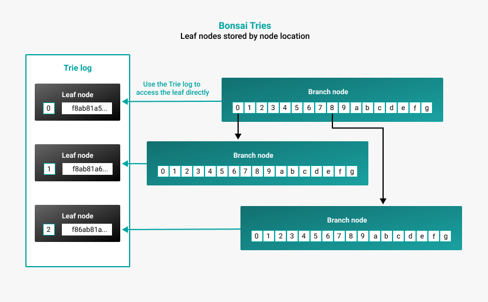

# Data storage formats

Besu offers two formats for storing the world state, [Forest of Tries](#forest-of-tries) and [Bonsai Tries](#bonsai-tries).

## Forest of Tries

Forest of Tries, also called forest mode, is the default storage format.

In forest mode, each node in the trie is saved in a key-value store by hash. For each block, the world state is updated
with new nodes, leaf nodes, and a new state root. Old leaf nodes remain in the underlying data store. Data is accessed
and stored by hash, which increases the size of the database and increases the resources and time needed to access account data.

## Bonsai Tries

Bonsai Tries is a data storage layout policy designed to reduce storage requirements and increase
read performance.

Bonsai stores leaf values in a trie log, separate from the branches of the trie. Bonsai stores nodes by the
location of the node instead of the hash of the node. Bonsai can access the leaf from the underlying storage directly using the
account key. This greatly reduces the disk space needed for storage and allows for less resource-demanding
and faster read performance. Bonsai inherently [prunes](Pruning.md) orphaned nodes and old branches.

To run a node with Bonsai Tries data storage format, use the command line option
[`--data-storage-format=BONSAI`](../Reference/CLI/CLI-Syntax.md#data-storage-format).

## Forest of Tries vs. Bonsai Tries

### Storage requirements

Forest mode uses significantly more memory than Bonsai. With full archives, forest mode uses an estimated 12 TB of storage,
while Bonsai with full archives uses an estimated 1100 GB of storage.

### Accessing data

Forest mode must go through all the branches by hash to read a leaf value. Bonsai can access the leaf from the
underlying storage directly using the account key. Bonsai will generally read faster than forest mode,
particularly if the blocks are more recent.

However, Bonsai becomes increasingly more resource-intensive the further in history you try to read data.
To prevent this, you can limit how far Bonsai looks back while reconstructing data.
The default limit Bonsai looks back is 512. To change the parameter, use the
[`--bonsai-maximum-back-layers-to-load`](../Reference/CLI/CLI-Syntax.md#bonsai-maximum-back-layers-to-load) option.

!!! note

    Using `--bonsai-maximum-back-layers-to-load` doesn't affect the size of the database being stored, only how far back to load.
    This means there is no "safe minimum" value to use with this option.

### Syncing nodes

!!! important

    We recommend using Bonsai with [snap sync](Node-Types.md#snap-synchronization) for the fastest sync and lowest
    storage requirements.

With forest or Bonsai mode, you can use [fast](Node-Types.md#fast-synchronization) or
[snap](Node-Types.md#snap-synchronization) sync to run a full node.

With forest mode, your node can fast or snap sync to other nodes, and other nodes can fast or snap sync to a fast synced
forest node.

With Bonsai mode, your node can fast or snap sync to other nodes, but other nodes can't fast or snap sync to a fast
synced Bonsai node.

Bonsai stores data at a point-in-time.
Fast sync messages request node data by-hash at a point-in-time (pivot block), thousands of blocks back
during the sync.

After Bonsai as a snap sync server is implemented, other nodes will be able to fast or snap sync to a snap synced forest
or Bonsai node.
