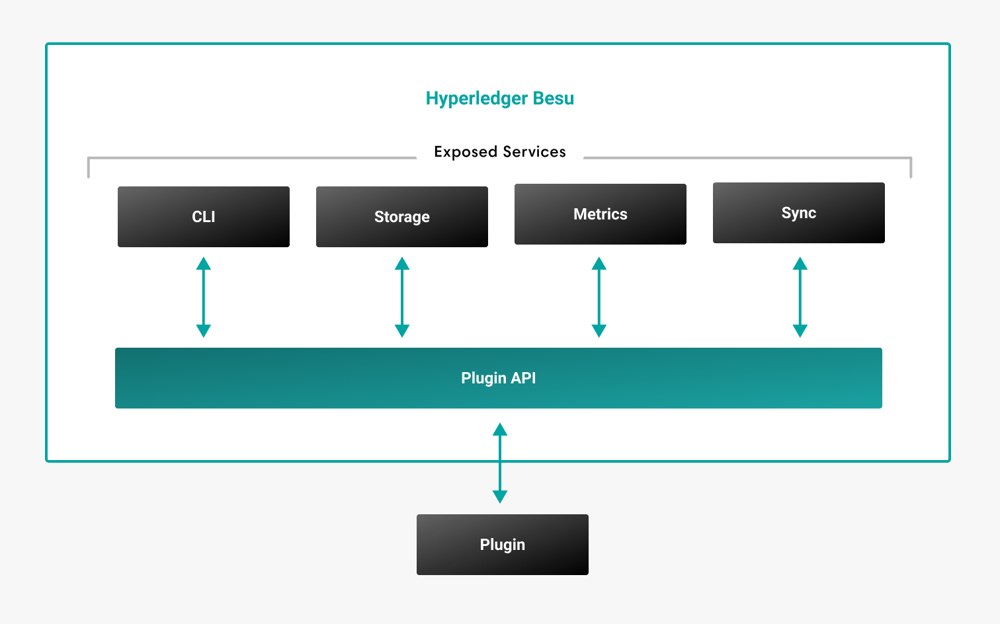

description: Plugins
<!--- END of page meta data -->

# Plugins

You can extend Hyperledger Besu functionality by building Java plugins. The
Plugin API allows you to take data from any Besu network, public or
permissioned, and feed it into an application or system. 

For example, a plugin can add additional monitoring functionality or stream
event data to a third-party application. The API exposes data about the
following components:

* Blocks
* Balances
* Transactions
* Smart contracts
* Execution results
* Logs 
* Syncing state

The Plugin API provides access to [interfaces](../Reference/Plugin-API-Interfaces.md) that allow you to build
the plugin.

!!! tip
    View the [Plugin API webinar](https://youtu.be/78sa2WuA1rg) for an example of how to build a plugin.

## Install Plugins

The plugin (`.jar`) must be copied to the `plugins` directory to allow Besu 
access and use the plugin.

!!! important
    If not already present, the `plugins` directory must be created one directory
    level below (`../`) the besu executable.

Each plugin in the directory has the following lifecycle events:

* **Register** - Executed when Besu starts. Besu checks plugin compatibility and registers plugins.
* **Start** - Plugins are started after being successfully registered.
* **Stop** - Plugins are stopped by Besu.

!!! note
    Besu does not guarantee the order of the lifecycle events. 
