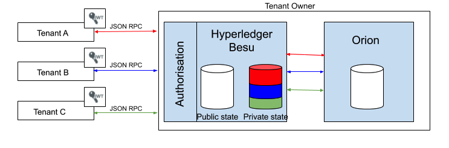

# Multi-tenancy

!!! warning

    Orion features have been merged into Tessera!
    Read our [Orion to Tessera migration guide](https://docs.orion.consensys.net/en/latest/Tutorials/Migrating-from-Orion-to-Tessera/)
    and about all the [new Tessera features](https://consensys.net/blog/quorum/tessera-the-privacy-manager-of-choice-for-consensys-quorum-networks).

By default, each participant in a privacy network uses its own Besu and Tessera node.

Multi-tenancy allows multiple participants to use the same Besu and Tessera node. Each participant
is a _tenant_, and the operator is the _owner_ of the Besu and Tessera node.

!!! important

    The operator is responsible for
    [configuring multi-tenancy](../../Tutorials/Privacy/Configuring-Multi-Tenancy.md), and has
    access to all tenant data.

!!! important

    Ensure the multi-tenant Tessera node client API is configured to allow access only by the
    multi-tenant Besu node. Access to your data is secured through Besu using multi-tenancy mode.

    If not configured to allow access only by the multi-tenant Besu node, other Tessera clients,
    including other Besu nodes, might be able to access tenant data.

    To secure access, you can [configure TLS between Besu and Tessera](../TLS.md) with the
    [`whitelist`](https://docs.orion.consensys.net/en/latest/Tutorials/TLS/#clientconnectiontlsservertrust)
    trust mode.

Multi-tenancy validates that tenants have permission to use the specified HTTP or Websocket
JSON-RPC requests, and the tenant has access to the requested privacy data.
Private data is isolated and each tenant uses a JSON Web Token (JWT) for authentication.

You can
[create the JWT either externally or internally](../../HowTo/Interact/APIs/Authentication.md).
