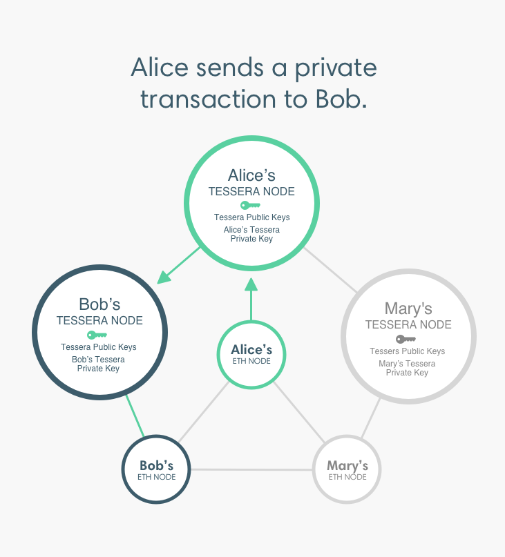

# Privacy

!!! warning

    Orion features have been merged into Tessera!
    Read our [Orion to Tessera migration guide](https://docs.orion.consensys.net/en/latest/Tutorials/Migrating-from-Orion-to-Tessera/)
    and about all the [new Tessera features](https://consensys.net/blog/quorum/tessera-the-privacy-manager-of-choice-for-consensys-quorum-networks).

In Besu, privacy refers to the ability to keep transactions private between the involved
participants. Other participants cannot access the transaction content or list of participants.

!!! important

    For production environments requiring private transactions:

    * We recommend using a network with a consensus mechanism supporting transaction finality. For
    example, [IBFT 2.0](../../HowTo/Configure/Consensus-Protocols/IBFT.md).
    * Tessera must be [highly available and run in a separate instance to Besu].

    Using private transactions with [pruning](../Pruning.md) or
    [fast sync](../../Reference/CLI/CLI-Syntax.md#sync-mode) is not supported.

## Private transaction manager

Besu uses a private transaction manager, [Tessera](https://docs.tessera.consensys.net/), to implement
privacy. Each Besu node sending or receiving private transactions requires an associated Tessera
node.

Private transactions pass from the Besu node to the associated Tessera node. The Tessera node
encrypts and directly distributes (that is, point-to-point) the private transaction to the Tessera
nodes participating in the transaction.

By default, each participant in a privacy network uses its own Besu and Tessera node.
[Multi-tenancy](Multi-Tenancy.md) allows more than one participant to use the same Besu and Tessera
node.

!!! tip

    Private Transaction Managers are also known as Enclaves.

## Reorg-compatible privacy

In v1.4, using private transactions in a network using a consensus mechanism where forks occur
(that is, PoW algorithms or Clique) is an early access feature. For example, using private
transactions on Ropsten.

Do not use private transactions in production environments using consensus mechanisms where forks
occur.

<!-- Links -->
[highly available and run in a separate instance to Besu]: ../../HowTo/Use-Privacy/Run-Tessera-With-Besu.md
