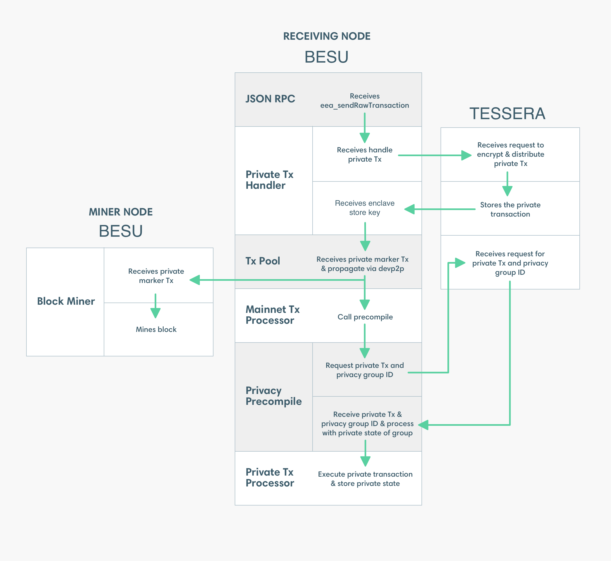

description: Private transaction processing
<!--- END of page meta data -->

# Processing private transactions

Processing private transactions involves the following: 

- **Precompiled Contract**: A smart contract compiled from the source language to EVM bytecode and
stored by an Ethereum node for later execution.

- **Privacy Marker Transaction**: A public Ethereum transaction with a payload of the enclave key.
The enclave key is a pointer to the private transaction in Orion. The `to` attribute of the Privacy
Marker Transaction is the address of the privacy precompiled contract.

   The Privacy Marker Transaction is
   [signed with a random key or the key specified on the command line].

Private transaction processing is illustrated and described in the following diagram.

1. Submit a private transaction using
[eea_sendRawTransaction](../../Reference/API-Methods.md#eea_sendrawtransaction). The signed
transaction includes transaction attributes specific to private transactions, including:

   * `privateFor` or `privacyGroupId` specifies the list of recipients
   * `privateFrom` specifies the sender
   * `restriction` specifies the transaction is of type
   [_restricted_](../Privacy/Privacy-Overview.md#private-transactions).

1. The JSON-RPC endpoint passes the private transaction to the Private Transaction Handler.

1. The Private Transaction Handler sends the private transaction to Orion.

1. Orion distributes the private transaction directly (that is, point-to-point) to the Orion nodes
specified in `privateFor` or belonging to the privacy group identified by `privacyGroupId`. All
recipient Orion nodes store the transaction. Orion associates the stored transaction with the
transaction hash and privacy group ID.

1. Orion returns the transaction hash to the Private Transaction Handler.

1. The Private Transaction Handler creates a Privacy Marker Transaction for the private
transaction. The Private Transaction Handler propagates the Privacy Marker Transaction using devP2P
in the same way as a public Ethereum transaction.

    !!! tip
        If you want to sign the Privacy Marker Transaction outside of Besu, use
        [`priv_distributeRawTransaction`] instead of
        [`eea_sendRawTransaction`](../../Reference/API-Methods.md#eea_sendrawtransaction).

1. Besu mines the Privacy Marker Transaction into a block and it is distributed to all Ethereum
nodes in the network.

1. The Mainnet Transaction Processor processes the Privacy Marker Transaction in the same way as
any other public transaction. On nodes containing the privacy precompile contract specified in the
`to` attribute of the Privacy Marker Transaction, the Mainnet Transaction Processor passes the
Privacy Marker Transaction to the privacy precompile contract.

    !!! note 
        Nodes receiving the Privacy Marker Transaction that do not contain the privacy precompile
        contract specified in the Privacy Marker Transaction ignore the Privacy Marker Transaction.

1. The privacy precompile contract queries Orion for the private transaction and privacy group ID
using the transaction hash.

1. The privacy precompile contract passes the private transaction to the Private Transaction
Processor. The privacy group ID specifies the private world state to use.

1. The Private Transaction Processor executes the transaction. The Private Transaction Processor
can read and write to the private world state, and read from the public world state.

!!! important
    
    For production systems requiring private transactions:

    * It is recommended you use a network with a consensus mechanism supporting transaction
    finality, such as [IBFT 2.0](../../HowTo/Configure/Consensus-Protocols/IBFT.md).
    * Orion must be [highly available and run in a separate instance to Besu].

<!-- Links -->
[signed with a random key or the key specified on the command line]: ../../HowTo/Use-Privacy/Sign-Privacy-Marker-Transactions.md
[`priv_distributeRawTransaction`]: ../../HowTo/Send-Transactions/Creating-Sending-Private-Transactions.md#priv_distributerawtransaction
[highly available and run in a separate instance to Besu]: ../../HowTo/Use-Privacy/Run-Orion-With-Besu.md
