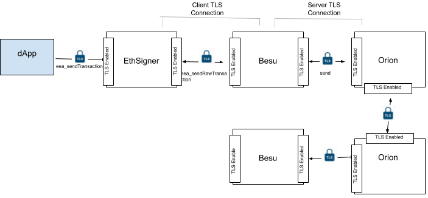

# TLS communication

Hyperledger Besu supports TLS to secure client and server communication, or [secure P2P communication] between nodes.

!!! important

    To secure client and server communication, you also need to configure the client ([EthSigner](https://docs.ethsigner.consensys.net/en/latest/Concepts/TLS/))
    or server ([Tessera](https://docs.tessera.consensys.net/HowTo/Configure/TLS/)) for TLS.

The following diagram displays an example client and server TLS configuration.

You must store private keys and certificates in password-protected PKCS12 keystore files.

Use the command line options to [enable and configure](../how-to/configure/TLS/Configure-TLS.md) TLS.

[secure P2P communication]: ../how-to/configure/TLS/P2P-TLS.md
