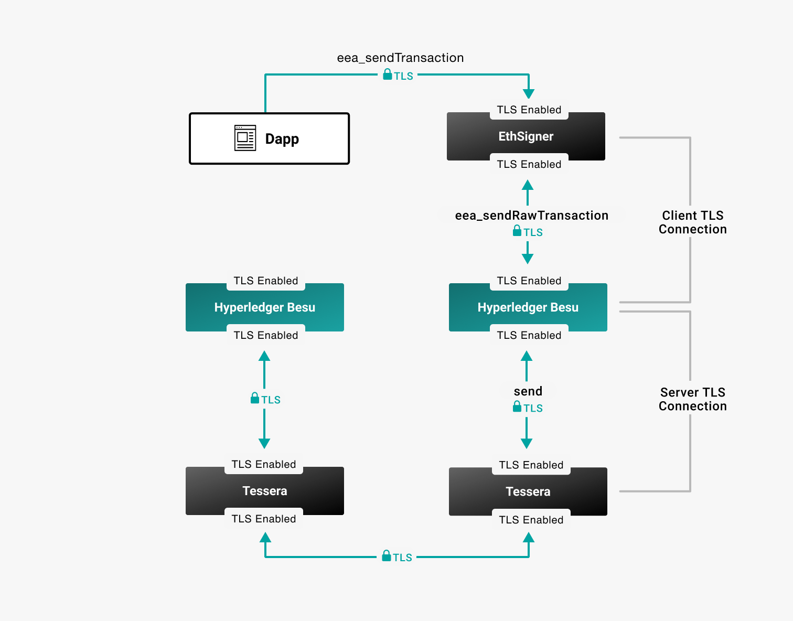

description: TLS overview
<!--- END of page meta data -->

# TLS Communication

Hyperledger Besu supports TLS to secure client and server communication. The
client ([EthSigner](https://docs.ethsigner.pegasys.tech/en/latest/Concepts/TLS/))
or server ([Orion](https://docs.orion.pegasys.tech/en/latest/Concepts/TLS-Communication/)) must also be configured for TLS  

    
Private keys and certificates must be stored in a password-protected PKCS #12
keystore files.

Use the command line options to [enable and configure](../HowTo/Configure/Configure-TLS.md) TLS.