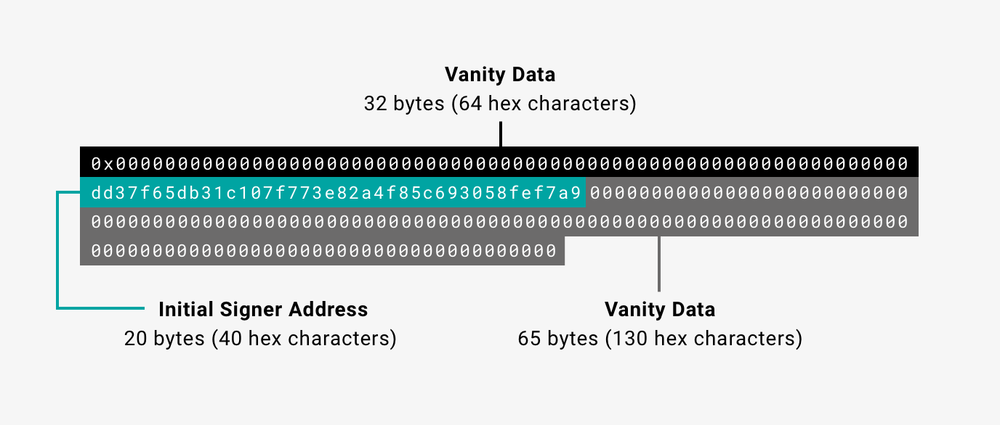
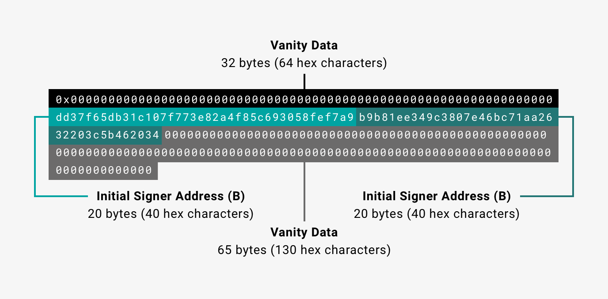

# Clique

Besu implements the [Clique](https://eips.ethereum.org/EIPS/eip-225) proof of authority (PoA) [consensus protocol](../../../Concepts/Consensus-Protocols/Overview-Consensus.md).
The Rinkeby and Goerli testnets uses Clique and private networks can also use Clique.

!!! warning

    Clique is not suitable for production environments.
    Use only in development environments.
    You can [migrate a Clique network to another consensus protocol](#migrate-from-clique-to-another-consensus-protocol).

In Clique networks, approved accounts, known as signers, validate transactions and blocks. Signers
take turns to create the next block.
Existing signers propose and vote to [add or remove signers](#add-and-remove-signers).

You can [create a private network using Clique](../../../Tutorials/Private-Network/Create-Private-Clique-Network.md).

## Genesis file

To use Clique in a private network, Besu requires a Clique [genesis file](../Genesis-File.md). When connecting to Rinkeby,
Besu uses the
[`rinkeby.json`](https://github.com/hyperledger/besu/blob/master/config/src/main/resources/rinkeby.json)
genesis file in the `/besu/config/src/main/resources` directory.

A Clique genesis file defines properties specific to Clique.

!!! example "Example Clique genesis file"

    ```json
    {
      "config":{
        "chainId":1981,
        "londonBlock": 0,
        "clique":{
          "blockperiodseconds":15,
          "epochlength":30000
        }
      },
      "coinbase":"0x0000000000000000000000000000000000000000",
      "difficulty":"0x1",
      "extraData":"0x000000000000000000000000000000000000000000000000000000000000000001a54556254bfa3db2daa7673435ec63649925c50000000000000000000000000000000000000000000000000000000000000000000000000000000000000000000000000000000000000000000000000000000000",
      "gasLimit":"0x1fffffffffffff",
      "mixHash":"0x0000000000000000000000000000000000000000000000000000000000000000",
      "nonce":"0x0",
      "timestamp":"0x5c51a607",
      "alloc": {},
      "number":"0x0",
      "gasUsed":"0x0",
      "parentHash":"0x0000000000000000000000000000000000000000000000000000000000000000"
    }
    ```

The properties specific to Clique are:

* `blockperiodseconds` - The block time, in seconds.
* `epochlength` - The number of blocks after which to reset all votes.
* `extraData` - [Extra data](#extra-data) including the initial signers.

### Extra data

The `extraData` property consists of:

* 0x prefix.
* 32 bytes of vanity data.
* A list of initial signer addresses (at least one initial signer is required).
  20 bytes for each signer.
* 65 bytes for the proposer signature.
  In the genesis block there is no initial proposer, so the proposer signature is all zeros.

!!! example "One initial signer"

    

!!! example "Two initial signers"

    

## Connect to a Clique network

To connect to the Rinkeby testnet, start Besu with the
[`--network=rinkeby`](../../../Reference/CLI/CLI-Syntax.md#network) command line option. To start a
node on a Clique private network, use the
[`--genesis-file`](../../../Reference/CLI/CLI-Syntax.md#genesis-file) option to specify the custom
genesis file.

## Add and remove signers

Existing signers propose and vote to add or remove validators using the Clique JSON-RPC API methods.
Enable the HTTP interface with [`--rpc-http-enabled`](../../../Reference/CLI/CLI-Syntax.md#rpc-http-enabled) or the
WebSocket interface with [`--rpc-ws-enabled`](../../../Reference/CLI/CLI-Syntax.md#rpc-ws-enabled).

The Clique API methods are disabled by default.
To enable them, specify the [`--rpc-http-api`](../../../Reference/CLI/CLI-Syntax.md#rpc-http-api) or
[`--rpc-ws-api`](../../../Reference/CLI/CLI-Syntax.md#rpc-ws-api) option and include `CLIQUE`.

The methods to add or remove signers are:

* [`clique_propose`](../../../Reference/API-Methods.md#clique_propose).
* [`clique_getSigners`](../../../Reference/API-Methods.md#clique_getsigners).
* [`clique_discard`](../../../Reference/API-Methods.md#clique_discard).

To view signer metrics for a specified block range, call
[`clique_getSignerMetrics`](../../../Reference/API-Methods.md#clique_getsignermetrics).

!!! tip

    You can use `clique_getSignerMetrics` to identify inactive validators.
    An inactive validator's `lastProposedBlockNumber` is `0x0`.

### Add a signer

To propose adding a signer to a Clique network, call
[`clique_propose`](../../../Reference/API-Methods.md#clique_propose), specifying the address of the proposed signer and `true`.
A majority of signers must execute the call.

!!! example "JSON-RPC `clique_propose` request example"

    ```bash
    curl -X POST --data '{"jsonrpc":"2.0","method":"clique_propose","params":["0xFE3B557E8Fb62b89F4916B721be55cEb828dBd73", true], "id":1}' <JSON-RPC-endpoint:port>
    ```

When the signer creates the next block, the signer adds a vote to the block for the proposed signer.

When more than 50% of the existing signers propose adding the signer, with their votes distributed in blocks, the
signer can begin signing blocks.

To return a list of signers and confirm the addition of a proposed signer, call
[`clique_getSigners`](../../../Reference/API-Methods.md#clique_getsigners).

!!! example "JSON-RPC `clique_getSigners` request example"

    ```bash
    curl -X POST --data '{"jsonrpc":"2.0","method":"clique_getSigners","params":["latest"], "id":1}' <JSON-RPC-endpoint:port>
    ```

To discard your proposal after confirming the addition of a signer, call
[`clique_discard`](../../../Reference/API-Methods.md#clique_discard) specifying the address of the proposed signer.

!!! example "JSON-RPC `clique_discard` request example"

    ```bash
    curl -X POST --data '{"jsonrpc":"2.0","method":"clique_discard","params":["0xFE3B557E8Fb62b89F4916B721be55cEb828dBd73"], "id":1}' <JSON-RPC-endpoint:port>
    ```

### Remove a signer

The process for removing a signer from a Clique network is the same as [adding a signer](#add-a-signer), except you
specify `false` as the second parameter of [`clique_propose`](../../../Reference/API-Methods.md#clique_propose).

### Epoch transition

At each epoch transition, Clique discards all pending votes collected from received blocks.
Existing proposals remain in effect and signers re-add their vote the next time they create a block.

Define the number of blocks between epoch transitions in the [Clique genesis file](#genesis-file).

## Limitations

In Clique, blocks created by in-turn validators are published immediately.
Out-of-turn validators create blocks that are published after a short delay.
In-turn blocks have a higher difficulty than out-of-turn blocks, which allows small forks to resolve to the chain with
more in-turn blocks.

However, when the out-of-turn delay is shorter than the block propagation delay, out-of-turn blocks may be published
before in-turn blocks.
This may cause large, irresolvable forks in a network.

!!! important

    We recommend using a more updated consensus protocol such as [IBFT 2.0](IBFT.md) or [QBFT](QBFT.md).

## Migrate from Clique to another consensus protocol

To migrate a network using Clique to a consensus protocol suitable for production such as [QBFT](QBFT.md), do one of the
following:

* Stop the Clique network and start the new network with the state at the time of migration.
  Historical transactions and state history are lost.

* Replay the historical transactions on the new network.
  The historical transactions are at different block heights on the new network, but the transactions and state history
  are the same on the new network as on the Clique network.

You can request migration support on [Discord](https://discord.gg/hyperledger).

<!-- Acronyms and Definitions -->

*[vanity data]: Signers can include anything they like as vanity data.
