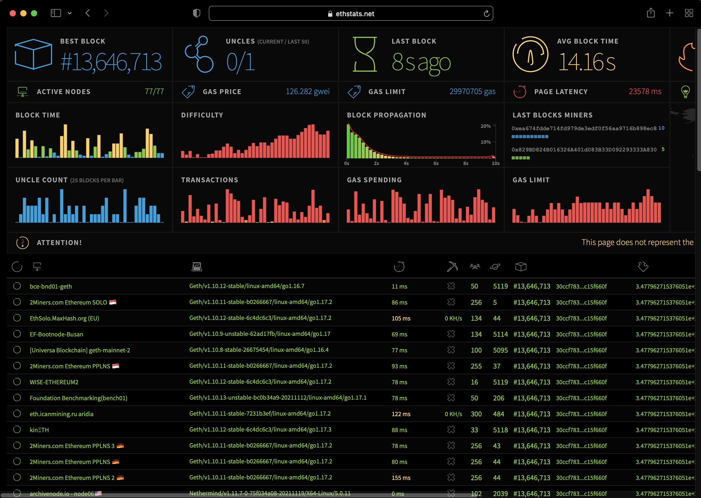

# Ethstats network monitor

Connect to [Ethstats](https://ethstats.net) to display real time and historical [statistics](#statistics) about the network and nodes.
You can connect to the Ethstats dashboard by [connecting to a client and server](#connecting-through-a-client-and-server) or by [connecting through the command line](#connecting-through-the-command-line).

## Components

Ethstats consists of the following:

- [Server](https://github.com/goerli/ethstats-server). The server consumes node data received from the client.
- [Client](https://github.com/goerli/ethstats-client). The client extracts data from the node and sends it to the server.
- [Dashboard](https://github.com/goerli/ethstats-client#available-dashboards). The dashboard displays statistics.

## Statistics

Statistics displayed by Ethstats include:

- Nodes in the network. Metrics for nodes include:
    - Information about the last received block such as block number, block hash, transaction count, uncle count, block time and propagation time.
    - Connected peers, whether the node is mining, hash rate, latency, and uptime.
- Charts for Block Time, Block Difficulty, Block Gas Limit, Block Uncles, Block Transactions, Block Gas Used, Block Propagation Histogram, and Top Miners.
- IP-based geolocation overview.
- Node logs, which display the data sent by a node.
- Block history, which provides the ability to go back in time and playback the block propagation through the nodes.

## Connecting through a client and server

Refer to the external [Ethstats client](https://github.com/goerli/ethstats-client) and [Ethstats server](https://github.com/goerli/ethstats-server) documentation
for installing those components and connecting to a dashboard.

## Connecting through the command line

Use the [`ethstats` command line options](../../Reference/CLI/CLI-Syntax.md#ethstats) to connect a node directly to a [dashboard](https://github.com/goerli/ethstats-client#available-dashboards), bypassing the need for a client.

Start a node using `--ethstats` command to specify the Ethstats server url.
You can specify a contact email to send to the server using `--ethstats-contact`.

!!! example 

    === "Syntax"

        ```bash
        --ethstats=<nodename:secret@host:port> --ethstats-contact=<CONTACT>
        ```

    === "Example"

        ```bash
        --ethstats=Dev-Node-1:secret@127.0.0.1:3001 --ethstats-contact=contact@mail.com
        ```

    === "Environment variable"

        ```bash
        BESU_ETHSTATS=Dev-Node-1:secret@127.0.0.1:3001 BESU_ETHSTATS_CONTACT=contact@mail.com
        ```

    === "Configuration file"

        ```bash
        ethstats="Dev-Node-1:secret@127.0.0.1:3001" ethstats-contact="contact@mail.com"
        ```

!!! note

    A server must be specified by `--ethstats` in order to use `--ethstats-contact`.

Open the selected dashboard website.  Find your node under the list of nodes to see the statistics for the node and the network.

