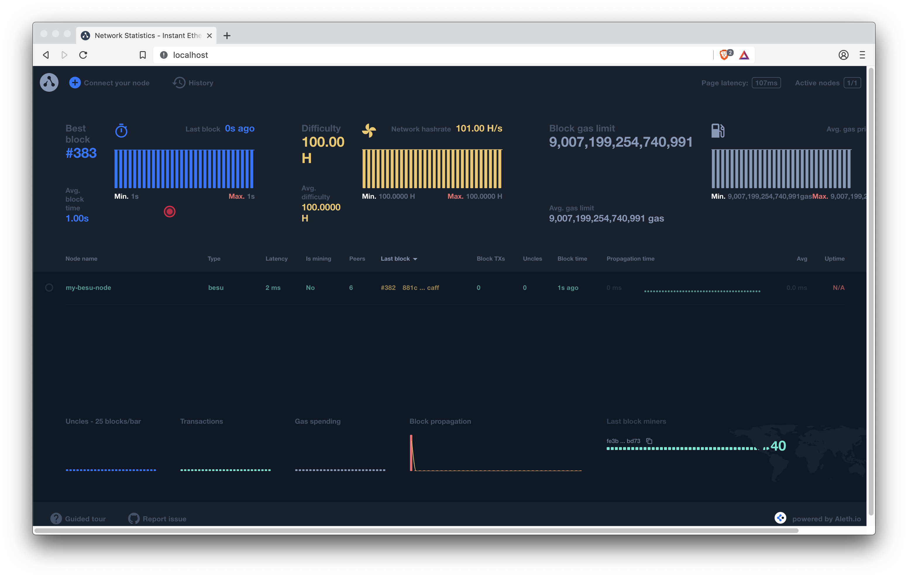

description: Alethio EthStats Lite network monitor
<!--- END of page meta data -->

# Alethio EthStats Lite (network monitor)

Use [Alethio EthStats Lite] to have a live view of private network health by displaying real time
and historical statistics about the network and nodes.

EthStats Lite supports in-memory persistence or using Redis to persist a fixed number of blocks (by
default, 3000).

A full online version of [EthStats for the Ethereum Mainnet](https://ethstats.io/) is also
available.

!!! tip

    The example
    [running EthStats Lite for a Hyperledger Besu Node](#running-ethstats-lite-for-a-besu-node)
    uses static local ports 80 and 3000.

## Statistics

Statistics displayed by EthStats Lite include:

* Nodes in the network. Metrics for nodes include:
  - Information about the last received block such as block number, block hash, transaction count,
    uncle count, block time and propagation time.
  - Connected peers, whether the node is mining, hash rate, latency, and uptime.
* Charts for Block Time, Block Difficulty, Block Gas Limit, Block Uncles, Block Transactions,
  Block Gas Used, Block Propagation Histogram, and Top Miners.
* IP-based geolocation overview.
* Node logs, which display the data sent by a node.
* Block history, which provides the ability to go back in time and playback the block propagation
  through the nodes.

## Components

EthStats Lite consists of a:

* [Server](https://github.com/Alethio/ethstats-network-server). The server consumes node data
  received from the client.
* [Client](https://github.com/Alethio/ethstats-cli). Each node in the network requires you to start
  a client. The client extracts data from the node and sends it to the server.
* [Dashboard](https://github.com/Alethio/ethstats-network-dashboard). The dashboard displays
  [statistics](#statistics).

## Pre-requisities

[Docker](https://docs.docker.com/install/)

!!! tip

    EthStats Lite has a number of dependencies. Using Docker is the easiest way to
    use EthStats Lite with Besu.

    The [EthStats CLI](https://github.com/Alethio/ethstats-cli),
    [EthStats Network Server](https://github.com/Alethio/ethstats-network-server), and
    [EthStats Network Dashboard](https://github.com/Alethio/ethstats-network-dashboard)
    documentation describes how to install the EthStats Lite tools.

## Running EthStats Lite for a Besu node

!!! important

    This example describes how to run EthStats Lite for a single Besu node. Running EthStats Lite
    for a network requires starting a [client](#3-client) for each node in the network.

### 1. Server

Start the EthStats Lite server using in-memory persistence:

1. Clone the server repository:

    ```bash
    git clone https://github.com/Alethio/ethstats-network-server.git
    ```

1. Change into the `/ethstats-network-server/docker/lite-mode/memory-persistence` directory:

    ```bash
    cd ethstats-network-server/docker/lite-mode/memory-persistence
    ```

1. Update the `docker-compose.yml` file to your Besu
   [network ID](../../Concepts/NetworkID-And-ChainID.md):

    ```yaml
     - NETWORK_ID=2018
     - NETWORK_NAME=mynetwork
    ```

    In this example, we are using the `dev` Besu network with a network ID of `2018`.

1. Start the server using Docker compose:

    ```bash
    docker-compose up -d
    ```

!!! tip

    A `docker-compose` file in the `ethstats-network-server/docker/lite-mode/redis-persistence`
    directory runs the server using Redis to persist a fixed number of blocks (the default is 3000).

### 2. Besu

Start Besu in development mode with WebSockets enabled:

```bash
docker run --rm -p 8546:8546 hyperledger/besu:latest --miner-enabled --miner-coinbase fe3b557e8fb62b89f4916b721be55ceb828dbd73 --rpc-http-cors-origins="all" --rpc-ws-enabled --network=dev
```

Where `<besudata-path>` is the volume to save the node data to.

### 3. Client

Start the client for the Besu node:

```bash
docker run -d --rm --name ethstats-client --net host alethio/ethstats-cli --register --account-email <email> --node-name <node_name> --server-url http://localhost:3000 --client-url ws://127.0.0.1:8546
```

Where:

* `--server-url` specifies [your server](#1-server). The default is the server consuming data for
  the Ethereum MainNet.
* `--register` specifies automatic registration of the Besu node with the specified `<email>` and
  `<node_name>`. Registering the node is only required when starting the client for the first time
  for the node.
* `--client-url` specifies the WebSockets URL for the Besu node.

### 4. Dashboard

To display the EthStats Lite dashboard, open [http://localhost](http://localhost) in your browser.



!!! note "Default HTTP port"

    We are using the default HTTP port (80) to run EthStats Lite. The
    [Lite Block Explorer](Lite-Block-Explorer.md) example uses port 8080, allowing you to run both
    at the same time.

    To change the port, update the `docker-compose.yml` file:

    ```yaml
        ports:
          - 127.0.0.1:80:80
    ```

    Update the first 80 to the required port:

    ```yaml
        ports:
          - 127.0.0.1:8080:80
    ```

### Stopping and cleaning up resources

To stop running EthStats Lite:

1. Stop Besu, using ++ctrl+c++.

1. Stop the EthStats Lite server and remove containers and volumes:

    ```bash
    docker-compose down -v
    ```

1. Stop the EthStats Lite client:

    ```bash
    docker stop ethstats-client
    ```

    !!! tip

        The client container is automatically removed because we used the `--rm` option.

<!-- Links -->
[Alethio EthStats Lite]: https://github.com/Alethio?utf8=%E2%9C%93&q=ethstats&type=&language=javascript
