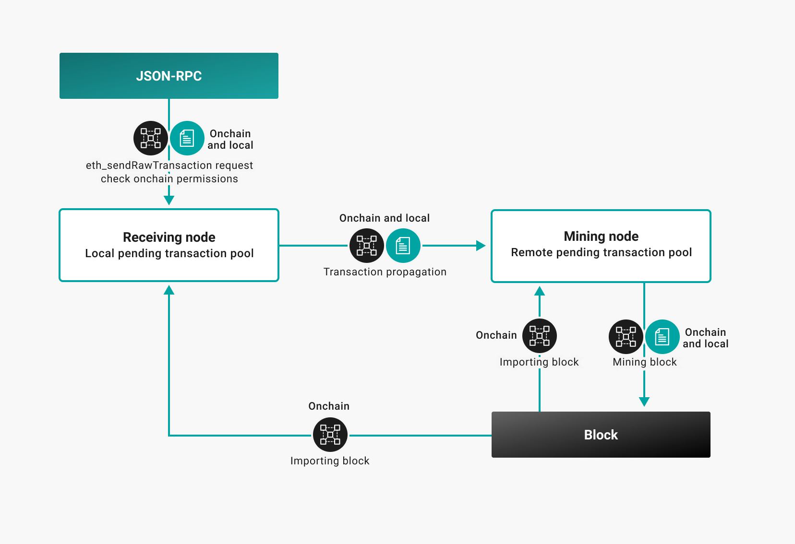

# Local permissioning

Local permissioning supports node and account allowlisting.

!!! tip

    If deploying Besu using Kubernetes in private permissioned networks, use the
    [`--Xdns-enabled`](../../Reference/CLI/CLI-Syntax.md#xdns-enabled) and
    [`--Xdns-update-enabled`](../../Reference/CLI/CLI-Syntax.md#xdns-update-enabled) options to use
    domain names instead of IP addresses. This ensures that Besu can connect to a container even if
    the IP address changes after being restarted.

## Node allowlisting

You can allow access to specified nodes in the
[permissions configuration file](#permissions-configuration-file). With node allowlisting
enabled, communication is only between nodes in the allowlist

!!! example "Nodes allowlist in the permissions configuration file"

    `nodes-allowlist=["enode://6f8a80d14311c39f35f516fa664deaaaa13e85b2f7493f37f6144d86991ec012937307647bd3b9a82abe2974e1407241d54947bbb39763a4cac9f77166ad92a0@192.168.0.9:4567","enode://6f8a80d14311c39f35f516fa664deaaaa13e85b2f7493f37f6144d86991ec012937307647bd3b9a82abe2974e1407241d54947bbb39763a4cac9f77166ad92a0@192.169.0.9:4568"]`

Node allowlisting is at the node level. That is, each node in the network has a
[permissions configuration file](#permissions-configuration-file) file in the
[data directory](../../Reference/CLI/CLI-Syntax.md#data-path) for the node.

To update the nodes allowlist while the node is running, use the JSON-RPC API methods:

* [perm_addNodesToAllowlist](../../Reference/API-Methods.md#perm_addnodestoallowlist)
* [perm_removeNodesFromAllowlist](../../Reference/API-Methods.md#perm_removenodesfromallowlist).

You can also update the [`permissions_config.toml`](#permissions-configuration-file) file directly
and then update the allowlist using the
[`perm_reloadPermissionsFromFile`](../../Reference/API-Methods.md#perm_reloadpermissionsfromfile)
method.

Updates to the permissions configuration file persist across node restarts.

To view the nodes allowlist, use the
[perm_getNodesAllowlist](../../Reference/API-Methods.md#perm_getnodesallowlist) method.

!!! note

    Each node has a [permissions configuration file](#permissions-configuration-file), which means
    nodes can have different nodes allowlists. This means nodes might be participating in the
    network that are not on the allowlist of other nodes in the network. We recommend each node in
    the network has the same nodes allowlist.

    On-chain permissioning is under development. On-chain permissioning uses one on-chain
    nodes allowlist.

!!! example "An example of different node allowlists"

    Node 1 Allowlist = [Node 2, Node 3]

    Node 2 Allowlist = [Node 3, Node 5]

    Node 5 is participating in the same network as Node 1 even though Node 1 does not have Node 5
    on their allowlist.

### Bootnodes

The nodes permissions list must include the bootnodes or Hyperledger Besu does not start with
node permissions enabled.

!!! example

    If you start Besu with specified bootnodes and have node permissioning enabled:

     ```bash
     --bootnodes="enode://7e4ef30e9ec683f26ad76ffca5b5148fa7a6575f4cfad4eb0f52f9c3d8335f4a9b6f9e66fcc73ef95ed7a2a52784d4f372e7750ac8ae0b544309a5b391a23dd7@127.0.0.1:30303","enode://2feb33b3c6c4a8f77d84a5ce44954e83e5f163e7a65f7f7a7fec499ceb0ddd76a46ef635408c513d64c076470eac86b7f2c8ae4fcd112cb28ce82c0d64ec2c94@127.0.0.1:30304","enode://7b61d5ee4b44335873e6912cb5dd3e3877c860ba21417c9b9ef1f7e500a82213737d4b269046d0669fb2299a234ca03443f25fe5f706b693b3669e5c92478ade@127.0.0.1:30305"
     ```

    The `nodes-allowlist` in the [permissions configuration file](#permissions-configuration-file)
    must contain the specified bootnodes.

### Enabling node allowlisting

To enable node allowlisting, specify the
[`--permissions-nodes-config-file-enabled`](../../Reference/CLI/CLI-Syntax.md#permissions-nodes-config-file-enabled)
option when starting Besu.

The `PERM` API methods are not enabled by default. To enable the `PERM` API methods, use the
[`--rpc-http-api`](../../Reference/CLI/CLI-Syntax.md#rpc-http-api) or
[`--rpc-ws-api`](../../Reference/CLI/CLI-Syntax.md#rpc-ws-api) options.

## Account allowlisting

You can specify accounts in the accounts allowlist in the
[permissions configuration file](#permissions-configuration-file). A node with account
permissioning accepts transactions only from accounts in the accounts allowlist.

!!! example "Accounts allowlist in the permissions configuration file"

    `accounts-allowlist=["0x0000000000000000000000000000000000000009"]`

Account allowlisting is at the node level. That is, each node in the network has a
[permisssions configuration file](#permissions-configuration-file) in the
[data directory](../../Reference/CLI/CLI-Syntax.md#data-path) for the node.

!!! caution "Using account permissioning and privacy"

    Account permissioning is incompatible with
    [random key signing](../Use-Privacy/Sign-Privacy-Marker-Transactions.md) for
    [privacy marker transactions](../../Concepts/Privacy/Private-Transaction-Processing.md).

    If using account permissioning and privacy, a signing key must be specified using the
    [`--privacy-marker-transaction-signing-key-file`](../../Reference/CLI/CLI-Syntax.md#privacy-marker-transaction-signing-key-file)
    command line option and the signing key included in the accounts allowlist.

Transaction validation against the accounts allowlist occurs at the following points:

* Submitted by JSON-RPC API method
  [`eth_sendRawTransaction`](../../Reference/API-Methods.md#eth_sendrawtransaction)
* Received via propagation from another node
* Added to a block by a mining node.

After adding transactions to a block, the transactions are not validated against the allowlist
when received by another node. That is, a node can synchronise and add blocks containing
transactions from accounts that are not on the accounts allowlist of that node.

The following diagram illustrates applying local and onchain permissioning rules.



!!! example "An Example of different account allowlists"

    Node 1 Allowlist = [Account A, Account B]

    Node 2 Allowlist = [Account B, Account C]

    Mining Node Allowlist = [Account A, Account B]

    Account A submits a transaction on Node 1. Node 1 validates and propagates the transaction. The
    Mining Node receives the transaction, validates it is from an account in the Mining Node
    accounts allowlist, and includes the transaction in the block. Node 2 receives and adds
    the block created by the Mining Node.

    Node 2 now has a transaction in the blockchain from Account A, which is not on the accounts
    allowlist for Node 2.

!!! note

    Each node has a [permissions configuration file](#permissions-configuration-file) which means
    nodes in the network can have different accounts allowlists. This means a transaction can
    be successfully submitted by Node A from an account in the Node A allowlist but rejected
    by Node B to which it's propagated if the account is not in the Node B allowlist. We
    recommend each node in the network has the same accounts allowlist.

To update the accounts allowlist when the node is running, use the JSON-RPC API methods:

* [`perm_addAccountsToAllowlist`](../../Reference/API-Methods.md#perm_addaccountstoallowlist)
* [`perm_removeAccountsFromAllowlist`](../../Reference/API-Methods.md#perm_removeaccountsfromallowlist).

You can also update the [`permissions_config.toml`](#permissions-configuration-file) file directly
and use the
[`perm_reloadPermissionsFromFile`](../../Reference/API-Methods.md#perm_reloadpermissionsfromfile)
method to update the allowlists.

Updates to the permissions configuration file persist across node restarts.

To view the accounts allowlist, use the
[`perm_getAccountsAllowlist`](../../Reference/API-Methods.md#perm_getaccountsallowlist) method.

### Enabling account allowlisting

To enable account allowlisting, specify the
[`--permissions-accounts-config-file-enabled`](../../Reference/CLI/CLI-Syntax.md#permissions-accounts-config-file-enabled)
option when starting Besu.

The `PERM` API methods are not enabled by default. To enable the `PERM` API methods, use the
[`--rpc-http-api`](../../Reference/CLI/CLI-Syntax.md#rpc-http-api) or
[`--rpc-ws-api`](../../Reference/CLI/CLI-Syntax.md#rpc-ws-api) options.

## Permissions configuration file

The permissions configuration file contains the nodes and accounts allowlists. If the
[`--permissions-accounts-config-file`](../../Reference/CLI/CLI-Syntax.md#permissions-accounts-config-file)
and [`--permissions-nodes-config-file`](../../Reference/CLI/CLI-Syntax.md#permissions-nodes-config-file)
options are not specified, the name of the permissions configuration file must be
[`permissions_config.toml`](#permissions-configuration-file) and must be in the
[data directory](../../Reference/CLI/CLI-Syntax.md#data-path) for the node.

You can specify the accounts and nodes allowlists in the same file or in separate files for
accounts and nodes.

To specify a permissions configuration file (or separate files for accounts and nodes) in any
location, use the
[`--permissions-accounts-config-file`](../../Reference/CLI/CLI-Syntax.md#permissions-accounts-config-file)
and
[`--permissions-nodes-config-file`](../../Reference/CLI/CLI-Syntax.md#permissions-nodes-config-file)
options.

!!!note

    The [`--permissions-accounts-config-file`](../../Reference/CLI/CLI-Syntax.md#permissions-accounts-config-file)
    and [`permissions-nodes-config-file`](../../Reference/CLI/CLI-Syntax.md#permissions-nodes-config-file)
    options are not used when running Besu from the
    [Docker image](../Get-Started/Run-Docker-Image.md). Use a bind mount to
    [specify a permissions configuration file with Docker].

!!! example "Sample Permissions Configuration File"

    ```toml
    accounts-allowlist=["0xb9b81ee349c3807e46bc71aa2632203c5b462032", "0xb9b81ee349c3807e46bc71aa2632203c5b462034"]

    nodes-allowlist=["enode://7e4ef30e9ec683f26ad76ffca5b5148fa7a6575f4cfad4eb0f52f9c3d8335f4a9b6f9e66fcc73ef95ed7a2a52784d4f372e7750ac8ae0b544309a5b391a23dd7@127.0.0.1:30303","enode://2feb33b3c6c4a8f77d84a5ce44954e83e5f163e7a65f7f7a7fec499ceb0ddd76a46ef635408c513d64c076470eac86b7f2c8ae4fcd112cb28ce82c0d64ec2c94@127.0.0.1:30304","enode://7b61d5ee4b44335873e6912cb5dd3e3877c860ba21417c9b9ef1f7e500a82213737d4b269046d0669fb2299a234ca03443f25fe5f706b693b3669e5c92478ade@127.0.0.1:30305"]
    ```

<!-- Links -->
[specify a permissions configuration file with Docker]: ../Get-Started/Run-Docker-Image.md#permissions-configuration-file
