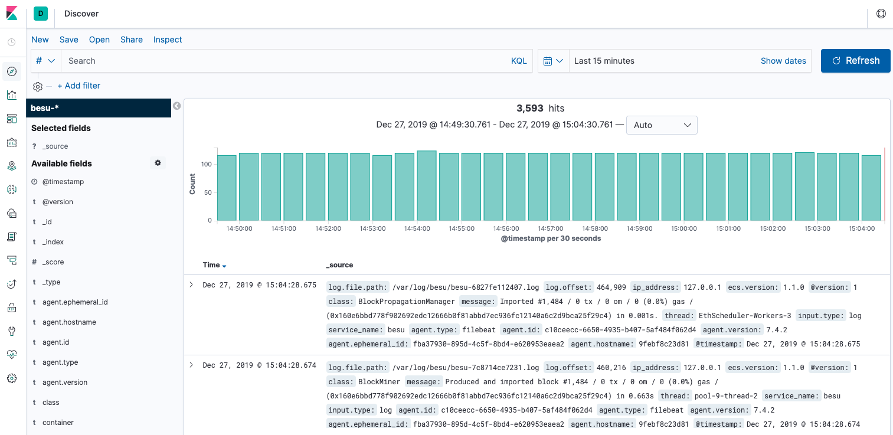

# Elastic Stack

Elastic Stack (also known as ELK) is a common open-source log management platform.

The [Quorum Developer Quickstart](https://github.com/ConsenSys/quorum-dev-quickstart) provides example
implementations using Elastic Stack for log management.

The [Filebeat] configuration ingests logs and the [Metricbeat] configuration collects metrics from
the nodes at regular defined intervals and outputs them to Redis for storage. Redis provides a
highly available mechanism enabling storage by any of the Elastic Beats and pulled by Logstash
as required.

The [pipeline configuration] defines the JSON format used for Besu logs and automatically picks up
any new log fields.

!!! note

    The pipeline configuration must match the your log format. If using the default, you can use
    the [grok plugin](https://www.elastic.co/guide/en/logstash/current/plugins-filters-grok.html)
    to extract the log fields.

To see the Besu Sample Networks logs in Kibana:

1. [Start the Quorum Developer Quickstart with Besu](../../Tutorials/Developer-Quickstart.md),
   and select the appropriate options.
1. Open the [`Kibana logs address`](http://localhost:5601/app/kibana#/discover) listed by the
   sample networks `list.sh` script. The logs display in Kibana.

    

<!-- Links -->
[Filebeat]: https://github.com/ConsenSys/quorum-dev-quickstart/blob/master/files/common/filebeat/filebeat.yml
[Metricbeat]: https://github.com/ConsenSys/quorum-dev-quickstart/blob/master/files/common/metricbeat/metricbeat.yml
[pipeline configuration]: https://github.com/ConsenSys/quorum-dev-quickstart/blob/master/files/common/logstash/pipeline/20_besu.conf
