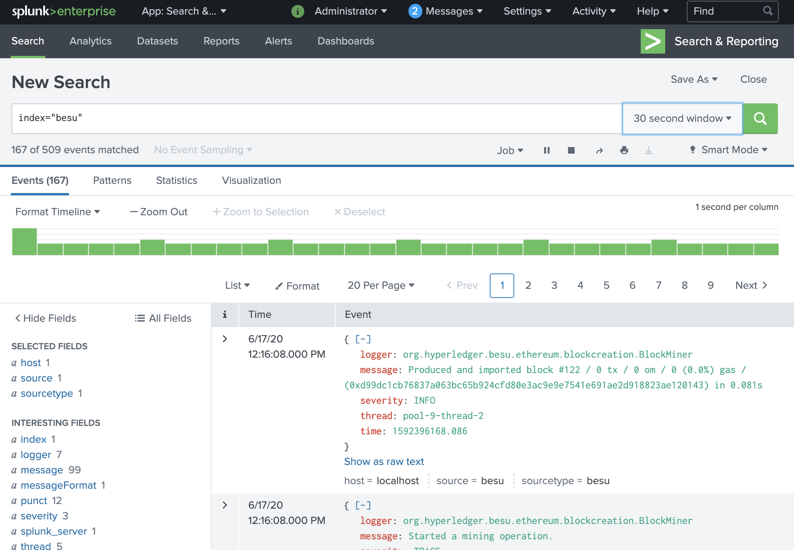

# Configure Besu for Splunk Enterprise

A Splunk server can receive Besu logs and enable complex search, visualisation and analysis.

Splunk will help you aggregate multiple node logs in one place and run complex queries without the need
to connect to the machine running the Besu node to read the standard output.

There are 3 ways to run Splunk and Besu:

- [_Splunk connect for Ethereum_ Docker Compose demo](#_splunk-connect-for-ethereum_-docker-compose-demo)
- [Splunk Enterprise Docker container](#try-splunk-enterprise-as-docker-container) _(comes with a trial license)_
- Standalone Splunk Enterprise (will not be explained here as it requires to install a Splunk license)

## Try _Splunk connect for Ethereum_ Docker Compose demo

The _Splunk connect for Ethereum_ demo Docker Compose environment provided by Splunk will help 
you to run a development Besu node and connect it to Splunk Enterprise.

!!!important
    You don't need to get a Splunk license to try the _Splunk connect for Ethereum_ demo.

### Requirements

The following tools are required to use the _Splunk connect for Ethereum_ Docker Compose environment.

- [Git](https://git-scm.com/)
- [Docker and Docker-compose](https://docs.docker.com/compose/install/).

### Clone the _Splunk connect for Ethereum_ repository

    Open a terminal window and run the following commands:

   ```bash
    git clone https://github.com/splunk/splunk-connect-for-ethereum.git
    cd splunk-connect-for-ethereum
   ``` 

### Try the demo environment

Follow instructions at [Besu example running ethlogger using docker-compose](https://github.com/splunk/splunk-connect-for-ethereum/tree/master/examples/besu).

!!!note

    Splunk enterprise takes some time to start.

    Run the `docker ps` command and wait for the 3 container status to be `Up [number] seconds (healthy)`.

    ```
    CONTAINER ID        IMAGE                        COMMAND                  CREATED             STATUS                    PORTS                                                                            NAMES
    127600dd1173        splunkdlt/ethlogger:latest   "ethlogger"              53 seconds ago      Up 51 seconds (healthy)                                                                                    ethlogger
    88dfcee683c4        splunk/splunk:latest         "/sbin/entrypoint.sh…"   53 seconds ago      Up 52 seconds (healthy)   8065/tcp, 8088-8089/tcp, 8191/tcp, 9887/tcp, 9997/tcp, 0.0.0.0:18000->8000/tcp   splunk
    111b0c6d6072        hyperledger/besu:1.4.4       "besu"                   53 seconds ago      Up 52 seconds (healthy)   8545-8547/tcp, 30303/tcp                                                         besu
    ```

## Try Splunk Enterprise as Docker container

### Requirements

!!!important
    You don't need to get a Splunk license to try Splunk Docker image as it includes a trial one.

    However, this image is not suitable to be used in production and comes with restrictions
    on daily log volume.

    See [Splunk website](https://www.splunk.com/) for more detail.

The following tools are required to try Splunk as a Docker container alongside Besu.

- [Docker](https://docs.docker.com/compose/install/).
- [Besu 1.4.4](https://github.com/hyperledger/besu/blob/master/CHANGELOG.md#144) or later [installed](../Get-Started/Install-Binaries.md).

!!!note
    You can also [use Besu as a Docker container](../Get-Started/Run-Docker-Image.md)
    but then it may be better to directly start testing
    the [_Splunk connect for Ethereum_ Docker Compose setup](#run-_splunk-connect-for-ethereum_-docker-compose-demo)
    or [use Kubernetes](../Deploy/Kubernetes.md).

### Run Splunk Enterprise trial container

Run the following command to start Splunk Enterprise container:
```bash
docker run \
-e SPLUNK_START_ARGS=--accept-license \
-e SPLUNK_HEC_TOKEN=11111111-1111-1111-1111-1111111111113 \
-e SPLUNK_PASSWORD=changeme \
--rm \
-p8080:8000 -p8088:8088 \
-d \
--name splunk-demo \
splunk/splunk:latest
```

Wait for the service to be fully started, once it's ready, connect on http://localhost:8080/ 
and login as `admin` with `changeme` for password.

### Create the `besu` index

1. In the Splunk web interface, navigate to [the index list in the settings](http://localhost:8080/en-US/manager/search/data/indexes).
1. Create a new index with `besu` for Index Name.
1. Leave other fields with defaults and save this new `besu` index.

### Run Besu

Run the following command to start a local development Besu network:

```bash
LOGGER=Splunk \
SPLUNK_URL=https://localhost:8088 \
SPLUNK_TOKEN=11111111-1111-1111-1111-1111111111113 \
SPLUNK_SKIPTLSVERIFY=true \
besu \
--network=dev \
--miner-coinbase=0xfe3b557e8fb62b89f4916b721be55ceb828dbd73 \
--miner-enabled \
--logging=trace
```

Notice the environment variables used to setup Besu to send its logs to Splunk.

Only `LOGGER`, `SPLUNK_URL`, `SPLUNK_TOKEN` and `SPLUNK_SKIPTLSVERIFY` are 
required in our example but find the complete list of options in the [Splunk options reference table](#splunk-options-reference).

### Display the logs

Navigate in the Splunk web interface to [the search page](http://localhost:8080/en-US/app/search/search).

type `index="besu"` in the search field and log events sent by Besu will be displayed.

Congratulations! You can now play with the search and other Splunk features to explore your Besu logs.



### Stop the demo

1. Shutdown Besu (using ctrl+C)
1. top Splunk container using `docker stop splunk-demo`

### Splunk options reference

| Name                    | Description                                                                                                                                           | Required |
|-------------------------|-------------------------------------------------------------------------------------------------------------------------------------------------------|----------|
| LOGGER                  | Set to `Splunk` to activate sending logs to Splunk.                                                                                                    | Yes      |
| HOST                    | Current host. If in a Docker environment, the default value is the docker container ID. Otherwise the default value is `localhost`.                   | No       |
| SPLUNK_URL              | URL of the Splunk HTTP Event Collector, for example, use `https://localhost:8088`                                                                                        | Yes      |
| SPLUNK_TOKEN            | Authentication token, usually of the form `11111111-1111-1111-1111-111111111111`                                                                        | Yes      |
| SPLUNK_INDEX            | [Index](https://docs.splunk.com/Splexicon:Index) to store logs. Defaults to `besu`                                                     | No       |
| SPLUNK_SOURCE           | [Source of the logs](https://docs.splunk.com/Splexicon:Source). Defaults to `besu`         | No       |
| SPLUNK_SOURCETYPE       | [Sourcetype of the logs](https://docs.splunk.com/Splexicon:Sourcetype). Defaults to `besu` | No       |
| SPLUNK_BATCH_SIZE_BYTES | Size of a log batch in bytes. Defaults to `65536`                                                                                                         | No       |
| SPLUNK_BATCH_SIZE_COUNT | Size of a log batch in number of events. Defaults to `1000`                                                                                               | No       |
| SPLUNK_BATCH_INTERVAL   | Interval at which to send log batches. Defaults to `500`                                                                                                  | No       |
| SPLUNK_SKIPTLSVERIFY    | Whether to check the Splunk instance TLS certificate when sending data. Defaults to `false`                                                               | No       |
