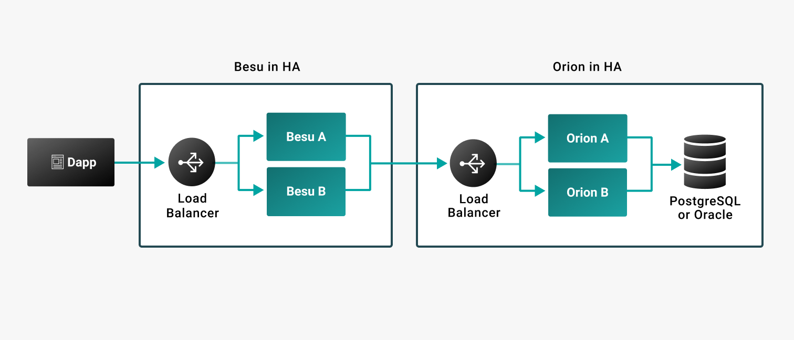

# Run Orion with Besu

To enable [privacy functionality](../../Concepts/Privacy/Privacy-Overview.md) in production
systems, [Orion](https://docs.orion.consensys.net/) must be [highly available](#high-availability)
and [run in a separate instance](#separate-instances) to Hyperledger Besu.

## High availability

Privacy requires you to
[configure Orion for high availability](https://docs.orion.consensys.net/HowTo/High-Availability/).

To successfully distribute a private transaction, all private transaction participants must be
online. If any participants are offline when submitting the private transaction, the transaction is
not attempted and you need to resubmit the transaction.

If an Orion node is unavailable when Besu attempts to process a privacy marker transaction, the
Besu node stops processing all new blocks until Orion is available. The Besu node continually
attempts to process the privacy marker transaction until Orion is available again.

!!! caution

    If Orion becomes available but has lost data, Besu resumes processing blocks and the private
    states in the Besu nodes might become inconsistent.

## Separate instances

For production systems, we recommend running Besu and Orion in separate instances. If running Besu
and Orion in the same instance, restrict the amount of memory used by each JVM to ensure each has
enough memory.
