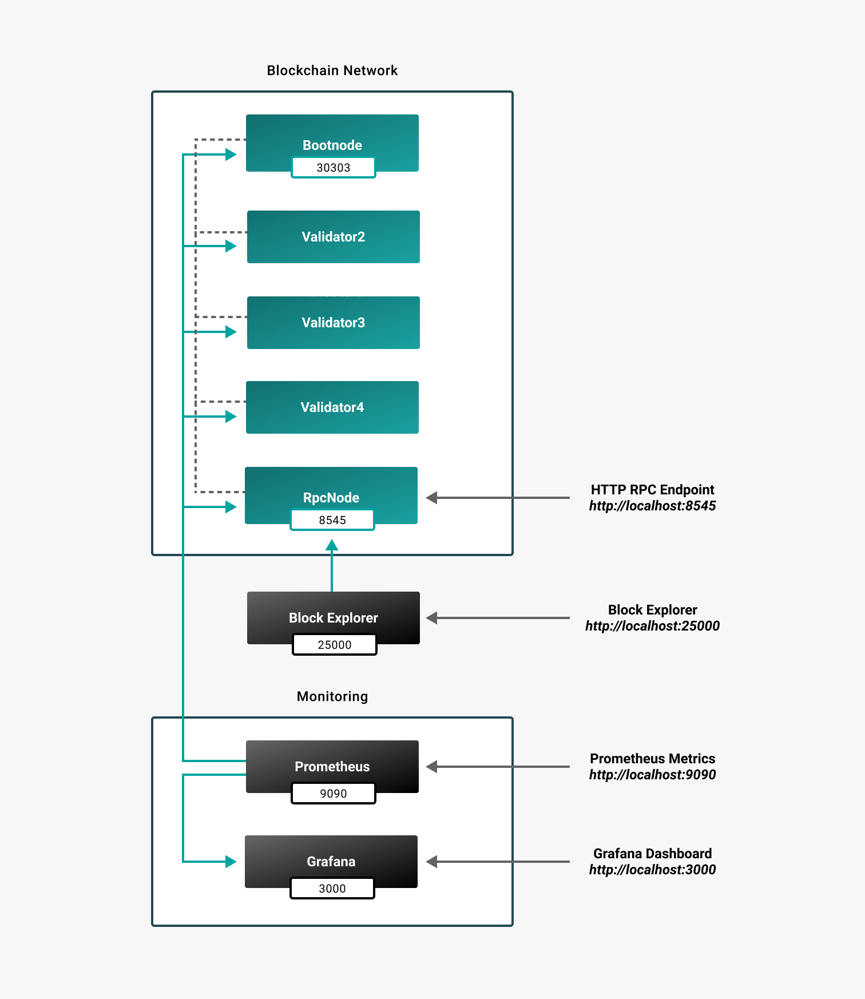
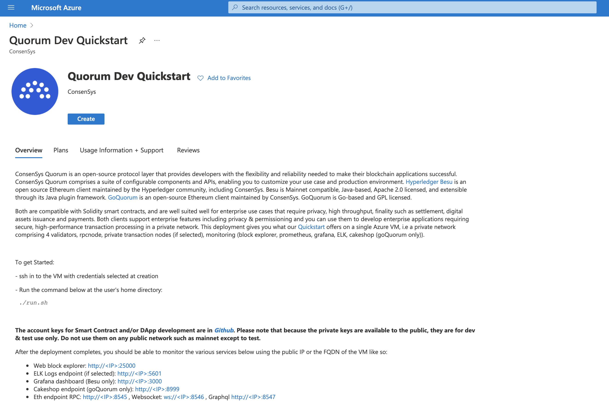
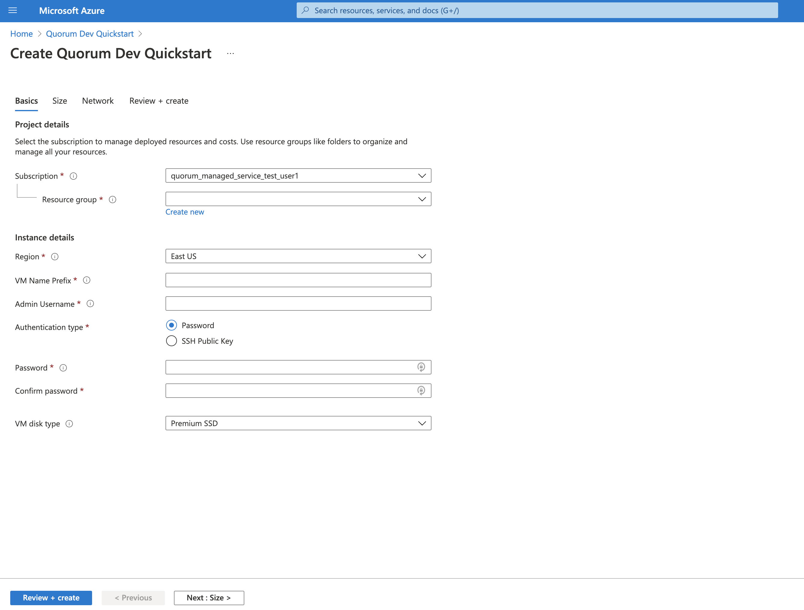
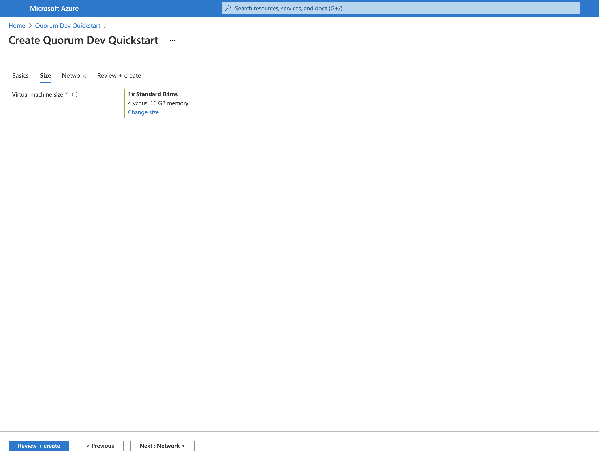
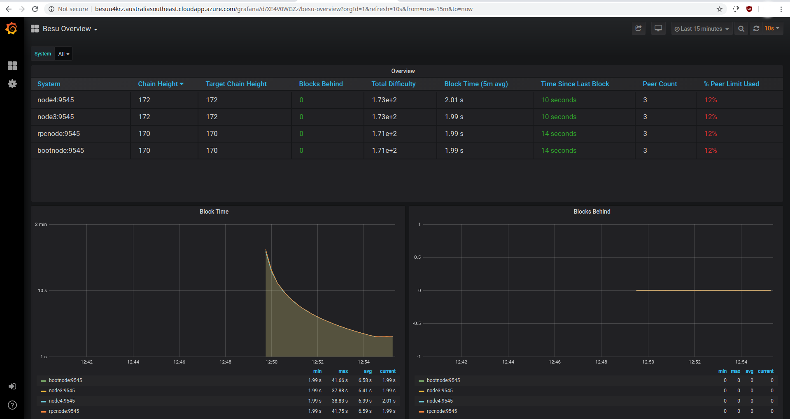

# Deploy private network example on Azure

The Hyperledger Besu Quickstart on [Azure](https://azuremarketplace.microsoft.com/en-us/marketplace/apps/consensys.hyperledger-besu-quickstart)
enables deploying a private IBFT 2.0 network, including:

* Bootnode
* RPC node
* 2 regular nodes
* Block explorer
* Prometheus and Grafana with the Besu dashboard installed.

The above is deployed on a single Azure VM in a matter of minutes.

Once deployed, you can develop and test applications and connect to the VS Code plugin using the RPC
endpoint: `http://<VM_IP>/jsonrpc`

## Overview

A high level overview of the deployed network is:

## Deploying

To deploy the private network example on Azure:

1. Create a Resource Group in the [Azure Portal](https://portal.azure.com).
 
2. Search for _Besu Quickstart_ or enter the URL `https://azuremarketplace.microsoft.com/en-us/marketplace/apps/consensys.hyperledger-besu-quickstart`
directly in your browser.

    The Hyperledger Besu Quickstart landing page is displayed.

    

3. Click the _Create_ button. The _Basics_ is displayed.

    

4. Enter:

    * Details of the Resource Group you created earlier
    * Basic user credentials to start a VM
    * Prefix for your new VM and any other resources created
    * Region to which you wish to deploy the VM.
 
5. Select the size of the VM you want to use.

    

6. To start the deployment, click the _Review + Create_ at the bottom left of the page.

    

     The deployment is started and typically takes around 3-5 minutes. The the progress of your
     deployment is displayed.

     When the deployment is complete, the resources created are displayed.

     

7. Click on the _Go to Resouce_ button. Everything created in the deployment is displayed.

    

8. Click on the VM name. The VM details such as the IP and DNS name are displayed. Use the IP and
DNS name displayed to connect to the VM, either in browser or via RPC calls.

    

## Block Explorer

To display the block explorer, open a new tab and enter either the IP of the VM, or the DNS name.

## Metrics

The deployment includes Prometheus metrics and Grafana with a custom _Besu Dashboard_ installed.
To display the dashboard:

1. Open a new tab and enter the IP or DNS name appended with _/grafana_.
For example: `http://<DNS_NAME_OF_VM>/grafana`.

2. Click on home and select the Besu dashboard.

    

The dashboard provides a visual way to monitor your network and nodes as the chain progresses.
Alerting can also be configured.

## Connecting to VM RPC Endpoint

You can connect DApps or develop directly from the IDE using the VS Code and connect to the VM RPC
endpoint. The endpoint is the DNS name appended with _/jsonrpc_: `http://<DNS_NAME_OF_VM>/jsonrpc`

## SSH

You can ssh into the VM to see how everything is set up and working. Use the credentials from
earlier and your preferred client:

`ssh username@<DNS_NAME_OF_VM>`

To list all containers running, run `docker ps`. Find the complete setup in `/home/<username>/besu-quickstart`.

