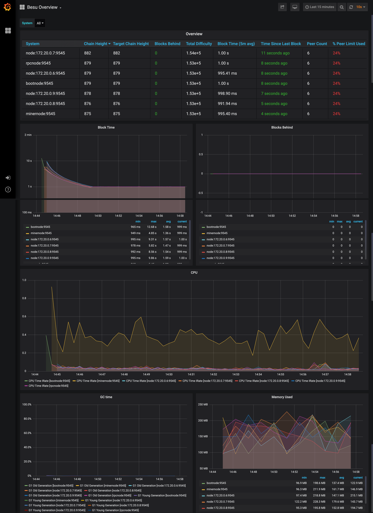
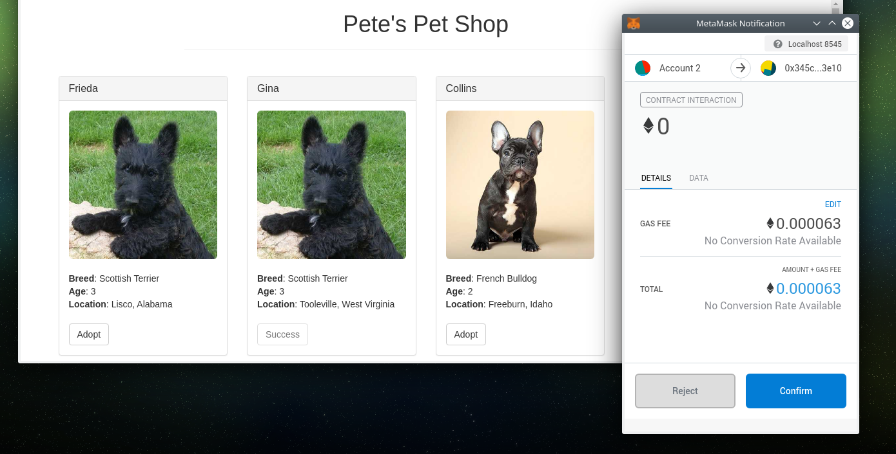
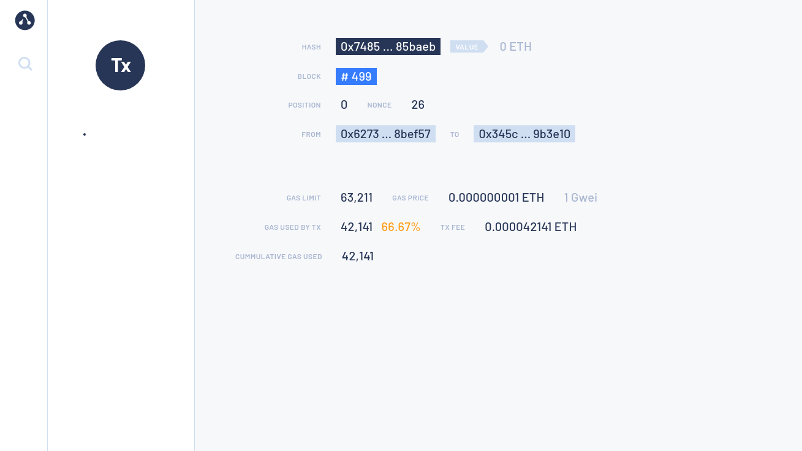

# Quorum Developer Quickstart tutorial

The Quorum Developer Quickstart uses the Hyperledger Besu Docker image to run a private
[IBFT2](../../HowTo/Configure/Consensus-Protocols/IBFT.md) network of Besu nodes managed by Docker Compose.

!!! warning
    This tutorial runs a private network suitable for education or demonstration purposes
    and is not intended for running production networks.

## Prerequisites

* One of the following operating systems is required:
    * Linux on x86_64 architecture.
    * macOS on an Intel processor (M1 processor not supported yet)
    * Windows 64bits edition
* [Docker and Docker-compose](https://docs.docker.com/compose/install/)
* On Windows only you will need:
    * Windows Subsystem for Linux 2
    * Docker desktop configured to use the WSL2-based engine.
    <!-- vale off -->
* [Node.js v6+ LTS](https://nodejs.org/en/)
    <!-- vale on -->
    installed and ready to use.
    The best way to install this tool it to use
    <!-- vale off -->
    [NVM](http://nvm.sh)
    <!-- vale on -->
    the Node Version Manager.
* [Truffle](https://www.trufflesuite.com/truffle) development framework installed:
* [cURL command line](https://curl.haxx.se/download.html)
* A Web browser with [MetaMask](https://metamask.io/) installed.
  MetaMask is currently available for Chrome, Firefox, Opera and Brave.

!!! important
    Ensure you allow Docker up to 4G of memory or 6G if running the privacy examples.
    Refer to the _Resources_ section in [Docker for Mac](https://docs.docker.com/docker-for-mac/) and
    [Docker Desktop](https://docs.docker.com/docker-for-windows/) for details.

## Generate the tutorial blockchain configuration files

To create the tutorial `docker-compose` files and artifacts, run:

```bash
npx quorum-dev-quickstart
```

Follow the prompts displayed to run Hyperledger Besu and [logging with ELK](../../HowTo/Monitor/Elastic-Stack.md).
Enter `n` for [Codefi Orchestrate](https://docs.orchestrate.consensys.net/en/stable/) and
[private transactions](../../Concepts/Privacy/Privacy-Overview.md).

## Start the network

To start the network, go to the installation directory (`quorum-test-network` if you used the default value) and run:

```bash
./run.sh
```

The script builds the Docker images, and runs the Docker containers.

Four Besu IBFT2 validator nodes and a non validator node are created to simulate a base network.

When execution is successfully finished, the process lists the available services:

!!! example "Services list"

    ```log
    *************************************
    Quorum Dev Quickstart
    *************************************
    ----------------------------------
    List endpoints and services
    ----------------------------------
    JSON-RPC HTTP service endpoint      : http://localhost:8545
    JSON-RPC WebSocket service endpoint : ws://localhost:8546
    Web block explorer address          : http://localhost:25000/
    Prometheus address                  : http://localhost:9090/graph
    Grafana address                     : http://localhost:3000/d/XE4V0WGZz/besu-overview?orgId=1&refresh=10s&from=now-30m&to=now&var-system=All
    Kibana logs address                 : http://localhost:5601/app/kibana#/discover

    For more information on the endpoints and services, refer to README.md in the installation directory.
    ****************************************************************
    ```

* Use the **JSON-RPC HTTP service endpoint** to access the RPC node service from your dapp or from
  cryptocurrency wallets such as MetaMask.
* Use the **JSON-RPC WebSocket service endpoint** to access the Web socket node service from your
  dapp.
* Use the **Web block explorer address** to display the block explorer Web application at [`http://localhost:25000`](http://localhost:25000).
* Use the **Prometheus address** to access the
  [Prometheus dashboard](http://localhost:9090/graph).
  _[Read more about metrics](../../HowTo/Monitor/Metrics.md)_.
* Use the **Grafana address** to access the
  [Grafana dashboard](http://localhost:3000/d/XE4V0WGZz/besu-overview?orgId=1&refresh=10s&from=now-30m&to=now&var-system=All).
  _[Read more about metrics](../../HowTo/Monitor/Metrics.md)_.
* Use the **Kibana logs address** to access the
  [logs in Kibana](http://localhost:5601/app/kibana#/discover).
  _[Read more about log management](../../HowTo/Monitor/Elastic-Stack.md)_.

To display the list of endpoints again, run:

```bash
./list.sh
```

## Block explorer

This tutorial uses a modified version of the [Alethio Ethereum Lite Explorer](https://github.com/Alethio/ethereum-lite-explorer).

Access the explorer at [`http://localhost:25000`](http://localhost:25000) as displayed when starting
the private network.

The block explorer displays a summary of the private network, indicating four peers.

Click the block number to the right of **Best Block** to display the block details:


You can explore blocks by clicking on the blue blocks under **`Bk`** on the left-hand side.

You can search for a specific block, transaction hash, or address by clicking the :mag:
in the top left-hand corner.


## Monitor nodes with Prometheus and Grafana

The sample network also includes Prometheus and Grafana monitoring tools to let you visualise
node health and usage.
You can directly access these tools from your browser at the addresses displayed in the endpoint list.

* [Prometheus dashboard](http://localhost:9090/graph).
* [Grafana dashboard](http://localhost:3000/d/XE4V0WGZz/besu-overview?orgId=1&refresh=10s&from=now-30m&to=now&var-system=All).

For more details on how to configure and use these tools for your own nodes, see our
[performances monitoring documentation](../../HowTo/Monitor/Metrics.md),
the [Prometheus documentation](https://prometheus.io/docs/introduction/overview/)
and [Grafana documentation](https://grafana.com/docs/).



## Run JSON-RPC requests

You can run JSON-RPC requests on:

* HTTP with `http://localhost:8545`.
* and Websocket with `ws://localhost:8546`.

### Run with `cURL`

This tutorial uses [cURL](https://curl.haxx.se/download.html) to send JSON-RPC requests over HTTP.

### Run with Postman

You can also run all the requests with the Besu Postman collection.

{!global/Postman.md!}

### Request the node version

Run the following command from the host shell:

```bash
curl -X POST --data '{"jsonrpc":"2.0","method":"web3_clientVersion","params":[],"id":1}' http://localhost:8545
```

The result displays the client version of the running node:

=== "Result example"

    ```json
    {
    "jsonrpc" : "2.0",
    "id" : 1,
    "result" : "besu/v21.1.2/linux-x86_64/oracle_openjdk-java-11"
    }
    ```

=== "Result explanation"

    * `"jsonrpc" : "2.0"` indicates the that JSON-RPC 2.0 spec format is used.
    * `"id" : 1` is the request identifier used to match the request and the response. This tutorial always uses 1.
    * `"result"` contains the running Besu information:
        * `v21.1.2` is the running Besu version number. This may be different when you run this tutorial.
        * `linux-x86_64` is the architecture used to build this version.
        * `oracle_openjdk-java-11` is the JVM type and version used to build this version. This may be different when you run this tutorial.

Successfully calling this method shows that you can connect to the nodes using JSON-RPC over HTTP.

From here, you can walk through more interesting requests demonstrated in the rest of this section,
or skip ahead to [Create a transaction using MetaMask](#create-a-transaction-using-metamask).

### Count the peers

Peers are the other nodes connected to the node receiving the JSON-RPC request.

Poll the peer count using [`net_peerCount`](../../Reference/API-Methods.md#net_peercount):

```bash
curl -X POST --data '{"jsonrpc":"2.0","method":"net_peerCount","params":[],"id":1}' http://localhost:8545
```

The result indicates that there are four peers (our validators):

```json
{
  "jsonrpc" : "2.0",
  "id" : 1,
  "result" : "0x4"
}
```

### Request the most recent block number

Call [`eth_blockNumber`](../../Reference/API-Methods.md#eth_blockNumber) to retrieve the number of the most recently synchronised block:

```bash
curl -X POST --data '{"jsonrpc":"2.0","method":"eth_blockNumber","params":[],"id":1}' http://localhost:8545
```

The result indicates the highest block number synchronised on this node.

```json
{
  "jsonrpc" : "2.0",
  "id" : 1,
  "result" : "0x2a"
}
```

Here the hexadecimal value `0x2a` translates to decimal as `42`, the number of blocks received by the node so far,
about 2 minutes after the new network started.

## Create a transaction using MetaMask

You will now use [MetaMask](https://metamask.io/) to send a transaction on your private network.

* Open MetaMask and connect it to your private network RPC endpoint by selecting `Localhost 8545` in the network list.
* Choose one of the following test accounts and [import it into MetaMask by copying the corresponding private key](https://metamask.zendesk.com/hc/en-us/articles/360015489331-How-to-import-an-Account).

{!global/test_accounts.md!}

!!!note

    Besu doesn't incorporate
    [account management](../../HowTo/Send-Transactions/Account-Management.md). To create your own
    account, you have to use a third-party tool, such as MetaMask.

When you're finished importing an existing test account, [create another test account from scratch]
to use as the recipient for a test Ether transaction.

In MetaMask, select the new test account and [copy its address](https://metamask.zendesk.com/hc/en-us/articles/360015289512-How-to-copy-your-MetaMask-Account-Public-Address).

In the [Block Explorer](http://localhost:25000), search for the new test account by clicking on the :mag: and pasting
the test account address into the search box.

The new test account displays with a zero balance.

[Send test Ether](https://metamask.zendesk.com/hc/en-us/articles/360015488991-Sending-Ether-New-UI-)
from the first test account (containing test Ether) to the new test account (which has a zero balance).

!!!tip

    You can use a zero gas price here as this private test network is a [free gas network](../../HowTo/Configure/FreeGas.md)
    but the maximum amount of gas that can be used (the gas limit) for a value transaction must be at least 21000.

Refresh the Block Explorer page in your browser displaying the target test account.

The updated balance displays and reflects the transaction completed using MetaMask.

## Smart contract and dapp usage

You are now going to use a demo dapp called Pet Shop and provided by [Truffle](https://www.trufflesuite.com/tutorials/pet-shop).

This dapp will run a local website using Docker and use smart contracts on the blockchain that you started in the previous steps.

The network directory created by `quorum-dev-quickstart` at the beginning of this tutorial has a
`dapps` directory with a `pet-shop` sub-directory containing the source code for the dapp
including the smart contracts, website and configurations to run this tutorial.

With the blockchain running and MetaMask connected to `Localhost 8545` via the browser,
run the following command to start the Pet Shop dapp:

```bash
cd dapps/pet-shop
./run-dapp.sh
```

The script will:

* Install the dapp Node dependencies (you may see some warning here, but it will not prevent the dapp to run).
* compiles the contracts.
* deploy then to the blockchain.
* runs tests.
* Build and run a Docker image to serve the dapp website.

!!! example "`./run-dapp.sh` example output"

    ```text
    Compiling your contracts...
    ===========================
    > Compiling ./contracts/Adoption.sol
    > Compiling ./contracts/Migrations.sol
    > Artifacts written to /Users/demo/quorum-test-network/dapps/pet-shop/pet-shop-box/build/contracts
    > Compiled successfully using:
        - solc: 0.5.16+commit.9c3226ce.Emscripten.clang

    Starting migrations...
    ======================
    > Network name:    'quickstartWallet'
    > Network id:      1337
    > Block gas limit: 16234336 (0xf7b760)

    1_initial_migration.js
    ======================

        Deploying 'Migrations'
        ----------------------
        > transaction hash:    0xdd27f5bc5b0c4a42bb4f4d9ba00b4d33742de10ba8f03484cbf095ee824ba11a
        > Blocks: 0            Seconds: 0
        > contract address:    0xFB88dE099e13c3ED21F80a7a1E49f8CAEcF10df6
        > block number:        2747
        > block timestamp:     1618000437
        > account:             0x627306090abaB3A6e1400e9345bC60c78a8BEf57
        > balance:             89999.97435026
        > gas used:            221555 (0x36173)
        > gas price:           20 gwei
        > value sent:          0 ETH
        > total cost:          0.0044311 ETH


        > Saving migration to chain.
        > Saving artifacts
           -------------------------------------
        > Total cost:           0.0044311 ETH

    2_deploy_contracts.js
    =====================

        Deploying 'Adoption'
        --------------------
        > transaction hash:    0xd6f5b11807a0727a92b6063c95b9101769d310592b0d3cf35d6df233d05d50e6
        > Blocks: 0            Seconds: 0
        > contract address:    0xf204a4Ef082f5c04bB89F7D5E6568B796096735a
        > block number:        2749
        > block timestamp:     1618000441
        > account:             0x627306090abaB3A6e1400e9345bC60c78a8BEf57
        > balance:             89999.968712
        > gas used:            239915 (0x3a92b)
        > gas price:           20 gwei
        > value sent:          0 ETH
        > total cost:          0.0047983 ETH


        > Saving migration to chain.
        > Saving artifacts
           -------------------------------------
        > Total cost:           0.0047983 ETH

    Summary
    =======
    > Total deployments:   2
    > Final cost:          0.0092294 ETH


    Using network 'quickstartWallet'.

    Compiling your contracts...
    ===========================
    > Compiling ./test/TestAdoption.sol

    TestAdoption
    ✓ testUserCanAdoptPet (2071ms)
    ✓ testGetAdopterAddressByPetId (6070ms)
    ✓ testGetAdopterAddressByPetIdInArray (6077ms)

    3 passing (37s)
    ```

    After these tests are successful, it builds a container for the Pet Shop DApp and deploys it,
    binding it to port 3001 on your system.

    ```text
    Sending build context to Docker daemon  489.4MB
    Step 1/5 : FROM node:12.14.1-stretch-slim
    ---> 2f7e25ad14ea
    Step 2/5 : EXPOSE 3001
    ---> Using cache
    ---> 2ef0665a040a
    Step 3/5 : WORKDIR /app
    ---> Using cache
    ---> e8e97cedb575
    Step 4/5 : COPY . /app
    ---> f70e4265e598
    Step 5/5 : CMD npm run dev
    ---> Running in 3c6e8bdb3f3b
    Removing intermediate container 3c6e8bdb3f3b
    ---> ce2588e47ab0
    Successfully built ce2588e47ab0
    Successfully tagged quorum-dev-quickstart_pet_shop:latest
    b1615ab765656bc027f63fc60019dba1ca572305766c820f41eaf113b7e14cf8
    ```

In the browser where you have MetaMask enabled and the account loaded, open a new tab and navigate
to [the Pet Shop dapp](http://localhost:3001) where you can adopt lovely pets (sorry, not for real, it's a demo).

When you click on 'Adopt', a MetaMask window will pop up and request your permissions to continue
with the transaction.

After the transaction is complete and successful, the status of the pet you adopted will show 'Success'.



You can also search for the transaction and view its details in the [Block Explorer](http://localhost:25000/).



The MetMask UI also keeps a record of the transaction.


## Stop and restart the private network without removing containers

To shut down the private network without deleting the containers:

=== "Linux/MacOS"

    ```bash
    ./stop.sh
    ```

This command stops the containers related to the services specified in the `docker-compose.yml`
file.

To restart the private network:

=== "Linux/MacOS"

    ```bash
    ./resume.sh
    ```

## Stop the private network and remove containers

To shut down the private network and delete all containers and images created from running the
sample network and the PetShop dapp:

=== "Linux/MacOS"

    ```bash
    ./remove.sh
    ```

<!-- Links -->
[Import one of the existing accounts above into MetaMask]: https://metamask.zendesk.com/hc/en-us/articles/360015489331-Importing-an-Account-New-UI-
[create another test account from scratch]: https://metamask.zendesk.com/hc/en-us/articles/360015289452-Creating-Additional-MetaMask-Wallets-New-UI-
