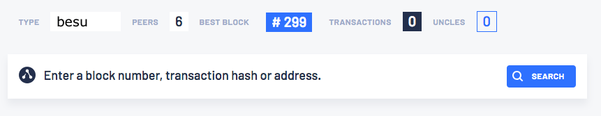
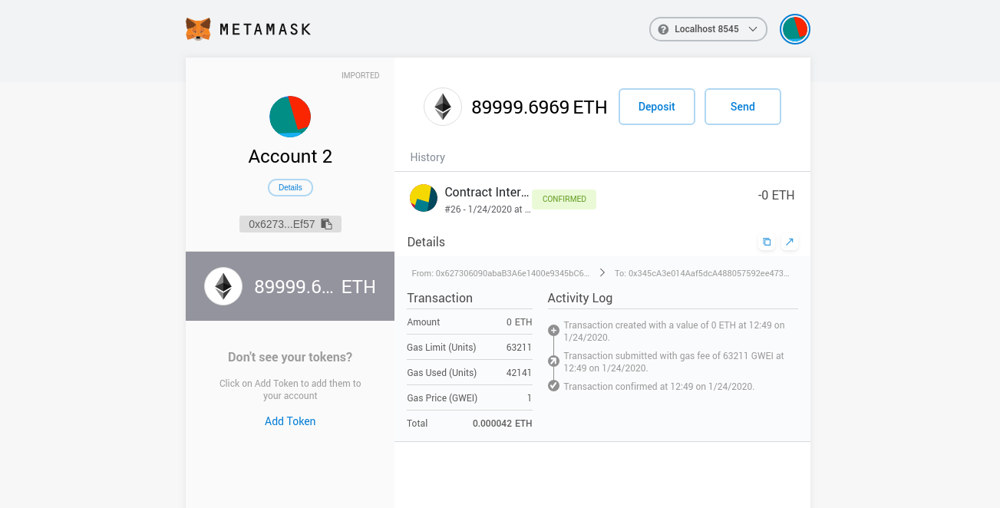

# Private network example tutorial

The private network example uses the Hyperledger Besu Docker image to run a private network of Besu
nodes managed by Docker Compose.

!!! important

    This tutorial runs a private network suitable for education or demonstration purposes and is
    not intended for running production networks.

## Prerequisites

To run this tutorial, you must have the following installed:

* [Docker and Docker-compose](https://docs.docker.com/compose/install/)

    !!! important

        If using [MacOS](https://docs.docker.com/docker-for-mac/) or
        [Windows](https://docs.docker.com/docker-for-windows/), set Docker to use up to 6GB of
        memory on the _Advanced_ tab in _Preferences_.

* [Git command line](https://git-scm.com/)
* [Curl command line](https://curl.haxx.se/download.html)
* A web browser that supports [Metamask](https://metamask.io/) (currently Chrome, Firefox, Opera,
  and Brave), and has the MetaMask plug-in installed. This tutorial uses screenshots from Brave.

## Clone Besu sample networks source code

Clone the repository from the `besu-sample-networks` repository:

```bash tab="Linux/MacOS"
git clone https://github.com/PegaSysEng/besu-sample-networks.git
```

!!!note

    To use a specific version of Hyperledger Besu, set the `BESU_VERSION` environment variable.

## Start the network

!!!important

    If running in Windows, run commands from the GitBash shell.

This tutorial uses [Docker Compose](https://docs.docker.com/compose/) to assemble the images and
run the private network. To build the docker images and run the containers, go to the
`besu-sample-networks` directory and run:

```bash tab="Linux/MacOS"
./run.sh
```

The script builds the images, and runs the containers. It also scales the regular node container to
four containers to simulate a network with enough peers to synchronize.

When the process ends, it lists the running services:

!!! example "Docker-compose services list example"

    ```log
    *************************************
    Sample Network for Besu at latest
    *************************************
    List endpoints and services
    ----------------------------------
                 Name                            Command               State                                        Ports
    -----------------------------------------------------------------------------------------------------------------------------------------------------------
    besu-sample-network_bootnode_1        /opt/besu/bootnode_start.s ...   Up      0.0.0.0:30303->30303/tcp, 0.0.0.0:30303->30303/udp, 8545/tcp, 8546/tcp, 8547/tcp
    besu-sample-network_elasticsearch_1   /usr/local/bin/docker-entr ...   Up      9200/tcp, 9300/tcp
    besu-sample-network_explorer_1        nginx -g daemon off;             Up      0.0.0.0:25000->80/tcp
    besu-sample-network_filebeat_1        /usr/local/bin/docker-entr ...   Up
    besu-sample-network_grafana_1         /run.sh                          Up      0.0.0.0:3000->3000/tcp
    besu-sample-network_kibana_1          /usr/local/bin/dumb-init - ...   Up      0.0.0.0:5601->5601/tcp
    besu-sample-network_logstash_1        /usr/local/bin/docker-entr ...   Up      5044/tcp, 9600/tcp
    besu-sample-network_minernode_1       /opt/besu/node_start.sh -- ...   Up      30303/tcp, 8545/tcp, 8546/tcp, 8547/tcp
    besu-sample-network_node_1            /opt/besu/node_start.sh -- ...   Up      30303/tcp, 8545/tcp, 8546/tcp, 8547/tcp
    besu-sample-network_prometheus_1      /bin/prometheus --config.f ...   Up      0.0.0.0:9090->9090/tcp
    besu-sample-network_redis_1           docker-entrypoint.sh redis ...   Up      6379/tcp
    besu-sample-network_rpcnode_1         /opt/besu/node_start.sh -- ...   Up      30303/tcp, 0.0.0.0:8545->8545/tcp, 8546/tcp, 8547/tcp
    Setting up the besu index pattern in kibana
    {"type":"index-pattern","id":"besu","attributes":{"title":"besu-*","timeFieldName":"@timestamp"},"references":[],"migrationVersion":{"index-pattern":"6.5.0"},"updated_at":"2019-12-27T04:41:07.665Z","version":"WzMsMV0="}
    Orion not running, skipping the orion index pattern in kibana.
    ```

Followed by a list of the endpoints:

!!! example "Endpoint list example"

    ```log
    ****************************************************************
    JSON-RPC HTTP service endpoint      : http://localhost:8545
    JSON-RPC WebSocket service endpoint : ws://localhost:8546
    GraphQL HTTP service endpoint       : http://localhost:8547
    Web block explorer address          : http://localhost:25000/
    Prometheus address                  : http://localhost:9090/graph
    Grafana address                     : http://localhost:3000/d/XE4V0WGZz/besu-overview?orgId=1&refresh=10s&from=now-30m&to=now&var-system=All
    Kibana logs address                 : http://localhost:5601/app/kibana#/discover
    ****************************************************************
    ```

* Use the **JSON-RPC HTTP service endpoint** to access the RPC node service from your Dapp or from
  cryptocurrency wallets such as Metamask.
* Use the **JSON-RPC WebSocket service endpoint** to access the web socket node service from your
  Dapp.
* Use the **GraphQL HTTP service endpoint** to access the
  [HTTP GraphQL](../../HowTo/Interact/APIs/GraphQL.md) node service from your Dapp.
* Use the **Web block explorer address** to display the block explorer web application. View the
  block explorer by entering the URL in your web browser.
* Use the **Prometheus address** to access the
  [Prometheus dashboard](../../HowTo/Monitor/Metrics.md).
* Use the **Grafana address** to access the
  [Grafana dashboard](../../HowTo/Monitor/Metrics.md).
* Use the **Kibana logs address** to access the
  [logs in Kibana](../../HowTo/Monitor/Elastic-Stack.md).

To display the list of endpoints again, run:

```bash tab="Linux/MacOS"
./list.sh
```

## Block explorer

This tutorial uses the Alethio Ethereum Lite Explorer.

### Run the block explorer

Access the explorer by copying and pasting the `Web block explorer address` displayed when starting
the private network to your browser.

The block explorer displays a summary of the private network:



See that the explorer indicates six peers: the four regular nodes, the mining node, and the
bootnode.

Click the block number to the right of **Best Block** to display the block details:


You can explore blocks by clicking on the blocks under **Bk** on the left-hand side.

You can search for a specific block, transaction hash, or address by clicking the magnifying glass
in the top left-hand corner.


## Monitor nodes with Prometheus and Grafana

The sample network also includes Prometheus and Grafana monitoring tools to let you visualise
node health and usage. You can directly access these tools from your browser at the addresses
displayed in the endpoint list.

For more details on how to configure and use these tools for your own nodes, see our
[performances monitoring documentation](../../HowTo/Monitor/Metrics.md), as well as
[Prometheus documentation](https://prometheus.io/docs/introduction/overview/) and
[Grafana documentation](https://grafana.com/docs/).


## Run JSON-RPC requests

You can run RPC requests on `rpcnode`, the node exposed to the host to listen for requests. This
tutorial uses [cURL](https://curl.haxx.se/download.html) to make JSON-RPC requests.

For the RPC URL, this tutorial uses the placeholder `<http-rpc-endpoint>`. When you run the
tutorial, replace this placeholder with the JSON-RPC HTTP service endpoint provided when you list
the endpoints. (For example, `http://localhost:8545`.) The dynamic docker port mapping changes each
time you run the network.

{!global/Postman.md!}

### Request the node version

Run the following command from the host shell:

```bash
curl -X POST --data '{"jsonrpc":"2.0","method":"web3_clientVersion","params":[],"id":1}' <http-rpc-endpoint>
```

The result specifies the client version:

```json
{
   "jsonrpc" : "2.0",
   "id" : 1,
   "result" : "besu/<version number>"
}
```

Here we query the version of the Besu node, which confirms the node is running.

Successfully calling this method shows that you can connect to the nodes using RPC. From here, you
can walk through more interesting requests demonstrated in the rest of this section, or skip ahead
to [Create a transaction using MetaMask](#create-a-transaction-using-metamask).

### Count the peers

Peers are the number of other nodes connected to the RPC node.

Poll the peer count using `net_peerCount`:

```bash
curl -X POST --data '{"jsonrpc":"2.0","method":"net_peerCount","params":[],"id":1}' <http-rpc-endpoint>
```

The result indicates that there are six peers:

```json
{
  "jsonrpc" : "2.0",
  "id" : 1,
  "result" : "0x6"
}
```

### Request the most recently mined block number

Call `eth_blockNumber` to retrieve the number of the most recent block:

```bash
curl -X POST --data '{"jsonrpc":"2.0","method":"eth_blockNumber","params":[],"id":1}' <http-rpc-endpoint>
```

The result provides the most recently mined block:

```json
{
  "jsonrpc" : "2.0",
  "id" : 1,
  "result" : "0x8b8"
}
```

The hexadecimal value `0x8b8` translates to `2232` in decimal, the number of mined blocks so far.

### Check the miner account balance

Call `eth_getBalance` to retrieve the balance of the mining address (coinbase) defined in the miner
node:

```bash
curl -X POST --data '{"jsonrpc":"2.0","method":"eth_getBalance","params":["0xfe3b557e8fb62b89f4916b721be55ceb828dbd73","latest"],"id":1}' <http-rpc-endpoint>
```

The result specifies the miner account balance:

```json
{
  "jsonrpc" : "2.0",
  "id" : 1,
  "result" : "0x79f905c6fd34e80000"
}
```

!!!info

    0x79f905c6fd34e80000 = 2250000000000000000000 Wei (2250 Ether).

!!!tip

    Use a [unit converter](https://www.etherchain.org/tools/unitConverter) to translate values from
    Wei to Ether.

Wait a few seconds until there are new mined blocks then call `eth_getBalance` again. The balance
increases, meaning the miner address successfully received the mining reward.

You can also view this information in the block explorer. It does exactly the same thing as this
call, connecting to the RPC node using HTTP JSON-RPC, and displaying information on a web page.

## Create a transaction using MetaMask

Now let's use [MetaMask](https://metamask.io/) to send transactions.

Before sending transactions, you need to create an account or use one of the accounts below
created during the genesis of this private test network.

{!global/test_accounts.md!}

!!!note

    Besu doesn't incorporate
    [account management](../../HowTo/Send-Transactions/Account-Management.md). To create your own
    account, you have to use a third-party tool, such as MetaMask.

After you sign in to MetaMask, connect to the private network RPC endpoint:

1. In the MetaMask network list, select **Custom RPC**.
1. In the **New RPC URL** field, enter the JSON-RPC HTTP service endpoint displayed when you
   started the private network.

Save the configuration and return to the MetaMask main screen. Your current network is now set to
the private network RPC node.

[Import one of the existing accounts above into MetaMask] using the corresponding private key.

!!!note

    In this tutorial, we don't need to secure the keys, because we're using a private test network
    to send valueless Ether. In a production environment, be sure to secure your accounts on the
    main Ethereum network (MainNet).

When you're finished importing an existing account, [create another account from scratch] to send
Ether to.

In MetaMask, select the new account and copy the account address by clicking the **&hellip;**
gadget and selecting **Copy Address to clipboard**.

In the block explorer, search for the new account by clicking on the magnifying glass and pasting
the account address into the search box. The account displays with a zero balance.

[Send Ether](https://metamask.zendesk.com/hc/en-us/articles/360015488991-Sending-Ether-New-UI-)
from the first account (containing ether) to the new account (which has a zero balance).

Refresh the browser page displaying the new account. The updated balance displays and reflects the
transaction completed using MetaMask.

## Smart contract and DApp usage with the blockchain network

We are going to use the
[PetShop tutorial on Truffle website](https://truffleframework.com/tutorials/pet-shop) with a few
modifications, so we use the private network in this tutorial as the blockchain network.

### Prerequisites

* [Node.js v6+ LTS and npm](https://nodejs.org/en/) (comes with Node)
* Import an account into Metamask using the private key
  `0xc87509a1c067bbde78beb793e6fa76530b6382a4c0241e5e4a9ec0a0f44dc0d3`. The following steps use
  this account.

### Install Truffle

Install Truffle:

```bash
npm install -g truffle
```

!!! note

    `npm` requires `sudo` on Linux.

The source code for the smart contract and DApp are in the `pet-shop` folder. With the blockchain
running and Metamask connected to it via the browser, run the command below to start the DApp.

The script first compiles the contract, then performs a migration to the blockchain network and
then runs some tests. You can then search for the deployed contracts and transactions in the Web
Block Explorer using the addresses displayed in your output earlier `http://localhost:32768/`
(your port will differ). Similar output to the following displays (your addresses will differ).

!!! example

     ```bash tab="Linux/MacOS command"
     ./run-dapp.sh
     ```

    ```log tab="DApp result"
    Compiling your contracts...
    ===========================
    > Compiling ./contracts/Adoption.sol
    > Compiling ./contracts/Migrations.sol

    Starting migrations...
    ======================
    > Network name:    'quickstartWallet'
    > Network id:      2018
    > Block gas limit: 0xf7b760

    1_initial_migration.js
    ======================

       Replacing 'Migrations'
       ----------------------
       > transaction hash:    0x10f5ebaca0e89fa84bcae19d6848dde19817ea3cf270be0fd0ab52f041a02c61
       > Blocks: 0            Seconds: 0
       > contract address:    0x8CdaF0CD259887258Bc13a92C0a6dA92698644C0
       > block number:        64
       > block timestamp:     1579833316
       > account:             0x627306090abaB3A6e1400e9345bC60c78a8BEf57
       > balance:             89999.99472518
       > gas used:            263741
       > gas price:           20 gwei
       > value sent:          0 ETH
       > total cost:          0.00527482 ETH

       > Saving migration to chain.
       > Saving artifacts
       -------------------------------------
       > Total cost:          0.00527482 ETH

    2_deploy_contracts.js
    =====================

       Replacing 'Adoption'
       --------------------
       > transaction hash:    0x56f39e2411f2e95b89832c6ff81b619815ee83db1c54d2b166ecdc3ceda633a8
       > Blocks: 0            Seconds: 0
       > contract address:    0x345cA3e014Aaf5dcA488057592ee47305D9B3e10
       > block number:        66
       > block timestamp:     1579833320
       > account:             0x627306090abaB3A6e1400e9345bC60c78a8BEf57
       > balance:             89999.9890877
       > gas used:            239851
       > gas price:           20 gwei
       > value sent:          0 ETH
       > total cost:          0.00479702 ETH

       > Saving migration to chain.
       > Saving artifacts
       -------------------------------------
       > Total cost:          0.00479702 ETH

    Summary
    =======
    > Total deployments:   2
    > Final cost:          0.01007184 ETH

    Compiling your contracts...
    ===========================
    > Compiling ./test/TestAdoption.sol

      TestAdoption
        ✓ testUserCanAdoptPet (2071ms)
        ✓ testGetAdopterAddressByPetId (6070ms)
        ✓ testGetAdopterAddressByPetIdInArray (6077ms)

      3 passing (37s)
    ```

After these tests are successful, it builds a container for the Pet Shop DApp and deployes it,
binding it to port 3001 on your system.

In the browser that you have metamask enabled and the account loaded, open a new tab and navigate
to `http://localhost:3001` which should have the Pet Shop running, and you can adopt pets from the
app. When you click on 'Adopt', a Metamask window should pop up and ask for permissions to continue
with the transaction. After the transaction is complete and successful, the status of the pet you
adopted will show 'Success'.


You can also search for the transaction and view its details in the Block Explorer UI at
http://localhost:25000/.


The Metmask UI also keeps a record of the transaction.



## Stop and restart the private network without removing containers

To shut down the private network without deleting the containers:

```bash tab="Linux/MacOS"
./stop.sh
```

This command stops the containers related to the services specified in the `docker-compose.yml`
file.

To restart the private network:

```bash tab="Linux/MacOS"
./resume.sh
```

## Stop the private network and remove containers

To shut down the private network and delete all containers and images created from running the
sample network:

```bash tab="Linux/MacOS"
./remove.sh
```

<!-- Links -->
[Import one of the existing accounts above into MetaMask]: https://metamask.zendesk.com/hc/en-us/articles/360015489331-Importing-an-Account-New-UI-
[create another account from scratch]: https://metamask.zendesk.com/hc/en-us/articles/360015289452-Creating-Additional-MetaMask-Wallets-New-UI-