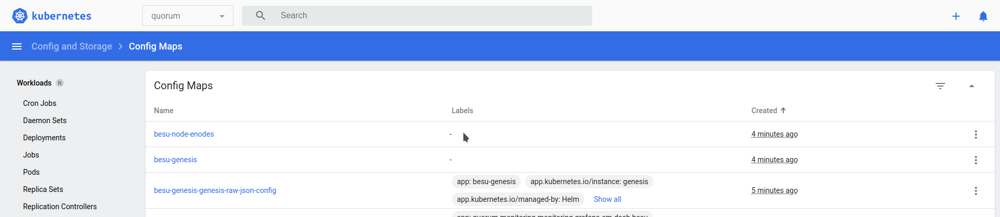
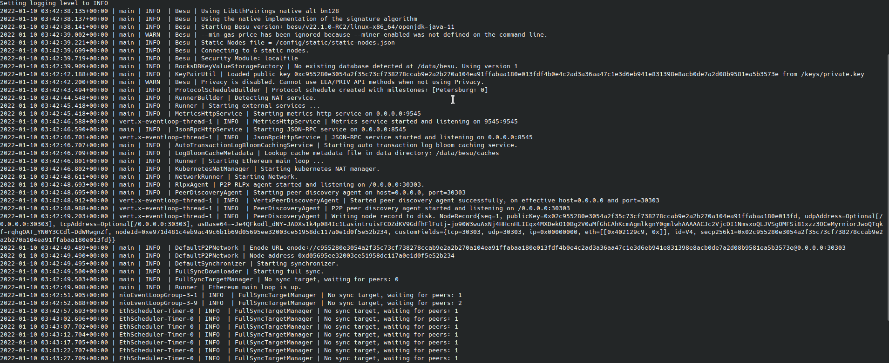
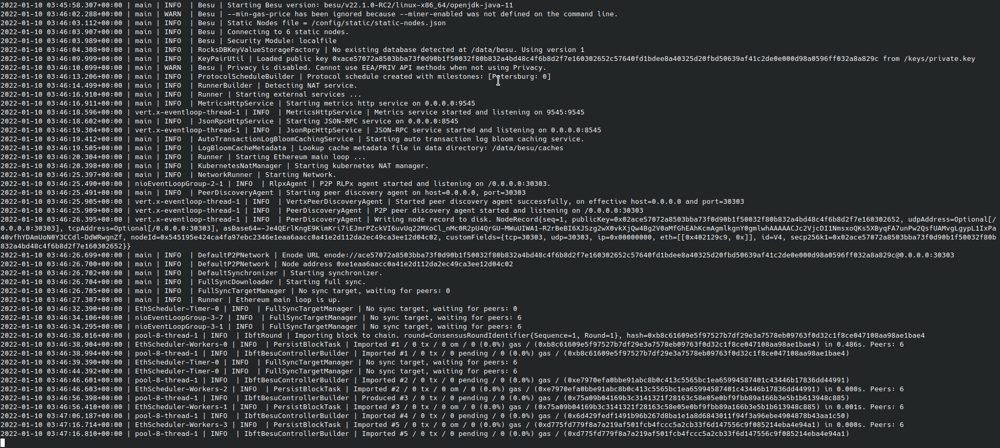

## Prerequisites

* Clone the [Quorum-Kubernetes](https://github.com/ConsenSys/quorum-kubernetes) repository
* A [running Kubernetes cluster](./Create-Cluster.md)
* Install [Kubectl](https://kubernetes.io/docs/tasks/tools/)
* Install [Helm3](https://helm.sh/docs/intro/install/)

## Provision with Helm charts

Helm allows you to package a collection of objects into a chart which can be deployed to the cluster. For the
rest of this tutorial we use the **[Dev](https://github.com/ConsenSys/quorum-kubernetes/tree/master/dev)** Helm charts.
After cloning the [Quorum-Kubernetes](https://github.com/ConsenSys/quorum-kubernetes) repository, change
to the `dev` directory for the rest of this tutorial.

```bash
cd dev/helm
```

If you're running the cluster on AWS or Azure, update the `values.yml` with `provider: aws` or
`provider: azure` as well.

!!! note

    You can customize any of the charts in this repository to suit your requirements, and make pull requests to
    extend functionality.

### 1. Check that you can connect to the cluster with `kubectl`

Verify kubectl is connected to cluster using:

```bash
kubectl version
```

The result looks similar to:

```bash
Client Version: version.Info{Major:"1", Minor:"23", GitVersion:"v1.23.1", GitCommit:"86ec240af8cbd1b60bcc4c03c20da9b98005b92e", GitTreeState:"clean", BuildDate:"2021-12-16T11:41:01Z", GoVersion:"go1.17.5", Compiler:"gc", Platform:"linux/amd64"}
Server Version: version.Info{Major:"1", Minor:"22", GitVersion:"v1.22.3", GitCommit:"c92036820499fedefec0f847e2054d824aea6cd1", GitTreeState:"clean", BuildDate:"2021-10-27T18:35:25Z", GoVersion:"go1.16.9", Compiler:"gc", Platform:"linux/amd64"}
```

### 2. Deploy the network

This tutorial isolates groups of resources (for example, StatefulSets and Services) within a single cluster.

!!! note

    The rest of this tutorial uses `besu` as the namespace,
    but you're free to pick any name when deploying, as long as it's consistent across the
    [infrastructure scripts](./Create-Cluster.md) and charts.

Run the following in a terminal window:

```bash
kubectl create namespace besu
```

### 3. Deploy the metrics chart

This chart deploys Prometheus and Grafana to monitor the cluster, nodes, and state of the network.
Each Besu pod has [`annotations`](https://kubernetes.io/docs/concepts/overview/working-with-objects/annotations/)
which allow Prometheus to scrape metrics from the pod at a specified port and path. For example:

```bash
  template:
    metadata:
      annotations:
        prometheus.io/scrape: "true"
        prometheus.io/port: 9545
        prometheus.io/path: "/metrics"
```

Update the admin `username` and `password` in the [monitoring values file](https://github.com/ConsenSys/quorum-kubernetes/blob/master/dev/helm/values/monitoring.yml),
then deploy the chart using:

```bash
helm repo add prometheus-community https://prometheus-community.github.io/helm-charts
helm repo update
helm install monitoring prometheus-community/kube-prometheus-stack --version 34.6.0 --namespace=quorum --create-namespace --values ./values/monitoring.yml --wait
kubectl --namespace quorum apply -f  ./values/monitoring/
```

!!! warning

     For production use cases, configure Grafana with one of the supported [native auth mechanisms](https://grafana.com/docs/grafana/latest/auth/). Also remember to
     configure alerts to the receiver of your choice i.e. email, slack etc

Optionally you can also deploy the [Elastic Stack](https://www.elastic.co/elastic-stack/) to view logs (and metrics).

```bash
helm repo add elastic https://helm.elastic.co
helm repo update
helm install elasticsearch --version 7.16.3 elastic/elasticsearch --namespace quorum --create-namespace --values ./values/elasticsearch.yml
helm install kibana --version 7.16.3 elastic/kibana --namespace quorum --values ./values/kibana.yml
helm install filebeat elastic/filebeat  --namespace quorum --values ./values/filebeat.yml
# to get metrics, please install metricbeat with config that is similar to filebeat and once complete create a `metricbeat` index in kibana
```

If you install `filebeat`, please create a `filebeat-*` index pattern in `kibana`. All the logs from the nodes are sent to the `filebeat` index.

You can optionally deploy BlockScout to aid with monitoring the network. To do this, update the
[BlockScout values file](https://github.com/ConsenSys/quorum-kubernetes/blob/master/dev/helm/values/blockscout-besu.yml)
and set the `database` and `secret_key_base` values.

!!! important

   Changes to the database requires changes to both the `database` and the `blockscout` dictionaries.

Once completed, deploy the chart using:

```bash
helm dependency update ./charts/blockscout
helm install blockscout ./charts/blockscout --namespace besu --values ./values/blockscout-besu.yaml
```

### 4. Deploy the genesis chart

The genesis chart creates the genesis file and keys for the validators and bootnodes.

!!! warning

    It's important to keep the release names of the bootnodes and validators as per this tutorial, that is `bootnode-n` and
    `validator-n` (for the initial validator pool), where `n` is the node number. Any validators created after the initial
    pool can be named to anything you like.

Update the number of validators, accounts, chain ID, and any parameters for the genesis file in the
[`genesis-besu` values file](https://github.com/ConsenSys/quorum-kubernetes/blob/master/dev/helm/values/genesis-besu.yml), then
deploy the chart using:

```bash
helm install genesis ./charts/besu-genesis --namespace besu --create-namespace --values ./values/genesis-besu.yml
```

Once completed, view the genesis and enodes (the list of static nodes) configuration maps that every Besu node uses, and
the validator and bootnode node keys as secrets.




### 5. Deploy the bootnodes

The Dev charts use two bootnodes to replicate best practices for a production network. Each Besu node has flags
that tell the StatefulSet what to deploy and how to clean up.
The default `values.yml` for the StatefulSet define the following flags which are present in all the
override values files.

```bash
nodeFlags:
  bootnode: true
  generateKeys: false
  privacy: false
  removeKeysOnDeletion: false
```

We don't generate keys for the bootnodes and initial validator pool. To create a Tessera pod paired to Besu
for private transactions, set the `privacy` flag to `true`. Optionally remove the secrets for the node if you
delete the StatefulSet (for example removing a member node) by setting the `removeKeysOnDeletion` flag to `true`.

For the bootnodes, set the `bootnode` flag to `true` to indicate they are bootnodes. All the other nodes
(for example, validators, and members) wait for the bootnodes to be up before proceeding, and have this flag set to `false`.

```bash
helm install bootnode-1 ./charts/besu-node --namespace besu --values ./values/bootnode.yml
helm install bootnode-2 ./charts/besu-node --namespace besu --values ./values/bootnode.yml
```

!!! warning

    It's important to keep the release names of the bootnodes the same as it is tied to the keys that the genesis chart
    creates. So we use `bootnode-1` and `bootnode-2` in the previous command.

Once complete, you see two StatefulSets, and the two bootnodes discover themselves and peer.
Because there are no validators present yet, there are no blocks created, as seen in the following logs.



### 6. Deploy the validators

The validators peer with the bootnodes and themselves, and when a majority of the validators have peered, blocks
are proposed and created on the chain.

For the initial validator pool we set all the node flags to `false` and then deploy.

```bash
helm install validator-1 ./charts/besu-node --namespace besu --values ./values/validator.yml
helm install validator-2 ./charts/besu-node --namespace besu --values ./values/validator.yml
helm install validator-3 ./charts/besu-node --namespace besu --values ./values/validator.yml
helm install validator-4 ./charts/besu-node --namespace besu --values ./values/validator.yml
```

!!! warning

    As with the bootnodes, it's important to keep the release names of the initial validators the same as it is tied
    to the keys that the genesis chart creates. So we use `validator-1`, `validator-2`, etc. in the previous command.

Once completed, you may need to give the validators a few minutes to peer and for round changes, depending on when the
first validator was spun up, before the logs display blocks being created.



**To add a validator into the network**, deploy a normal RPC node (step 7) and then
[vote](../../HowTo/Configure/Consensus-Protocols/IBFT.md#adding-and-removing-validators) it into the validator pool.

### 7. Deploy RPC or transaction nodes

These nodes need their own node keys, so set the `generateKeys` flag to `true` for a standard RPC node.
For a transaction node (Besu paired with Tessera for private transactions), set the `privacy` flag to `true` and
deploy in the same manner as before.

For an RPC node with the release name `rpc-1`:

```bash
helm install rpc-1 ./charts/besu-node --namespace besu --values ./values/reader.yml
```

For a transaction node release name `tx-1`:

```bash
helm install tx-1 ./charts/besu-node --namespace besu --values ./values/txnode.yml
```

Logs for `tx-1` resemble the following for Tessera:


Logs for Besu resemble the following:


### 8. Connect to the node from your local machine via an ingress

To view Grafana dashboards or connect to the nodes to make transactions from your local machine, you can
deploy an ingress controller with rules. We use the `ingress-nginx` ingress controller which can be deployed as follows:

```bash
helm repo add ingress-nginx https://kubernetes.github.io/ingress-nginx
helm repo update
helm install besu-ingress ingress-nginx/ingress-nginx \
    --namespace besu \
    --set controller.replicaCount=1 \
    --set controller.nodeSelector."beta\.kubernetes\.io/os"=linux \
    --set defaultBackend.nodeSelector."beta\.kubernetes\.io/os"=linux \
    --set controller.admissionWebhooks.patch.nodeSelector."beta\.kubernetes\.io/os"=linux \
    --set controller.service.externalTrafficPolicy=Local
```

Use [pre-defined rules](https://github.com/ConsenSys/quorum-kubernetes/blob/master/ingress/ingress-rules-besu.yml)
to test functionality, and alter to suit your requirements (for example, to connect to multiple nodes via different paths).

Edit the [rules](https://github.com/ConsenSys/quorum-kubernetes/blob/master/ingress/ingress-rules-besu.yml) file so that the
service names match your release name. In the example, we deployed a transaction node with the release name `member-1`
so the corresponding service is called `besu-node-member-1` for the `rpc` and `ws` path prefixes. Once you have settings
that match your deployments, deploy the rules as follows:

```bash
kubectl apply -f ../../ingress/ingress-rules-besu.yml
```

Once complete, view the IP address under the `Ingress` section if you're using the Kubernetes Dashboard
or equivalent `kubectl` command.


You can view the Grafana dashboard by going to:

```bash
# For Besu's grafana address:
http://<INGRESS_IP>/d/XE4V0WGZz/besu-overview?orgId=1&refresh=10s
```

The following is an example RPC call, which confirms that the node running the JSON-RPC service is syncing:

=== "curl HTTP request"

    ```bash
    curl -v -X POST -H "Content-Type: application/json" --data '{"jsonrpc":"2.0","method":"eth_blockNumber","params":[],"id":1}' http://<INGRESS_IP>/rpc
    ```

=== "JSON result"

    ```json
    {
    "jsonrpc" : "2.0",
    "id" : 1,
    "result" : "0x4e9"
    }
    ```
