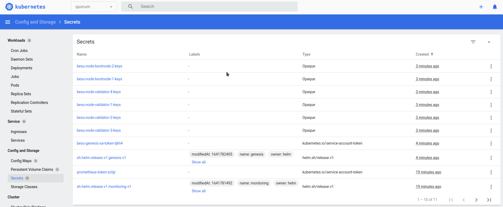

## Prerequisites

* Clone the [Quorum-Kubernetes](https://github.com/ConsenSys/quorum-kubernetes) repository
* A [running Kubernetes cluster](./Create-Cluster.md)
* [Kubectl](https://kubernetes.io/docs/tasks/tools/)
* [Helm3](https://helm.sh/docs/intro/install/)

## Provisioning with Helm charts

Helm is a method of packaging a collection of objects into a chart which can then be deployed to the cluster. For the
rest of this tutorial we use the **[Dev](https://github.com/ConsenSys/quorum-kubernetes/tree/master/dev)** Helm charts.
After you have cloned the [Quorum-Kubernetes](https://github.com/ConsenSys/quorum-kubernetes) repository, change
the directory to `dev` for the rest of this tutorial.

```bash
cd dev/helm
```

If you are running the cluster on AWS or Azure, please remember to update the `values.yml` with `provider: aws` or
`provider: azure` as well.

You are also free to customize any of the charts in this repository to suit your requirements and pull requests are
encouraged to extend functionality.

### 1. Check that you can connect to the cluster with `kubectl`

Verify kubectl is connected to cluster with:

```bash
kubectl version
Client Version: version.Info{Major:"1", Minor:"23", GitVersion:"v1.23.1", GitCommit:"86ec240af8cbd1b60bcc4c03c20da9b98005b92e", GitTreeState:"clean", BuildDate:"2021-12-16T11:41:01Z", GoVersion:"go1.17.5", Compiler:"gc", Platform:"linux/amd64"}
Server Version: version.Info{Major:"1", Minor:"22", GitVersion:"v1.22.3", GitCommit:"c92036820499fedefec0f847e2054d824aea6cd1", GitTreeState:"clean", BuildDate:"2021-10-27T18:35:25Z", GoVersion:"go1.16.9", Compiler:"gc", Platform:"linux/amd64"}
```

### 2. Deploy the network

Follow the steps in the deploy charts tutorial  provides a mechanism for isolating groups of resources (for example
StatefulSets, Services, etc) within a single cluster. For the rest of this tutorial we will use `besu` as the namespace,
but you are free to pick any name when deploying, but it must be consistent across the
[infrastructure scripts](./Create-Cluster.md) and the charts.

Run the following in a terminal window:

```bash
kubectl create namespace besu
```

### 3. Deploy the Monitoring chart

This is the first chart we will deploy, which will deploy Prometheus and Grafana to monitor the cluster, nodes and the
state of the network. Each Besu pod has a few
[`annotations`](https://kubernetes.io/docs/concepts/overview/working-with-objects/annotations/) which tell Prometheus
it can scrape metrics from the pod at a given port and path, as can be seen in the snippet below

```bash
  template:
    metadata:
      annotations:
        prometheus.io/scrape: "true"
        prometheus.io/port: 9545
        prometheus.io/path: "/metrics"
```

Update the admin `username` and `password` in the monitoring
[values](https://github.com/ConsenSys/quorum-kubernetes/blob/master/dev/helm/values/monitoring.yml) file. Then deploy
the chart

```bash
cd dev/helm
helm install monitoring ./charts/quorum-monitoring --namespace besu --values ./values/monitoring.yaml
```

!!! warning

     For production use cases, please configure Grafana with one of the 
     [native auth mechanisms](https://grafana.com/docs/grafana/latest/auth/) supported.

Once complete, you should see a couple of deployments in the Kubernetes dashboard (or equivalent) like so:


Optionally, you can also deploy BlockScout to monitor the network to aid with monitoring. Begin by updating the
BlockScout [values](https://github.com/ConsenSys/quorum-kubernetes/blob/master/dev/helm/values/blockscout-besu.yml) file
and set the `database` values that you would like to use and the `secret_key_base`. Please note, any changes to
the database will require changes to both the `database` and the `blockscout` dictionaries. Once completed, deploy
the chart.

```bash
helm dependency update ./charts/blockscout
helm install blockscout ./charts/blockscout --namespace besu --values ./values/blockscout-besu.yaml
```

### 4. Deploy the Genesis chart

This is the most important chart that gets deployed because it creates the genesis file and keys for the validators and
bootnodes.

!!! warning

    It is important to keep the release names of the bootnodes and validators as per this tutorial, that is bootnode-n and
    validator-n (for the initial validator pool), where `n` is the node number. Any validators created after the initial
    pool can be named to anything that you would like.

Update the number of validators, accounts, chainId and any parameters in the genesis file in the `genesis-besu`
[values](https://github.com/ConsenSys/quorum-kubernetes/blob/master/dev/helm/values/genesis-besu.yml) file. Then, deploy
the chart:

```bash
helm install genesis ./charts/besu-genesis --namespace besu --create-namespace --values ./values/genesis-besu.yml
```

Once complete, you should see the genesis and enodes (the list of static nodes) config maps that every Besu node uses and
validator and bootnodes node keys saves as secrets.




### 5. Deploy the Bootnodes

This is the set of running nodes that we will deploy. The Dev charts use two bootnodes to replicate best practices on
a production network. Each Besu node has a few flags that tell the StatefulSet what to deploy and how to cleanup, etc.
The default `values.yml` for the StatefulSet define the following flags and this dictionary is present in all the
override values files.

```bash
nodeFlags:
  bootnode: true
  generateKeys: false
  privacy: false
  removeKeysOnDeletion: false
```

We do not generate keys for the bootnodes and only the initial validator pool; therefore, we set to `true` for everything
else. To create a Tessera pod paired to Besu for private transactions, set the `privacy` flag to `true`. You can
optionally remove the secrets for the node if you delete the StatefulSet (for example removing a member node) by
setting the `removeKeysOnDeletion` flag to `true`.

For the bootnodes we set `bootnode: true` flag to indicate they are bootnodes and then deploy. All the other nodes
(validators, members etc) will wait for the bootnodes to be up before proceeding and have this flag set to `false`.

```bash
helm install bootnode-1 ./charts/besu-node --namespace besu --values ./values/bootnode.yml
helm install bootnode-2 ./charts/besu-node --namespace besu --values ./values/bootnode.yml
```

!!! warning

    It is important to keep the release names of the bootnodes the same as it is tied to the keys that the genesis chart
    creates. So we use `bootnode-1` and `bootnode-2` in the command above

Once complete, you should see two Stateful sets and the two bootnodes will discover themselves and peer. However because
there are no validators present yet, there will be no blocks created as can be seen in the logs below


### 6. Deploy the Validators

This is the next set of nodes that we will deploy. The validators peer with the bootnodes and themselves and when a
majority of the validators have peered, blocks are proposed and created on the chain.

For the initial validator pool we set all the node flags to `false` and then deploy.

```bash
helm install validator-1 ./charts/besu-node --namespace besu --values ./values/validator.yml
helm install validator-2 ./charts/besu-node --namespace besu --values ./values/validator.yml
helm install validator-3 ./charts/besu-node --namespace besu --values ./values/validator.yml
helm install validator-4 ./charts/besu-node --namespace besu --values ./values/validator.yml
```

!!! warning

    As with the bootnodes, it is important to keep the release names of the initial validators the same as it is tied
    to the keys that the genesis chart creates. So we use `validator-1`, `validator-2` and so on in the command above

Once complete, you may need to give the validators a few minutes to peer and for round changes depending when the first
validator was spun up and then the logs should show blocks being created


To add a validator into the network, deploy a normal RPC node (step 7) and then
[vote](../../HowTo/Configure/Consensus-Protocols/IBFT.md#adding-and-removing-validators) into the validator pool.

### 7. Deploy RPC or Transaction nodes

These nodes need their own node keys so we set the `generateKeys: true` for a standard RPC node. For a Transaction node
(Besu paired with Tessera for private transactions) we also set the `privacy: true` flag and deploy in the same manner
as before.

For an RPC node with the release name `rpc-1`:

```bash
helm install rpc-1 ./charts/besu-node --namespace besu --values ./values/reader.yml
```

For a Transaction node release name `tx-1`:

```bash
helm install tx-1 ./charts/besu-node --namespace besu --values ./values/txnode.yml
```

and logs for `tx-1` would resemble the following for Tessera:


and logs for Besu:


### 8. Connecting to the node from your local machine via an Ingress

In order to view the Grafana dashboards or connect to the nodes to make transactions from your local machine you can
deploy an ingress controller with rules. We use the `ingress-nginx` ingress controller which can be deployed like so:

```bash
helm repo add ingress-nginx https://kubernetes.github.io/ingress-nginx
helm repo update
helm install besu-ingress ingress-nginx/ingress-nginx \
    --namespace besu \
    --set controller.replicaCount=1 \
    --set controller.nodeSelector."beta\.kubernetes\.io/os"=linux \
    --set defaultBackend.nodeSelector."beta\.kubernetes\.io/os"=linux \
    --set controller.admissionWebhooks.patch.nodeSelector."beta\.kubernetes\.io/os"=linux \
    --set controller.service.externalTrafficPolicy=Local
```

We have some pre-defined
[rules](https://github.com/ConsenSys/quorum-kubernetes/blob/master/ingress/ingress-rules-besu.yml) that you can use to
test functionality and alter to suit your requirements (for example connect to multiple nodes via different paths).

Edit the [rules](https://github.com/ConsenSys/quorum-kubernetes/blob/master/ingress/ingress-rules-besu.yml) file so the
service names match your release name. In the example, we deployed a transaction node with the release name `member-1`
so the corresponding service is called `besu-node-member-1` for the `rpc` and `ws` path prefixes. Once you have settings
that match your deployments, deploy the rules like so:

```bash
kubectl apply -f ../../ingress/ingress-rules-besu.yml
```

Once complete, you should see an IP address listed under the `Ingres` section if you are using the Kubernetes Dashboard
or equivalent `kubectl` command.


The Grafana dashboard can be viewed by going to:

```bash
# For Besu's grafana address:
http://<INGRESS_IP>/d/XE4V0WGZz/besu-overview?orgId=1&refresh=10s
```

Or for RPC calls:

```bash
curl -v -X POST -H "Content-Type: application/json" --data '{"jsonrpc":"2.0","method":"eth_blockNumber","params":[],"id":1}' http://<INGRESS_IP>/rpc
```

which should return (confirming that the node running the JSON-RPC service is syncing):

```json
{
"jsonrpc" : "2.0",
"id" : 1,
"result" : "0x4e9"
}
```
