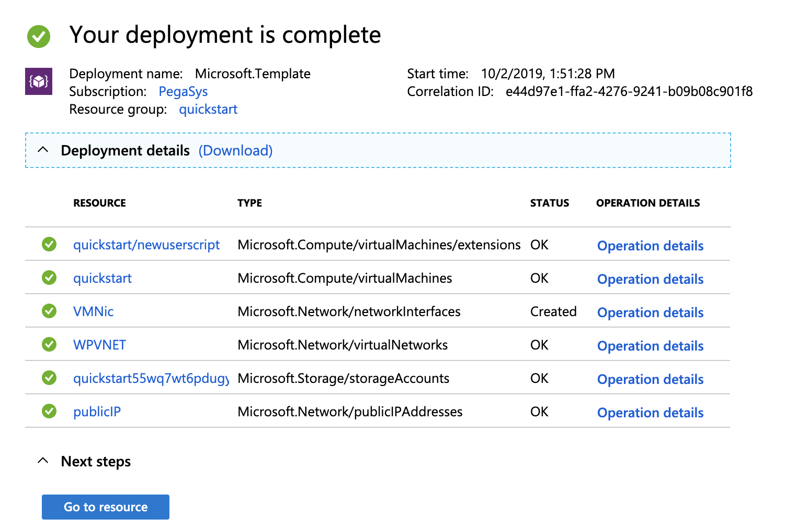
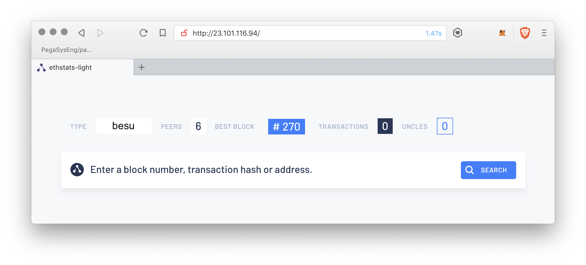

description: Hyperledger Besu private network quickstart on Azure tutorial
<!--- END of page meta data -->

# Azure Private Network Quickstart Tutorial

This tutorial describes how to use the [Hyperledger Besu quickstart](https://github.com/PegaSysEng/besu-quickstart) 
to run a private network of Besu nodes in a Docker container in a Linux Virtual 
machine hosted on Microsoft Azure.

## Duration

**Duration : Approximately 20 minutes**

The duration includes the Azure resources deployment (usually around 5 minutes) but it can vary. 
This tutorial contains some optional steps that will increase the duration.

## Steps

* Step 1 - [Requirements](#requirements)
    * Up to 20 minutes if you need to install requirements
* Step 2 - [Deploy the Quickstart](#deploy-the-quickstart)
    * One Click Deploy : 5 minutes
    * Manually : 15 minutes
* Step 3 - [Access the Lite Block Explorer](#accessing-the-alethio-ethstats-lite-block-explorer).
    * 2 minutes
* Step 4 (optional) - [Copy endpoints and continue from here by following our Docker Quickstart Tutorial](#rpc-enpoints).
    * Up to 10 minutes
* Step 5 - [Shut down the Azure Quickstart resources](#shutting-down-the-quickstart)
    * Up to 10 minutes depending on the method

## Requirements

* Azure account. A [free trial account](https://azure.microsoft.com/en-us/free/) can be used for this tutorial.
* If not using Linux or MacOS, a tool to connect to a remote console using SSH. Free tools include:
     * [Putty](https://www.putty.org/)  
     * [mRemoteNG](https://mremoteng.org/) 
     * [Terminals](https://github.com/terminals-Origin/Terminals)

## Deploy the Quickstart

### One Click Deploy

Deploy the Besu Quickstart on [Microsoft Azure](https://azure.microsoft.com) by clicking the button below.

[](https://portal.azure.com/#create/Microsoft.Template/uri/https%3A%2F%2Fraw.githubusercontent.com%2FPegaSysEng%2Fbesu-quickstart%2Fmaster%2Fazure%2Fazuredeploy.json)

If prompted to log in to the Azure Portal, log in before being redirected to the deployment form.  

???info "Filling in the Azure Deployment Form"
    * **Subscription** : Default
    * **Resource group** : Click **Create new** and enter `besu-quickstart`
    * **Vm Name** : Default
    * **Admin Username** : Default
    * **Admin Password** : Create a password between 12 and 72 characters with numbers, lower and upper-case
      letters, and a special symbol
    * **Vm Size** : Standard DS2s v3 is the minimum usable size for this quickstart.

### Deploy Manually

To deploy manually instead of using the [One Click Deploy](#one-click-deploy), expand the 
instructions. 

???example "Manual Deployment Steps"

    #### Connect to Azure Portal
    Log into [Azure portal](https://portal.azure.com/) using your account credentials.
    
    #### Create Resources
    On the home page, click **Create resource button** at the top left hand corner.
    
    Search the Marketplace for **Ubuntu Server 18.04 LTS** by Canonical and click on it. 
    An information page is displayed. Accept the default deployment model of Resource Manager and click **Create**.
    
    In **Create a virtual machine**, set the following values for each tab:
    
    ##### Basics Step
    
      * Subscription --> Free trial
      * Resource group --> Create a group and name it. For example, besu-quickstart
      * Virtual machine name --> quickstart
      * Region --> Default
      * Availability options --> No infrastructure redundancy required
      * Image --> Ubuntu Server 18.04 LTS
      * Size --> Default. The quickstart doesn't require a lot of power and disk space. 
        A **Standard D2s v3 (2 vcpus, 8 GB memory)** is enough and is less expensive.
      * Authentication type --> Choose the one you prefer
      * Username --> Provide a user name. **azure** is used for this tutorial.
      * Depending on the authentication method, enter the password or the public key.
      * Login with Azure Active Directory --> **off**
      * Public inbound ports --> Allow selected ports
      * Select inbound ports --> Select **HTTP** and **SSH**
      
    At the top of the page, select the **Guest config** tab.
    
    ##### Guest Config
    
    This step installs the required software (Docker and Docker-compose) on your virtual machine 
    and retrieves and runs the quickstart private network.
    
    1. Click on the **Select an extension to install** link and a new resource pane is displayed on the right.
    
    1. In the list, click **Custom Script For Linux**. Another pane is displayed with a blue **Create** button at
    the bottom. 
    
    1. Click the blue **Create** button. A form with two fields is displayed. 
    
    1. In another browser tab or window, open [https://raw.githubusercontent.com/Hyperledger/besu-quickstart/master/azure/install_and_run.sh](https://raw.githubusercontent.com/Hyperledger/besu-quickstart/master/azure/install_and_run.sh)
    
    1. Save (++ctrl+s++) this script to your computer, in any location, called `install_and_run.sh`. 
    
    1. Click on the **Script files** field and select the `install_and_run.sh` script you saved.
    
    1. In the **Command** field, enter (replacing the pre filled `sh script.sh`):
    
        ```bash
        sh install_and_run.sh azure
        ```
    
        !!!important
            The username is included at the end of this command, **azure** in this example. Use the
            username defined in the Basics step.
        
    1. Click **Ok**. 
     
    1. Click the **Review + create** blue button at the bottom of the page.
    
    1. When the green **Validation passed** message is displayed at the top of the screen, 
    press the blue **Create** button.

## Access Resources

Now your Quickstart is deploying, a **Your deployment is underway** screen is displayed.
The deployment takes approximately 5 minutes. 

Once the deployment is complete, **Your deployment is complete** is displayed with a list of deployed resources.



CLick the **quickstart** resource (the VM) in the list. The machine overview page is displayed.

## Accessing the Alethio EthStats Lite Block Explorer

On the right of the virtual machine page, the **Public IP address** of this machine is displayed. 
Copy the public IP address and copy it into the navigation bar of a new browser tab or window.

The EthStats Lite Block Explorer is displayed.
Wait a few seconds and 6 peers and the blocks mined are displayed.



## RPC Endpoints

For the following optional tutorial steps, the RPC endpoints are:

* HTTP RPC endpoint: **http://&lt;your VM public IP>/jsonrpc**
* WebSocket RPC endpoint: **ws://&lt;your VM public IP>/jsonws**

## Optional Private Network Tutorial

Follow the [private network quickstart tutorial starting from creating RPC requests](../Quickstarts/Private-Network-Quickstart.md#run-json-rpc-requests).

When complete, resume this tutorial to shut down your resources.

## Shutting Down the Quickstart

!!!attention
    Don't forget to shutdown the quickstart because it will consume your Azure resources
    and that can be expensive or drain free credits from your trial account.

Options for shutting down are:

### I Want to Remove Everything From My Azure Account

This is the easiest way to ensure your Azure resources won't consume any credits.

In the Azure portal, navigate to your resource group (for example, **besu-quickstart**) and 
click the **Delete resource group** button.

### I Want to Remove the Virtual Machine Only

In the Azure portal, navigate to your resource group (for example, **besu-quickstart**) and
click the virtual machine resource and click the **Delete** button.

### I Want to Keep the Virtual Machine but Remove the Besu Network

1. In the Azure portal, navigate to the VM:
     1. Click **All services** in the left pane
     1. Click **Virtual machines**
     1. Click VM you named **quickstart**
     
1. Click the **connect** button to obtain the information to connect with SSH (see [Requirements](#requirements)).

1. Once connected to the machine, go to the `besu-quickstart` directory:
    ```bash
    cd besu-quickstart
    ``` 

1. Run the remove script:
    ```bash
    ./remove.sh
    ```

1. To run the network again, use the following script:

    ```bash
    ./run.sh -p 80
   ```

    Where 80 is the port number for the Block Explorer and RPC connections.
 
### I Want to Stop the Besu Network and Be Able to Resume It

Connect to the VM using SSH as for [I want to keep the VM but remove the nodes network](#i-want-to-keep-the-vm-but-remove-the-nodes-network)
but instead of running the remove script, run the stop script:
```bash
./stop.sh
```

To resume the network:
```bash
./resume.sh
```