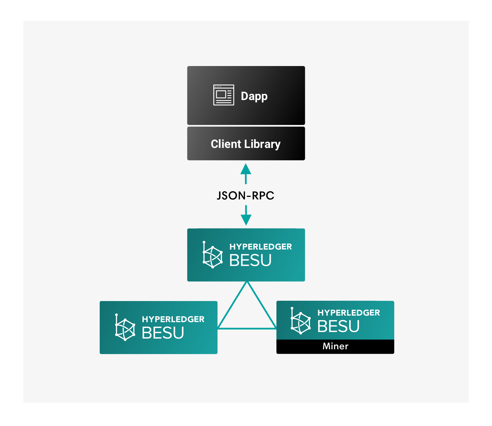

# Client libraries

Dapps use client libraries, such as [web3.js](https://github.com/ethereum/web3.js/),
[web3j](https://github.com/web3j/web3j), or [ethereumj](https://github.com/ethereum/ethereumj), to
forward JSON-RPC requests to Hyperledger Besu. Any client library implementing core Ethereum RPC
methods works with Besu.

Use the [web3js-quorum library](../Interact/Client-Libraries/web3js-quorum.md) with Besu for
[privacy features](../../concepts/Privacy/Privacy-Overview.md).

Use client libraries to:

* Create signed transactions
* [Create and send private transactions].

!!! note
    [Hyperledger Besu does not support key management inside the client](../Send-Transactions/Account-Management.md).

<!-- Links -->
[Create and send private transactions]: ../../private-networks/how-to/send-transactions/private-transactions.md
