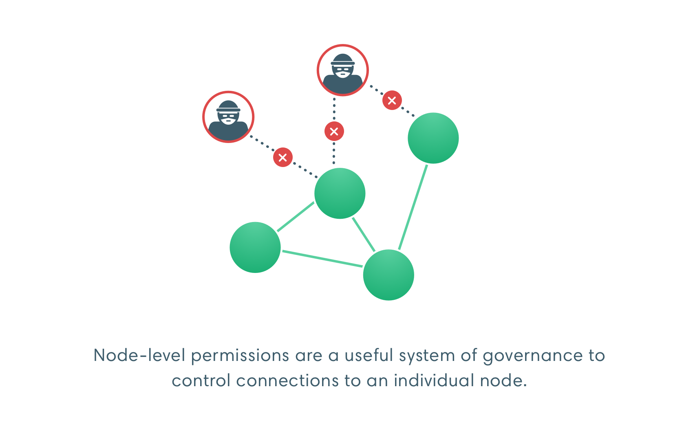

# Permissioning

A permissioned network enables node permissioning and account permissioning, allowing only specified nodes and accounts to access the network.

:::caution Permissioning in peer-to-peer networks: challenges and enforcement

In peer-to-peer networks, permissioning enforces rules on nodes you control.

Permissioning requires a distributed network of trust across the network where participants agree to follow the rules. One bad actor can decide not to follow the rules. Nodes can take action to prevent the bad actor from adding to the chain but they cannot prevent the bad actor from allowing access to the chain.

:::

## Node permissioning

Use node permissioning to restrict access to known participants only.

## Account permissioning

Use account permissioning to:

- Enforce onboarding or identity requirements.
- Suspend accounts.
- Restrict the actions an account can perform.

## Specify local permissioning

[Local permissioning](../../how-to/use-local-permissioning.md) works at the node level. Each node in the network has a [permissions configuration file], which can be used to configure node and/or account permissioning rules.

Local permissioning affects your node but not the rest of the network. Use local permissioning to restrict use of your node (that is, the resources under your control). For example, customers are able to access your node.

Local permissioning does not require coordination with the rest of the network and you can act immediately to protect your node. Your rules are not enforced in blocks produced by other nodes.

To implement more complex permissioning rules, you can [write your own plugin](plugin.md).

<!-- Links -->

[permissions configuration file]: ../../how-to/use-local-permissioning.md#permissions-configuration-file
