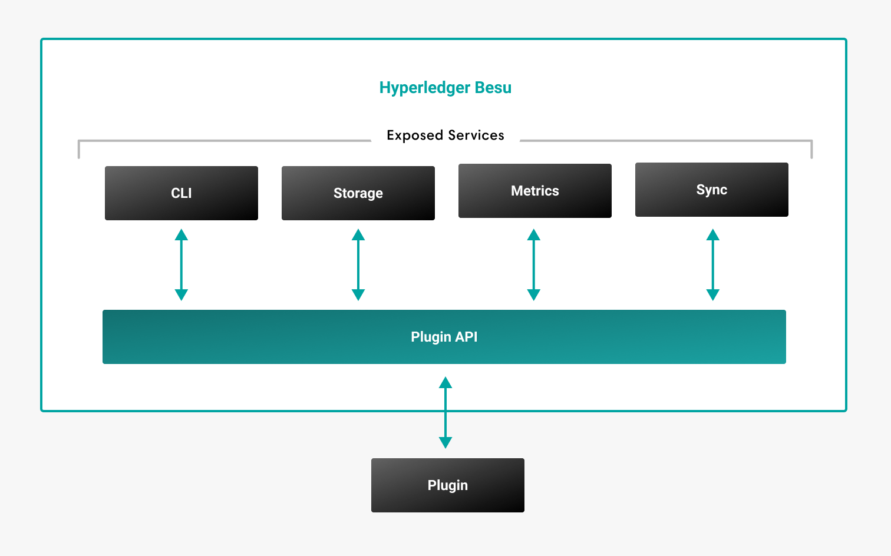

# Plugins

You can extend Hyperledger Besu functionality by building Java plugins or using existing open source Besu plugins. Use the Plugin API to take data from any Besu network, public or permissioned, and feed it into an application or system.

For example, create a plugin to add more monitoring functionality or stream event data to a third-party application. The API exposes data about the following components:

- Blocks
- Balances
- Transactions
- Smart contracts
- Execution results
- Logs
- Syncing state.

The plugin API provides access to [interfaces](../reference/plugin-api-interfaces.md) allowing you to build the plugin.

:::info

View the [plugin API webinar](https://youtu.be/78sa2WuA1rg) for an example of how to build a plugin.

For more information about the available interfaces, see the [Plugin API Javadoc](https://javadoc.io/doc/org.hyperledger.besu/plugin-api/latest/index.html).

:::

## Install plugins

To allow Besu to access and use the plugin, copy the plugin (`.jar`) to the `plugins` directory.

:::caution

If not already present, you must create the `plugins` directory one directory level below (`../`) the `besu` executable.

:::

Each plugin in the directory has the following lifecycle events:

- **Register** - Executed when Besu starts. Besu checks plugin compatibility and registers plugins.
- **Start** - Plugins start after being successfully registered.
- **Stop** - Besu stops plugins.

:::note

The order in which Besu calls plugins during lifecycle events is not guaranteed.

:::
