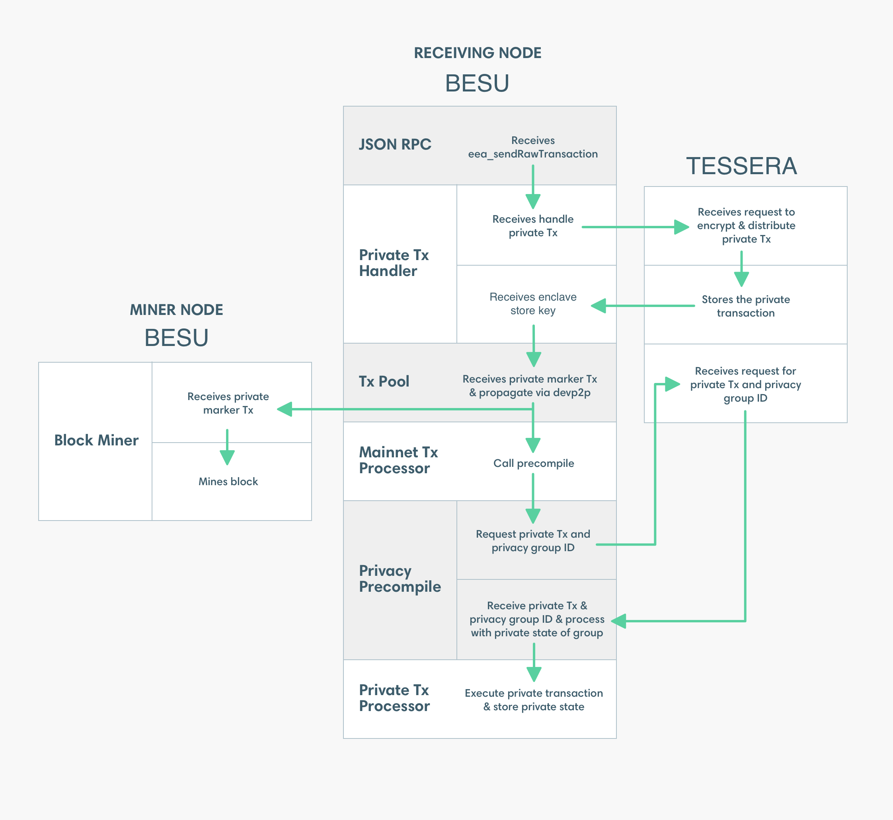

# Private transaction processing

Processing [private transactions](index.md) involves the following:

- **Precompiled contract**: A smart contract compiled from the source language to EVM bytecode and stored by an Ethereum node for later execution.

- **Privacy marker transaction (PMT)**: A public Ethereum transaction with a payload of the enclave key. The enclave key is a pointer to the private transaction in Tessera. The `to` attribute of the PMT is the [address of the privacy precompiled contract](../../../reference/api/index.md#priv_getprivacyprecompileaddress).

  The PMT is [signed with a random key or the key specified on the command line].

Private transaction processing is illustrated and described in the following diagram.

1.  Submit a private transaction using [`eea_sendRawTransaction`](../../../reference/api/index.md#eea_sendrawtransaction). The signed transaction includes transaction parameters specific to private transactions, including:

    - `privateFor` or `privacyGroupId`, which specifies the list of recipients.
    - `privateFrom`, which specifies the sender.
    - `restriction`, which specifies the transaction is restricted to the transaction participants.

1.  The JSON-RPC endpoint passes the private transaction to the Private Transaction Handler.

1.  The Private Transaction Handler sends the private transaction to Tessera.

1.  Tessera distributes the private transaction directly (that is, point-to-point) to the Tessera nodes specified in `privateFor` or belonging to the privacy group identified by `privacyGroupId`. All recipient Tessera nodes store the transaction. Tessera associates the stored transaction with the transaction hash and privacy group ID.

1.  Tessera returns the transaction hash to the Private Transaction Handler.

1.  The Private Transaction Handler creates a PMT for the private transaction. The Private Transaction Handler propagates the PMT using devP2P in the same way as any other public Ethereum transaction.

    :::tip

    If you want to sign the PMT outside of Besu, use [`priv_distributeRawTransaction`](../../../how-to/send-transactions/private-transactions.md#priv_distributerawtransaction) instead of [`eea_sendRawTransaction`](../../../reference/api/index.md#eea_sendrawtransaction).

    :::

1.  Besu mines the PMT into a block and the PMT is distributed to all Ethereum nodes in the network.

1.  The Mainnet Transaction Processor processes the PMT in the same way as any other public transaction. On nodes containing the [privacy precompile contract](../../../reference/api/index.md#priv_getprivacyprecompileaddress) specified in the `to` attribute of the PMT, the Mainnet Transaction Processor passes the PMT to the privacy precompile contract.

    :::note

    Nodes receiving the PMT that don't contain the privacy precompile contract ignore the PMT.

    :::

1.  The privacy precompile contract queries Tessera for the private transaction and privacy group ID using the transaction hash.

1.  The privacy precompile contract passes the private transaction to the Private Transaction Processor. The privacy group ID specifies the private world state to use.

1.  The Private Transaction Processor executes the transaction. The Private Transaction Processor can read and write to the private world state, and read from the public world state.

:::danger Recommendations

- We recommend using a network with a consensus mechanism supporting transaction finality. For example, [IBFT 2.0](../../../how-to/configure/consensus/ibft.md).
- Tessera must be [highly available and run in a separate instance to Besu](../../../how-to/use-privacy/tessera.md).

Using private transactions with [pruning] or [fast sync](../../../../public-networks/reference/cli/options.md#sync-mode) is not supported.

:::

<!-- Links -->

[signed with a random key or the key specified on the command line]: ../../../how-to/use-privacy/sign-pmts.md
[highly available and run in a separate instance to Besu]: ../../../how-to/use-privacy/tessera.md
[pruning]: ../../../../public-networks/concepts/data-storage-formats.md#pruning
