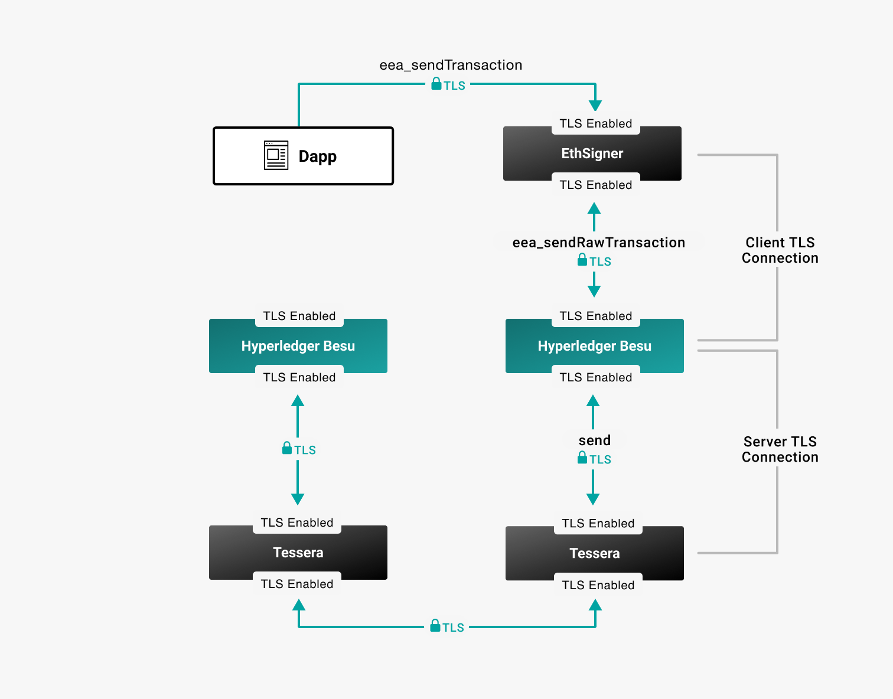

# Configure client TLS

Besu supports TLS for client communication. For example, you can configure TLS for communication between [Web3Signer](https://docs.web3signer.consensys.net/concepts/tls) and Besu.

The following instructions allow you to configure client authentication to secure HTTP JSON-RPC
calls.

:::info Secure Websocket JSON-RPC calls

You can configure SSL/TLS authentication for WebSocket calls by enabling
[`--rpc-ws-ssl-enabled`](../../../public-networks/reference/cli/options.md#rpc-ws-ssl-enabled) for
server authentication, and
[`--rpc-ws-ssl-client-auth-enabled`](../../../public-networks/reference/cli/options.md#rpc-ws-ssl-client-auth-enabled) for client authentication.

:::

The following diagram displays an example client and server TLS configuration.



Configure TLS communication from the command line.

## Prerequisites

- Besu's password-protected PKCS12 keystore
- File containing the keystore password

## Configure client TLS

Allow clients (for example a dapp, curl, or Web3Signer) to send and receive secure HTTP JSON-RPCs.

**Client prerequisites**:

- [Configure the client for TLS]
- Client's PKCS12 keystore information

### Create the known clients file

The known clients file allows clients with self-signed certificates or non-public certificates to connect to Besu.

Create a file (in this example, `knownClients`) that lists one or more trusted clients. Use the format`<common_name> <hex-string>` where:

- `<common_name>` is the Common Name specified in the client certificate.
- `<hex-string>` is the SHA-256 fingerprint of the client certificate.

```bash title="Example"
web3signer 8E:E0:85:9F:FC:2E:2F:21:31:46:0B:82:4C:A6:88:AB:30:34:9A:C6:EA:4F:04:31:ED:0F:69:A7:B5:C2:2F:A7
curl FC:18:BF:39:45:45:9A:15:46:76:A6:E7:C3:94:64:B8:34:84:A3:8E:B8:EA:67:DC:61:C0:29:E6:38:B8:B7:99
```

You can use [`openssl`](https://www.openssl.org/) or [`keytool`](https://docs.oracle.com/javase/6/docs/technotes/tools/solaris/keytool.html) to display the SHA256 fingerprint.

```
keytool -list -v -keystore <keystore> -storetype PKCS12 -storepass <MY_PASSWORD>`.
```

### Start Besu

```bash
besu --rpc-http-enabled --rpc-http-tls-enabled --rpc-http-tls-client-auth-enabled --rpc-http-tls-keystore-file=/Users/me/my_node/keystore.pfx --rpc-http-tls-keystore-password-file=/Users/me/my_node/keystorePassword --rpc-http-tls-known-clients-file=/Users/me/my_node/knownClients --rpc-http-tls-cipher-suite=TLS_AES_256_GCM_SHA384 --rpc-http-tls-protocol=TLSv1.3,TLSv1.2
```

The command line:

- Enables the HTTP JSON-RPC service using the [`--rpc-http-enabled`](../../../public-networks/reference/cli/options.md#rpc-http-enabled) option.
- Enables TLS for the HTTP JSON-RPC service using the [`--rpc-http-tls-enabled`](../../../public-networks/reference/cli/options.md#rpc-http-tls-enabled) option.
- Enables TLS client authentication using the [`--rpc-http-tls-client-auth-enabled`](../../../public-networks/reference/cli/options.md#rpc-http-tls-client-auth-enabled) option.
- Specifies the keystore using the [`--rpc-http-tls-keystore-file`](../../../public-networks/reference/cli/options.md#rpc-http-tls-keystore-file) option.
- Specifies the file that contains the password to decrypt the keystore using the [`--rpc-http-tls-keystore-password-file`](../../../public-networks/reference/cli/options.md#rpc-http-tls-keystore-password-file) option.
- [Specifies the clients](#create-the-known-clients-file) allowed to connect to Besu using the [`--rpc-http-tls-known-clients-file`](../../../public-networks/reference/cli/options.md#rpc-http-tls-known-clients-file) option.
- specifies the Java cipher suites using the [`--rpc-http-tls-cipher-suite`](../../../public-networks/reference/cli/options.md#rpc-http-tls-cipher-suite) option.
- specifies the TLS protocol version using the [`--rpc-http-tls-protocol`](../../../public-networks/reference/cli/options.md#rpc-http-tls-protocol) option.

:::note

Set [`--rpc-http-tls-ca-clients-enabled`](../../../public-networks/reference/cli/options.md#rpc-http-tls-ca-clients-enabled) to `true` to allow access to clients with signed and trusted root CAs.

:::

<!-- Links -->

[Configure the client for TLS]: https://docs.web3signer.consensys.net/how-to/configure-tls
