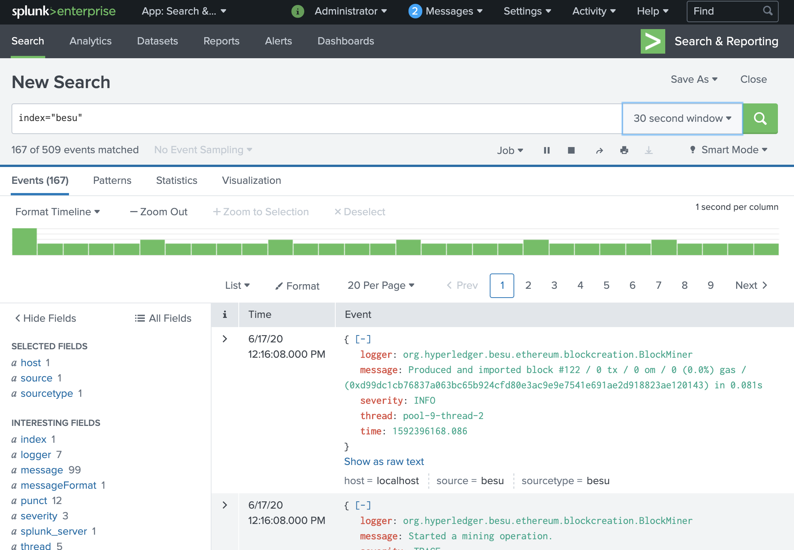

# Use Splunk

[Splunk](https://splunkbase.splunk.com/app/4866/) is a third-party monitoring solution compatible with Besu. A Splunk server can receive Besu logs and enable complex search, visualization, and analysis.

Splunk can aggregate multiple logs in one place and run complex queries without being connected to the machine running Besu to read the standard output.

Options for running Splunk and Besu are:

- [Developer Quickstart with Splunk](#developer-quickstart-with-splunk)
- [Splunk Connect for Ethereum Docker Compose](#splunk-connect-for-ethereum-docker-compose)
- [Use Splunk Enterprise as a Docker container](#use-splunk-enterprise-as-a-docker-container)
- [Run a Splunk Enterprise instance](#run-a-splunk-enterprise-instance)

## Developer Quickstart with Splunk

To view the Quickstart network logs in Splunk:

1. [Start the Developer Quickstart with Besu](../../tutorials/quickstart.md), selecting Splunk monitoring.
1. Open the [Splunk UI](http://localhost:8000).

## Splunk Connect for Ethereum Docker Compose

To run a development Besu node and connect it to Splunk Enterprise, use the Splunk Connect for Ethereum demonstration Docker Compose environment provided by Splunk.

### Requirements

- [Git](https://git-scm.com/)
- [Docker and Docker-compose](https://docs.docker.com/compose/install/)

:::info

A Splunk license is not required to use the Splunk Connect for Ethereum demonstration.

:::

### Steps

1.  Clone the Splunk Connect for Ethereum repository:

    ```bash
    git clone https://github.com/splunk/splunk-connect-for-ethereum.git
    cd splunk-connect-for-ethereum
    ```

1.  Start the demonstration environment by following the Splunk Connect for Ethereum repository [README](https://github.com/splunk/splunk-connect-for-ethereum/tree/master/examples/besu).

    :::note

    Splunk enterprise takes some time to start.

    Run `docker ps` and wait for the `STATUS` of the 3 containers to be `Up [number] seconds (healthy)`.

    ```
    CONTAINER ID        IMAGE                        COMMAND                  CREATED             STATUS                    PORTS                                                                            NAMES
    127600dd1173        splunkdlt/ethlogger:latest   "ethlogger"              53 seconds ago      Up 51 seconds (healthy)                                                                                    ethlogger
    88dfcee683c4        splunk/splunk:latest         "/sbin/entrypoint.sh…"   53 seconds ago      Up 52 seconds (healthy)   8065/tcp, 8088-8089/tcp, 8191/tcp, 9887/tcp, 9997/tcp, 0.0.0.0:18000->8000/tcp   splunk
    111b0c6d6072        hyperledger/besu:1.4.4       "besu"                   53 seconds ago      Up 52 seconds (healthy)   8545-8547/tcp, 30303/tcp                                                         besu
    ```

    :::

## Use Splunk Enterprise as a Docker container

### Prerequisites

- [Docker](https://docs.docker.com/compose/install/)
- [Besu 1.4.4](https://github.com/hyperledger/besu/blob/750580dcca349d22d024cc14a8171b2fa74b505a/CHANGELOG.md#144) or later [installed](../../get-started/install/binary-distribution.md)

:::info

A Splunk license is not required to use the trial version of the Splunk Docker image. The image is not suitable for production use and has [restrictions on daily log volume](https://www.splunk.com/).

:::

:::note

If running [Besu as a Docker container](../../get-started/install/run-docker-image.md), consider using [Splunk Connect for Ethereum Docker Compose](#splunk-connect-for-ethereum-docker-compose) or [Kubernetes](../deploy/kubernetes.md) instead of the Splunk Enterprise trial container.

:::

### Steps

1.  Start the Splunk Enterprise container:

    ```bash
    docker run \
    -e SPLUNK_START_ARGS=--accept-license \
    -e SPLUNK_HEC_TOKEN=11111111-1111-1111-1111-1111111111113 \
    -e SPLUNK_PASSWORD=changeme \
    --rm \
    -p8080:8000 -p8088:8088 \
    -d \
    --name splunk-demo \
    splunk/splunk:latest
    ```

    Once the service is started, connect on [`http://localhost:8080/`](http://localhost:8080/) and login as the `admin` user with a password of `changeme`.

    :::tip

    To follow the logs of the Splunk container:

    ```bash
    docker logs -f splunk-demo
    ```

    :::

2.  Create the Besu index:

    1. In the Splunk Web interface, navigate to the [index list in the settings](http://localhost:8080/en-US/manager/search/data/indexes).
    2. [Create an event index] with an Index Name of `besu`.
    3. Leave other fields with the default values.
    4. Save the `besu` index.

3.  Run Besu. To start a Besu node running in development mode, run the following command:

    ```bash
    LOGGER=Splunk \
    SPLUNK_URL=https://localhost:8088 \
    SPLUNK_TOKEN=11111111-1111-1111-1111-1111111111113 \
    SPLUNK_SKIPTLSVERIFY=true \
    besu \
    --network=dev \
    --miner-coinbase=0xfe3b557e8fb62b89f4916b721be55ceb828dbd73 \
    --miner-enabled \
    --logging=trace
    ```

    The environment variables specified send the Besu logs to Splunk. Only `LOGGER`, `SPLUNK_URL`, `SPLUNK_TOKEN` and `SPLUNK_SKIPTLSVERIFY` are required in this example. The complete list of options is in the [Splunk options reference table](#splunk-options-reference).

4.  In the Splunk Web interface, navigate to the [search page](http://localhost:8080/en-US/app/search/search). Type `index="besu"` in the search field. Log events sent by Besu are displayed.

    Congratulations! You can now play with the search and other Splunk features to explore your Besu logs.

    

5.  Stop Besu with ++ctrl+c++. Stop the Splunk container with `docker stop splunk-demo`.

## Run a Splunk Enterprise instance

### Prerequisites

- [Splunk Enterprise license](https://www.splunk.com/)
- [Besu 1.4.4](https://github.com/hyperledger/besu/blob/master/CHANGELOG.md#144) or later [installed](../../get-started/install/binary-distribution.md)

### Steps

1. Follow the steps in the [Splunk Enterprise documentation](https://docs.splunk.com/Documentation/Splunk/8.0.4/Installation) to download, install, and run Splunk Enterprise.

1. After logging into the Splunk Enterprise Web interface, navigate to the settings to:

   1. [Create an HTTP Event Collector](https://docs.splunk.com/Documentation/Splunk/8.0.4/Data/UsetheHTTPEventCollector).
   1. [Create an event index] named `besu`.

1. Run Besu as in step 3 in [using Splunk on Docker](#use-splunk-enterprise-as-a-docker-container). Set the `SPLUNK_URL` value to match the HTTP Event Collector address and port.

   You can display logs and use the search engine as in step 4 in [using Splunk on Docker](#use-splunk-enterprise-as-a-docker-container).

## Splunk options reference

| Name | Description | Required |
| --- | --- | --- |
| `LOGGER` | Set to `Splunk` to activate sending logs to Splunk. | Yes |
| `HOST` | Current host. If in a Docker environment, the default value is the docker container ID. Otherwise, the default value is `localhost`. | No |
| `SPLUNK_URL` | URL of the Splunk HTTP Event Collector. For example, use `https://localhost:8088` | Yes |
| `SPLUNK_TOKEN` | Authentication token, usually of the form `11111111-1111-1111-1111-111111111111` | Yes |
| `SPLUNK_INDEX` | [Index](https://docs.splunk.com/Splexicon:Index) to store logs. Defaults to `besu` | No |
| `SPLUNK_SOURCE` | [Source of the logs](https://docs.splunk.com/Splexicon:Source). Defaults to `besu` | No |
| `SPLUNK_SOURCETYPE` | [Source type of the logs](https://docs.splunk.com/Splexicon:Sourcetype). Defaults to `besu` | No |
| `SPLUNK_BATCH_SIZE_BYTES` | Size of a log batch in bytes. Defaults to `65536` | No |
| `SPLUNK_BATCH_SIZE_COUNT` | Size of a log batch in number of events. Defaults to `1000` | No |
| `SPLUNK_BATCH_INTERVAL` | Interval at which to send log batches. Defaults to `500` | No |
| `SPLUNK_SKIPTLSVERIFY` | Whether to check the Splunk instance TLS certificate when sending data. Defaults to `false` | No |

[Create an event index]: https://docs.splunk.com/Documentation/Splunk/8.0.4/Indexer/Setupmultipleindexes#Create_events_indexes
