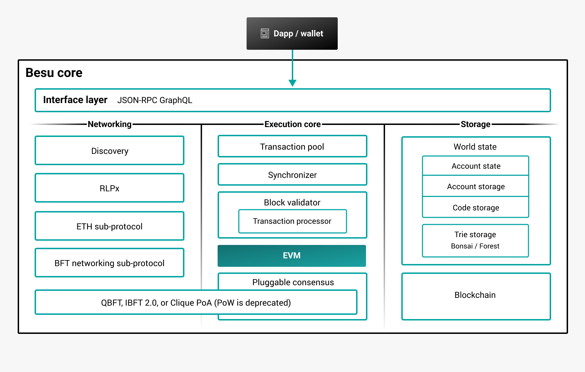

# Besu for private (permissioned) networks

You can use Besu to develop enterprise applications requiring secure, high-performance transaction processing in a private network.

A private (also known as permissioned) network is a network not connected to Ethereum Mainnet or an Ethereum testnet. Private networks typically use a different [chain ID](../public-networks/concepts/network-and-chain-id.md) and proof of authority (PoA) consensus ([QBFT](how-to/configure/consensus/qbft.md), [IBFT 2.0](how-to/configure/consensus/ibft.md), or [Clique](how-to/configure/consensus/clique.md)).

You can also [create a local development network using proof of work (PoW) (Deprecated)](tutorials/ethash.md).

Besu supports enterprise features including [permissioning](concepts/permissioning/index.md).

Get started with the [Developer Quickstart](tutorials/quickstart.md) to rapidly generate local blockchain networks.

If you have any questions about Besu for private (permissioned) networks, ask on the **besu-enterprise** channel on
[Discord](https://discord.com/channels/905194001349627914/1172617318845657199).

## Architecture

The following diagram outlines the high-level architecture of Besu for private networks.

