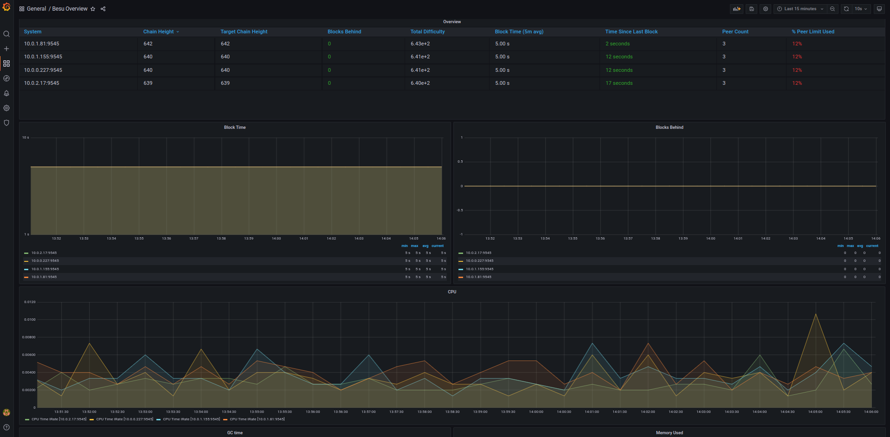
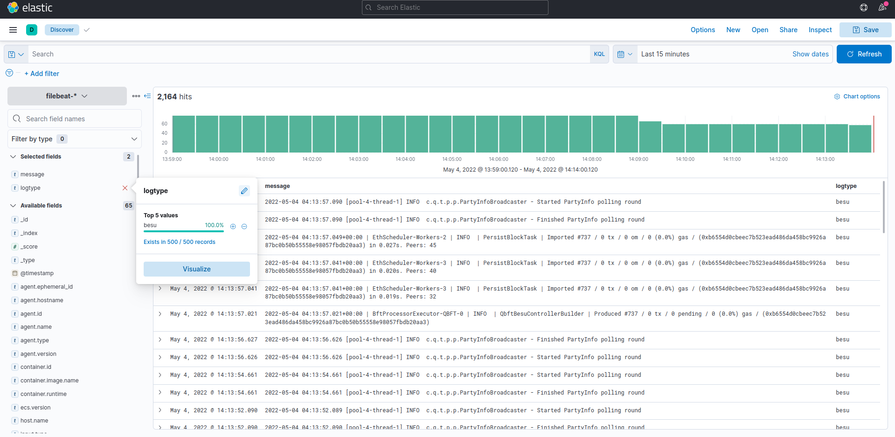
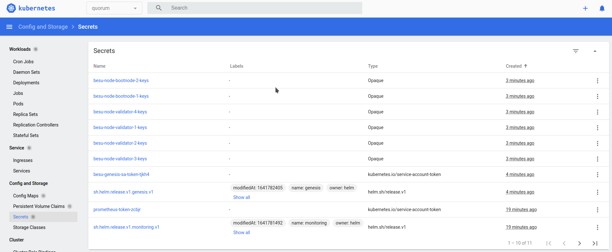
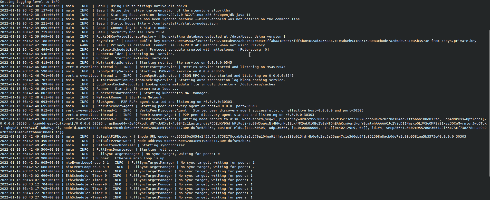

import Tabs from '@theme/Tabs';
import TabItem from '@theme/TabItem';

# Deploy charts

You can deploy Besu Helm charts for a Kubernetes cluster.

## Prerequisites

- Clone the [Quorum-Kubernetes](https://github.com/ConsenSys/quorum-kubernetes) repository
- A [running Kubernetes cluster](cluster.md)
- Install [Kubectl](https://kubernetes.io/docs/tasks/tools/)
- Install [Helm3](https://helm.sh/docs/intro/install/)

## Provision with Helm charts

Helm is a method of packaging a collection of objects into a chart which can then be deployed to the cluster. After you have cloned the [Quorum-Kubernetes](https://github.com/ConsenSys/quorum-kubernetes) repository, change the directory to `helm` for the rest of this tutorial.

```bash
cd helm
```

Each helm chart has the following key-map values which you will need to set depending on your needs. The `cluster.provider` is used as a key for the various cloud features enabled. Please specify only one cloud provider, not both. At present, the charts have full support for cloud native services in both AWS and Azure. Please note that if you use GCP, IBM etc please set `cluster.provider: local` and set `cluster.cloudNativeServices: false`.

Please update the `aws` or `azure` map as shown below if you deploy to either cloud provider.

```bash
cluster:
  provider: local  # choose from: local | aws | azure
  cloudNativeServices: false # set to true to use Cloud Native Services (SecretsManager and IAM for AWS; KeyVault & Managed Identities for Azure)
  reclaimPolicy: Delete # set to either Retain or Delete; note that PVCs and PVs will still exist after a 'helm delete'. Setting to Retain will keep volumes even if PVCs/PVs are deleted in kubernetes. Setting to Delete will remove volumes from EC2 EBS when PVC is deleted

quorumFlags:
  privacy: false
  removeKeysOnDelete: false

aws:
  # the aws cli commands uses the name 'quorum-node-secrets-sa' so only change this if you altered the name
  serviceAccountName: quorum-node-secrets-sa
  # the region you are deploying to
  region: ap-southeast-2

azure:
  # the script/bootstrap.sh uses the name 'quorum-pod-identity' so only change this if you altered the name
  identityName: quorum-pod-identity
  # the clientId of the user assigned managed identity created in the template
  identityClientId: azure-clientId
  keyvaultName: azure-keyvault
  # the tenant ID of the key vault
  tenantId: azure-tenantId
  # the subscription ID to use - this needs to be set explicitly when using multi tenancy
  subscriptionId: azure-subscriptionId
```

Setting the `cluster.cloudNativeServices: true`:

- Stores keys in Azure Key Vault or AWS Secrets Manager.
- Uses Azure Managed Identities or AWS Identity and Access Management for pod identity access.

:::note

You can customize any of the charts in this repository to suit your requirements, and make pull requests to extend functionality.

:::

### 1. Check that you can connect to the cluster with `kubectl`

Verify kubectl is connected to cluster using: (use the latest version)

```bash
kubectl version
```

The result looks similar to:

```bash
Client Version: version.Info{Major:"1", Minor:"23", GitVersion:"v1.23.1", GitCommit:"86ec240af8cbd1b60bcc4c03c20da9b98005b92e", GitTreeState:"clean", BuildDate:"2021-12-16T11:41:01Z", GoVersion:"go1.17.5", Compiler:"gc", Platform:"linux/amd64"}
Server Version: version.Info{Major:"1", Minor:"22", GitVersion:"v1.22.3", GitCommit:"c92036820499fedefec0f847e2054d824aea6cd1", GitTreeState:"clean", BuildDate:"2021-10-27T18:35:25Z", GoVersion:"go1.16.9", Compiler:"gc", Platform:"linux/amd64"}
```

### 2. Create the namespace

This tutorial isolates groups of resources (for example, StatefulSets and Services) within a single cluster.

:::note

The rest of this tutorial uses `besu` as the namespace, but you're free to pick any name when deploying, as long as it's consistent across the [infrastructure scripts](cluster.md) and charts.

:::

Run the following in a terminal window:

```bash
kubectl create namespace besu
```

### 3. Deploy the monitoring chart

This chart deploys Prometheus and Grafana to monitor the metrics of the cluster, nodes and state of the network.

Update the admin `username` and `password` in the [monitoring values file](https://github.com/ConsenSys/quorum-kubernetes/blob/5920caff6dd15b4ca17f760ad9e4d7d2e43b41a1/helm/values/monitoring.yml). Configure alerts to the receiver of your choice (for example, email or Slack), then deploy the chart using:

```bash
helm repo add prometheus-community https://prometheus-community.github.io/helm-charts
helm repo update
helm install monitoring prometheus-community/kube-prometheus-stack --version 34.10.0 --namespace=besu --values ./values/monitoring.yml --wait
kubectl --namespace besu apply -f  ./values/monitoring/
```

Metrics are collected via a [ServiceMonitor](https://github.com/prometheus-operator/prometheus-operator/blob/7c77626e5e270a2530e187b185d45eeed8a773bf/Documentation/user-guides/getting-started.md) that scrapes each Besu pod, using given [`annotations`](https://kubernetes.io/docs/concepts/overview/working-with-objects/annotations/) which specify the port and path to use. For example:

```bash
  template:
    metadata:
      annotations:
        prometheus.io/scrape: "true"
        prometheus.io/port: 9545
        prometheus.io/path: "/metrics"
```

:::warning

For production use cases, configure Grafana with one of the supported [native auth mechanisms](https://grafana.com/docs/grafana/latest/auth/).

:::



Optionally you can also deploy the [Elastic Stack](https://www.elastic.co/elastic-stack/) to view logs (and metrics).

```bash
helm repo add elastic https://helm.elastic.co
helm repo update
# if on cloud
helm install elasticsearch --version 7.17.1 elastic/elasticsearch --namespace quorum --values ./values/elasticsearch.yml
# if local - set the replicas to 1
helm install elasticsearch --version 7.17.1 elastic/elasticsearch --namespace quorum --values ./values/elasticsearch.yml --set replicas=1 --set minimumMasterNodes: 1
helm install kibana --version 7.17.1 elastic/kibana --namespace quorum --values ./values/kibana.yml
helm install filebeat --version 7.17.1 elastic/filebeat  --namespace quorum --values ./values/filebeat.yml
```

If you install `filebeat`, please create a `filebeat-*` index pattern in `kibana`. All the logs from the nodes are sent to the `filebeat` index. If you use The Elastic stack for logs and metrics, please deploy `metricbeat` in a similar manner to `filebeat` and create an index pattern in Kibana.



To connect to Kibana or Grafana, we also need to deploy an ingress so you can access your monitoring endpoints publicly. We use Nginx as our ingress here, and you are free to configure any ingress per your requirements.

```bash
helm repo add ingress-nginx https://kubernetes.github.io/ingress-nginx
helm repo update
helm install quorum-monitoring-ingress ingress-nginx/ingress-nginx \
    --namespace quorum \
    --set controller.ingressClassResource.name="monitoring-nginx" \
    --set controller.ingressClassResource.controllerValue="k8s.io/monitoring-ingress-nginx" \
    --set controller.replicaCount=1 \
    --set controller.nodeSelector."kubernetes\.io/os"=linux \
    --set defaultBackend.nodeSelector."kubernetes\.io/os"=linux \
    --set controller.admissionWebhooks.patch.nodeSelector."kubernetes\.io/os"=linux \
    --set controller.service.externalTrafficPolicy=Local

kubectl apply -f ../ingress/ingress-rules-monitoring.yml
```

Once complete, view the IP address listed under the `Ingress` section if you're using the Kubernetes Dashboard or on the command line `kubectl -n quorum get services quorum-monitoring-ingress-ingress-nginx-controller`.

:::note

We refer to the ingress here as `external-nginx` because it deals with monitoring endpoints specifically. We also deploy a second ingress called `network-ingress` which is for the blockchain nodes only in [step 8](#9-connect-to-the-node-from-your-local-machine-via-an-ingress)

:::


You can view the Besu dashboard by going to:

```bash
http://<INGRESS_IP>/d/XE4V0WGZz/besu-overview?orgId=1&refresh=10s
```

You can view the Kibana dashboard (if deployed) by going to:

```bash
http://<INGRESS_IP>/kibana
```

### 4. Deploy the genesis chart

The genesis chart creates the genesis file and keys for the validators.

:::warning

It's important to keep the release names of the initial validator pool as per this tutorial, that is `validator-n`, where `n` is the node number. Any validators created after the initial pool can be named to anything you like.

:::

The override [values.yml](https://github.com/ConsenSys/quorum-kubernetes/blob/5920caff6dd15b4ca17f760ad9e4d7d2e43b41a1/helm/values/genesis-besu.yml) looks like below:

```bash
---
quorumFlags:
  removeGenesisOnDelete: true

cluster:
  provider: local  # choose from: local | aws | azure
  cloudNativeServices: false

aws:
  # the aws cli commands uses the name 'quorum-node-secrets-sa' so only change this if you altered the name
  serviceAccountName: quorum-node-secrets-sa
  # the region you are deploying to
  region: ap-southeast-2

azure:
  # the script/bootstrap.sh uses the name 'quorum-pod-identity' so only change this if you altered the name
  identityName: quorum-pod-identity
  # the clientId of the user assigned managed identity created in the template
  identityClientId: azure-clientId
  keyvaultName: azure-keyvault
  # the tenant ID of the key vault
  tenantId: azure-tenantId
  # the subscription ID to use - this needs to be set explicitly when using multi tenancy
  subscriptionId: azure-subscriptionId

# the raw Genesis config
# rawGenesisConfig.blockchain.nodes set the number of validators/signers
rawGenesisConfig:
  genesis:
    config:
      chainId: 1337
      algorithm:
        consensus: qbft # choose from: ibft2 | qbft | clique
        blockperiodseconds: 10
        epochlength: 30000
        requesttimeoutseconds: 20
    gasLimit: '0x47b760'
    difficulty: '0x1'
    coinbase: '0x0000000000000000000000000000000000000000'
  blockchain:
    nodes:
      generate: true
      count: 4
    accountPassword: 'password'
```

Please set the `aws`, `azure` and `cluster` keys are as per the [Provisioning](#provision-with-helm-charts) step. `quorumFlags.removeGenesisOnDelete: true` tells the chart to delete the genesis file when the chart is deleted. If you may wish to retain the genesis on deletion, please set that value to `false`.

The last config item is `rawGenesisConfig` which has details of the chain you are creating, please edit any of the parameters in there to match your requirements. To set the number of initial validators set the `rawGenesisConfig.blockchain.nodes` to the number that you'd like. We recommend using the Byzantine formula of `N=3F+1` when setting the number of validators.

One more thing to note is that when `cluster.cloudNativeServices: true` is set, the genesis job will not add the [Quickstart](../quickstart.md) test accounts into the genesis file.

When you are ready deploy the chart with :

```bash
cd helm
helm install genesis ./charts/besu-genesis --namespace besu --create-namespace --values ./values/genesis-besu.yml
```

Once completed, view the genesis and enodes (the list of static nodes) configuration maps that every Besu node uses, and the validator and bootnode node keys as secrets.




### 5. Deploy the bootnodes

This is an optional but recommended step. In a production setup we recommend the use of two ore more bootnodes for best practices. Each Besu node has a map that tells the StatefulSet what to deploy and how to clean up. The default `values.yml` for the StatefulSet define the following flags which are present in all the override values files.

```bash
---
quorumFlags:
  privacy: false
  removeKeysOnDelete: true
  isBootnode: true    # set this to true if this node is a bootnode
  usesBootnodes: true # set this to true if the network you are connecting to use a bootnode/s that are deployed in the cluster

cluster:
  provider: local  # choose from: local | aws | azure
  cloudNativeServices: false
  reclaimPolicy: Delete # set to either Retain or Delete; note that PVCs and PVs will still exist after a 'helm delete'. Setting to Retain will keep volumes even if PVCs/PVs are deleted in kubernetes. Setting to Delete will remove volumes from EC2 EBS when PVC is deleted

aws:
  # the aws cli commands uses the name 'quorum-node-secrets-sa' so only change this if you altered the name
  serviceAccountName: quorum-node-secrets-sa
  # the region you are deploying to
  region: ap-southeast-2

azure:
  # the script/bootstrap.sh uses the name 'quorum-pod-identity' so only change this if you altered the name
  identityName: quorum-pod-identity
  # the clientId of the user assigned managed identity created in the template
  identityClientId: azure-clientId
  keyvaultName: azure-keyvault
  # the tenant ID of the key vault
  tenantId: azure-tenantId
  # the subscription ID to use - this needs to be set explicitly when using multi tenancy
  subscriptionId: azure-subscriptionId

node:
  besu:
    metrics:
      serviceMonitorEnabled: true
    resources:
      cpuLimit: 1
      cpuRequest: 0.1
      memLimit: "2G"
      memRequest: "1G"
```

Please set the `aws`, `azure` and `cluster` keys are as per the [Provisioning](#provision-with-helm-charts) step. `quorumFlags.removeKeysOnDelete: true` tells the chart to delete the node's keys when the chart is deleted. If you may wish to retain the keys on deletion, please set that value to `false`.

For the bootnodes only, set the `quorumFlags.isBootnode: true`. When using bootnodes you have to also set `quorumFlags.usesBootnodes: true` to indicate that all nodes on the network will use these bootnodes.

:::note

If you use bootnodes, you must set `quorumFlags.usesBootnodes: true` in the override values.yaml for every other node type, that is validators.yaml, txnode.yaml and reader.yaml

:::

```bash
helm install bootnode-1 ./charts/besu-node --namespace besu --values ./values/bootnode.yml
helm install bootnode-2 ./charts/besu-node --namespace besu --values ./values/bootnode.yml
```

Once complete, you see two StatefulSets, and the two bootnodes discover themselves and peer. Because there are no validators present yet, there are no blocks created, as seen in the following logs.



### 6. Deploy the validators

The validators peer with the bootnodes and themselves, and when a majority of the validators have peered, blocks are proposed and created on the chain.

These are the next set of nodes that we will deploy. The charts use four validators (default) to replicate best practices for a network. The override [values.yml](https://github.com/ConsenSys/quorum-kubernetes/blob/5920caff6dd15b4ca17f760ad9e4d7d2e43b41a1/helm/values/validator.yml) for the StatefulSet looks like below:

```bash
---
quorumFlags:
  privacy: false
  removeKeysOnDelete: false
  isBootnode: false   # set this to true if this node is a bootnode
  usesBootnodes: true # set this to true if the network you are connecting to use a bootnode/s that are deployed in the cluster
```

Please set the `aws`, `azure` and `cluster` keys are as per the [Provisioning](#provision-with-helm-charts) step. `quorumFlags.removeKeysOnDelete: true` tells the chart to delete the node's keys when the chart is deleted. If you may wish to retain the keys on deletion, please set that value to `false`.

:::warning

Please note that if you delete a majority of the validators, the network will halt. Additionally, if the validator keys are deleted you may not be able to recover as you need a majority of the validators up to vote to add new validators into the pool

:::

When using bootnodes (if deployed in the previous step) you have to also set `quorumFlags.usesBootnodes: true` to indicate that all nodes on the network will use these bootnodes.

For the initial validator pool we set all the node flags to `false` and then deploy.

```bash
helm install validator-1 ./charts/besu-node --namespace besu --values ./values/validator.yml
helm install validator-2 ./charts/besu-node --namespace besu --values ./values/validator.yml
helm install validator-3 ./charts/besu-node --namespace besu --values ./values/validator.yml
helm install validator-4 ./charts/besu-node --namespace besu --values ./values/validator.yml
```

:::warning

It's important to keep the release names of the validators the same as it is tied to the keys that the genesis chart creates. So we use `validator-1`, `validator-2`, etc. in the following command.

:::

Once completed, you may need to give the validators a few minutes to peer and for round changes, depending on when the first validator was spun up, before the logs display blocks being created.


### 7. Add/Remove additional validators to the validator pool

To add (or remove) more validators to the initial validator pool, you need to deploy a node such as an RPC node (step 8) and then [vote](../../how-to/configure/consensus/ibft.md#add-and-remove-validators) that node in. The vote API call must be made on a majority of the existing pool and the new node will then become a validator.

Please refer to the [Ingress Section](#9-connect-to-the-node-from-your-local-machine-via-an-ingress) for details on making the API calls from your local machine or equivalent.

### 8. Deploy RPC or Transaction nodes

An RPC node is simply a node that can be used to make public transactions or perform read heavy operations such as when connected to a chain explorer like [BlockScout](https://github.com/blockscout/blockscout).

The RPC override [values.yml](https://github.com/ConsenSys/quorum-kubernetes/blob/5920caff6dd15b4ca17f760ad9e4d7d2e43b41a1/helm/values/reader.yml) for the StatefulSet looks identical to that of the validators above, and will create it's own node keys before the node starts.

To deploy an RPC node:

```bash
helm install rpc-1 ./charts/besu-node --namespace besu --values ./values/reader.yml
```

A Transaction or Member node in turn is one which has an accompanying Private Transaction Manager, such as Tessera; which allow you to make private transactions between nodes.

The Transaction override [values.yml](https://github.com/ConsenSys/quorum-kubernetes/blob/5920caff6dd15b4ca17f760ad9e4d7d2e43b41a1/helm/values/txnode.yml) for the StatefulSet looks identical to that of the validators above and only has `quorumFlags.privacy: true` to indicate that it is deploying a pair of GoQuorum and Tessera nodes.

To deploy a Transaction or Member node:

```bash
helm install member-1 ./charts/besu-node --namespace besu --values ./values/txnode.yml
```

Logs for `member-1` resemble the following for Tessera:


Logs for Besu resemble the following:


:::note

In these examples we use `member-1` and `rpc-1` as release names for the deployments. You can pick any release name that you'd like to use in place of those as per your requirements.

:::

### 9. Connect to the node from your local machine via an ingress

In order to view the Grafana dashboards or connect to the nodes to make transactions from your local machine you can deploy an ingress controller with rules. We use the `ingress-nginx` ingress controller which can be deployed as follows:

```bash
helm repo add ingress-nginx https://kubernetes.github.io/ingress-nginx
helm repo update
helm install quorum-network-ingress ingress-nginx/ingress-nginx \
    --namespace quorum \
    --set controller.ingressClassResource.name="network-nginx" \
    --set controller.ingressClassResource.controllerValue="k8s.io/network-ingress-nginx" \
    --set controller.replicaCount=1 \
    --set controller.nodeSelector."kubernetes\.io/os"=linux \
    --set defaultBackend.nodeSelector."kubernetes\.io/os"=linux \
    --set controller.admissionWebhooks.patch.nodeSelector."kubernetes\.io/os"=linux \
    --set controller.service.externalTrafficPolicy=Local
```

Use [pre-defined rules](https://github.com/ConsenSys/quorum-kubernetes/blob/5920caff6dd15b4ca17f760ad9e4d7d2e43b41a1/ingress/ingress-rules-besu.yml) to test functionality, and alter to suit your requirements (for example, restrict access for API calls to trusted CIDR blocks).

Edit the [rules](https://github.com/ConsenSys/quorum-kubernetes/blob/5920caff6dd15b4ca17f760ad9e4d7d2e43b41a1/ingress/ingress-rules-besu.yml) file so that the service names match your release name. In the example, we deployed a transaction node with the release name `member-1` so the corresponding service is called `besu-node-member-1`. Once you have settings that match your deployments, deploy the rules as follows:

```bash
kubectl apply -f ../ingress/ingress-rules-besu.yml
```

Once complete, view the IP address listed under the `Ingress` section if you're using the Kubernetes Dashboard or on the command line `kubectl -n quorum get services quorum-network-ingress-ingress-nginx-controller`.


The following is an example RPC call, which confirms that the node running the JSON-RPC service is syncing:

<Tabs>

<TabItem value="curl HTTP request" label="curl HTTP request" default>

```bash
curl -v -X POST -H "Content-Type: application/json" --data '{"jsonrpc":"2.0","method":"eth_blockNumber","params":[],"id":1}' http://<INGRESS_IP>/rpc
```

</TabItem>

<TabItem value="JSON result" label="JSON result">

```json
{
  "jsonrpc": "2.0",
  "id": 1,
  "result": "0x4e9"
}
```

</TabItem>

</Tabs>

### 10. Blockchain explorer

You can deploy [BlockScout](https://github.com/blockscout/blockscout) to aid with monitoring the blockchain. To do this, update the [BlockScout values file](https://github.com/ConsenSys/quorum-kubernetes/blob/5920caff6dd15b4ca17f760ad9e4d7d2e43b41a1/helm/values/blockscout-besu.yml) and set the `database` and `secret_key_base` values.

:::important

Changes to the database requires changes to both the `database` and the `blockscout` dictionaries.

:::

Once completed, deploy the chart using:

```bash
helm dependency update ./charts/blockscout
helm install blockscout ./charts/blockscout --namespace quorum --values ./values/blockscout-goquorum.yaml
```

You can optionally deploy the [Quorum-Explorer](https://github.com/ConsenSys/quorum-explorer) as a lightweight blockchain explorer. The Quorum Explorer is not recommended for use in production and is intended for demonstration or Development purposes only. The Explorer can give an overview over the whole network, such as querying each node on the network for node or block information, voting (add/remove) validators from the network, demonstrating a SimpleStorage smart contract with privacy enabled, and sending transactions between wallets as you would do in MetaMask. Please see the [Explorer](quorum-explorer.md) page for details on how to use the application.

:::warning

The accounts listed in the file below are for test purposes only and should not be used on a production network.

:::

To deploy the application, update the [Explorer values file](https://github.com/ConsenSys/quorum-kubernetes/blob/5920caff6dd15b4ca17f760ad9e4d7d2e43b41a1/helm/values/explorer-besu.yaml) with details of your nodes and endpoints and then deploy.

```bash
helm install quorum-explorer ./charts/explorer --namespace besu --values ./values/explorer-besu.yaml
```

You will also need deploy the ingress (if not already done in [Monitoring](#3-deploy-the-monitoring-chart) to access the endpoint on `http://<INGRESS_IP>/explorer`


