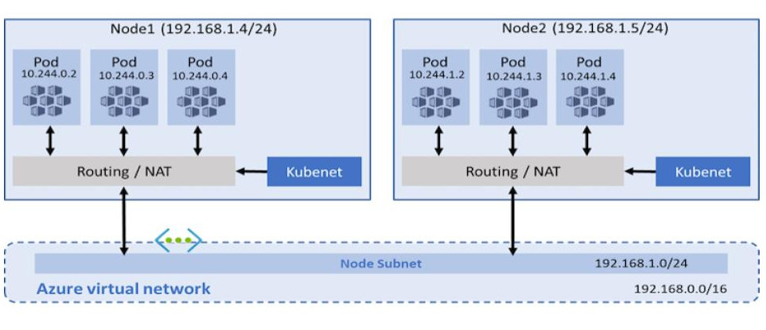
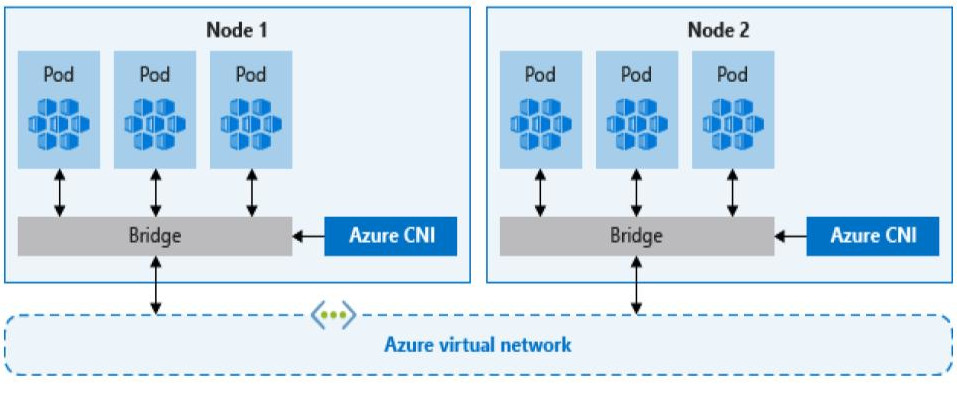
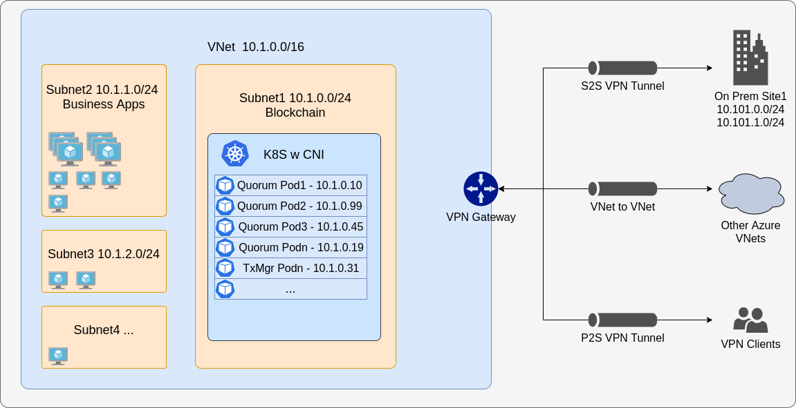

# Deploy Besu using Kubernetes

Use the [reference implementations](https://github.com/ConsenSys/besu-kubernetes) to install private networks using Kubernetes (K8s). Reference implementations are available using:

- [Helm](https://github.com/ConsenSys/quorum-kubernetes/tree/master/helm).
- [Helmfile](https://github.com/roboll/helmfile).
- [`kubectl`](https://github.com/ConsenSys/besu-kubernetes/tree/master/playground/kubectl).

Familiarize yourself with the reference implementations and customize them for your requirements.

## Quorum-Kubernetes

[Quorum-Kubernetes](https://github.com/ConsenSys/quorum-Kubernetes) is a repository containing Kubernetes manifests and Helm charts that you can customize and deploy on a local cluster or in the cloud.

:::important

We recommend starting with the [playground](https://github.com/ConsenSys/quorum-kubernetes/tree/master/playground) directory and working through the example setups before moving to the [`Helm charts`](https://github.com/ConsenSys/quorum-kubernetes/tree/master/helm/) directory.

:::

The `helm` directory contains charts for the various components, and each chart has a `cluster` map with features that you can toggle.

```bash
cluster:
  provider: local  # choose from: local | aws | azure
  cloudNativeServices: false # set to true to use Cloud Native Services (SecretsManager and IAM for AWS; KeyVault & Managed Identities for Azure)
```

Setting `cluster.cloudNativeServices: true` stores keys in AWS Secrets Manager or Azure Key Vault instead of Kubernetes Secrets, and will also make use of AWS IAM or Azure Managed Identities for the pods.

### Cloud support

The repository's `helm` charts support on-premise and cloud providers such as AWS, Azure, GCP, IBM etc. You can configure the provider in the [values.yml](https://github.com/ConsenSys/quorum-kubernetes/blob/5920caff6dd15b4ca17f760ad9e4d7d2e43b41a1/helm/values/genesis-besu.yml) file of the respective charts by setting `cluster.provider` to `local`, `aws`, or `azure`. If you use GCP, IBM etc., please set `cluster.provider: local` and `cluster.cloudNativeServices: false`.

The repository also contains [Azure ARM templates](https://github.com/ConsenSys/quorum-kubernetes/tree/master/azure) and [AWS `eksctl` templates](https://github.com/ConsenSys/quorum-kubernetes/tree/master/aws) to deploy the required base infrastructure.

## Limitations

When using multi-clusters, Kubernetes load balancers disallow TCP and UDP traffic on the same port, which inhibits discovery working natively for each pod. Use the following solutions to mitigate this limitation:

- Disallow discovery and use static nodes to allow only TCP traffic. This isn't an issue for load balancers or exposing nodes publicly.
- If you need to use discovery, use something such as [CNI](#cni) which is supported by all major cloud providers, and the cloud templates already have CNI implemented.

### CNI

With the traditional `kubenet` networking mode, nodes get an IP from the virtual network subnet. Each node in turn uses NAT to configure the pods so that they reach other pods on the virtual network. This limits where they can reach but also more specifically what can reach them. For example, an external VM which must have custom routes does not scale well.



CNI, on the other hand, allows every pod to get a unique IP directly from the virtual subnet which removes this restriction. Therefore, it has a limit on the maximum number of pods that can be spun up, so you must plan ahead to avoid IP exhaustion.



## Multi-cluster

You must enable [CNI](#cni) to use multi-cluster, or to connect external nodes to an existing Kubernetes cluster. To connect multiple clusters, they must each have different CIDR blocks to ensure no conflicts, and the first step is to peer the VPCs or VNets together and update the route tables. From that point on you can use static nodes and pods to communicate across the cluster.

The same setup also works to connect external nodes and business applications from other infrastructure, either in the cloud or on premise.



## Concepts

### Namespaces

In Kubernetes, [namespaces](https://kubernetes.io/docs/concepts/overview/working-with-objects/namespaces/) provide a mechanism for isolating groups of resources within a single cluster. Both namespaces and resources (for example, Stateful Sets or Services) within a namespace must be unique, but resources across namespaces don't need to be.

:::note

Namespace-based scoping is not applicable for cluster-wide objects (for example, Storage Class or Persistent Volumes).

:::

### Nodes

Consider using Stateful Sets instead of Deployments for Besu. The term 'client node' refers to bootnode, validator and member/RPC nodes. For Besu nodes, we only use CLI arguments to keep things consistent.

### Role-based access controls

We encourage using role-based access controls (RBACs) for access to the private key of each node, that is, only a specific pod or statefulset is allowed to access a specific secret.

If you need to specify a Kube configuration file for each pod, use the `KUBE_CONFIG_PATH` variable.

### Storage

We use separate data volumes to store the blockchain data. This is similar to using separate volumes to store data when using docker containers natively or docker-compose. This is done for a few reasons:

- Containers are mortal and we do not want to store data on them.
- Kubernetes host nodes can fail and we want the chain data to persist.

Ensure that you provide enough data storage capacity for all nodes on the cluster. Select the appropriate type of [Storage Class](https://kubernetes.io/docs/concepts/storage/storage-classes/) based on your cloud provider. In the templates, the size of the [volume claims](https://kubernetes.io/docs/concepts/storage/persistent-volumes/#persistentvolumeclaims) is set to 20Gb by default; you can change this depending on your needs. If you have a different storage account than the one in the charts, you may edit those [Storage Classes](https://github.com/ConsenSys/quorum-kubernetes/blob/5920caff6dd15b4ca17f760ad9e4d7d2e43b41a1/helm/charts/besu-node/templates/node-storage.yaml).

When using Persistent Volume Claims, set the `allowVolumeExpansion` to `true`. This helps keep costs low and enables growing the volume over time rather than creating new volumes and copying data across.

### Monitoring

We recommend deploying metrics to get an overview of the network, nodes, and volumes. You can also create alerts.

Besu publishes metrics to Prometheus, and you can configure metrics using the kubernetes scraper configuration. We also have custom Grafana dashboards to monitor the blockchain.

:::note

Refer to `values/monitoring.yml` to configure the alerts per your requirements (for example slack or email).

:::

```bash
cd helm
helm repo add prometheus-community https://prometheus-community.github.io/helm-charts
helm repo update
helm install monitoring prometheus-community/kube-prometheus-stack --version 34.10.0 --namespace=besu --create-namespace --values ./values/monitoring.yml --wait
kubectl --namespace besu apply -f  ./values/monitoring/
```

You can configure Besu to suit your environment. For example, use the Elastic charts to log to a file that you can parse using Logstash into an ELK cluster.

```bash
cd helm
helm repo add elastic https://helm.elastic.co
helm repo update
# if on cloud
helm install elasticsearch --version 7.17.1 elastic/elasticsearch --namespace besu --create-namespace --values ./values/elasticsearch.yml
# if local - set the replicas to 1
helm install elasticsearch --version 7.17.1 elastic/elasticsearch --namespace besu --create-namespace --values ./values/elasticsearch.yml --set replicas=1 --set minimumMasterNodes: 1
helm install kibana --version 7.17.1 elastic/kibana --namespace besu --values ./values/kibana.yml
helm install filebeat --version 7.17.1 elastic/filebeat  --namespace besu --values ./values/filebeat.yml
```

### Ingress Controllers

If you require the ingress controllers for the RPC calls or the monitoring dashboards, we have provided example [rules](https://github.com/ConsenSys/quorum-kubernetes/blob/5920caff6dd15b4ca17f760ad9e4d7d2e43b41a1/ingress/ingress-rules-besu.yml) that are pre-configured for common use cases. Use these as a reference and develop solutions to match your network topology and requirements.
