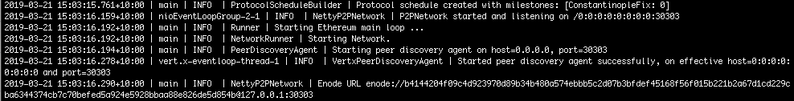

import Tabs from '@theme/Tabs';
import TabItem from '@theme/TabItem';

# Create a permissioned network

The following steps set up a permissioned network with local node and account permissions. The network uses the [IBFT 2.0 proof of authority consensus protocol].

:::danger

A permissioned Ethereum network as described here is not protected against all attack vectors. We recommend applying defense in depth to protect your infrastructure.

:::

## Prerequisites

- [Hyperledger Besu](../../get-started/install/binary-distribution.md)
- [curl (or similar Web service client)](https://curl.haxx.se/download.html)

## Steps

### 1. Create folders

Each node requires a data directory for the blockchain data.

Create directories for your permissioned network and each of the three nodes, and a data directory for each node:

```bash
Permissioned-Network/
├── Node-1
│   ├── data
├── Node-2
│   ├── data
└── Node-3
│   ├── data
└── Node-4
    ├── data
```

### 2. Create the configuration file

The configuration file defines the [IBFT 2.0 genesis file](../../how-to/configure/consensus/ibft.md#genesis-file) and the number of node key pairs to generate.

The configuration file has two nested JSON nodes. The first is the `genesis` property defining the IBFT 2.0 genesis file, except for the `extraData` string, which Besu generates automatically in the resulting genesis file. The second is the `blockchain` property defining the number of key pairs to generate.

Copy the following configuration file definition to a file called `ibftConfigFile.json` and save it in the `Permissioned-Network` directory:

```json
{
  "genesis": {
    "config": {
      "chainId": 1337,
      "berlinBlock": 0,
      "ibft2": {
        "blockperiodseconds": 2,
        "epochlength": 30000,
        "requesttimeoutseconds": 4
      }
    },
    "nonce": "0x0",
    "timestamp": "0x58ee40ba",
    "gasLimit": "0x47b760",
    "difficulty": "0x1",
    "mixHash": "0x63746963616c2062797a616e74696e65206661756c7420746f6c6572616e6365",
    "coinbase": "0x0000000000000000000000000000000000000000",
    "alloc": {
      "fe3b557e8fb62b89f4916b721be55ceb828dbd73": {
        "privateKey": "8f2a55949038a9610f50fb23b5883af3b4ecb3c3bb792cbcefbd1542c692be63",
        "comment": "private key and this comment are ignored.  In a real chain, the private key should NOT be stored",
        "balance": "0xad78ebc5ac6200000"
      },
      "627306090abaB3A6e1400e9345bC60c78a8BEf57": {
        "privateKey": "c87509a1c067bbde78beb793e6fa76530b6382a4c0241e5e4a9ec0a0f44dc0d3",
        "comment": "private key and this comment are ignored.  In a real chain, the private key should NOT be stored",
        "balance": "90000000000000000000000"
      },
      "f17f52151EbEF6C7334FAD080c5704D77216b732": {
        "privateKey": "ae6ae8e5ccbfb04590405997ee2d52d2b330726137b875053c36d94e974d162f",
        "comment": "private key and this comment are ignored.  In a real chain, the private key should NOT be stored",
        "balance": "90000000000000000000000"
      }
    }
  },
  "blockchain": {
    "nodes": {
      "generate": true,
      "count": 4
    }
  }
}
```

:::danger Security warning

Don't use the accounts in the genesis file on Mainnet or any public network except for testing. The private keys display, which means the accounts are not secure.

:::

### 3. Generate node keys and a genesis file

In the `Permissioned-Network` directory, generate the node key and genesis file:

```bash
besu operator generate-blockchain-config --config-file=ibftConfigFile.json --to=networkFiles --private-key-file-name=key
```

Besu creates the following in the `networkFiles` directory:

- `genesis.json` - The genesis file including the `extraData` property specifying the four nodes are validators.
- A directory for each node named using the node address and containing the public and private key for each node.

```bash
networkFiles/
├── genesis.json
└── keys
    ├── 0x438821c42b812fecdcea7fe8235806a412712fc0
    │   ├── key
    │   └── key.pub
    ├── 0xca9c2dfa62f4589827c0dd7dcf48259aa29f22f5
    │   ├── key
    │   └── key.pub
    ├── 0xcd5629bd37155608a0c9b28c4fd19310d53b3184
    │   ├── key
    │   └── key.pub
    └── 0xe96825c5ab8d145b9eeca1aba7ea3695e034911a
        ├── key
        └── key.pub
```

### 4. Copy the genesis file to the Permissioned-Network directory

Copy the `genesis.json` file to the `Permisssioned-Network` directory.

### 5. Copy the node private keys to the node directories

For each node, copy the key files to the `data` directory for that node

```bash
Permissioned-Network/
├── genesis.json
├── Node-1
│   ├── data
│   │    ├── key
│   │    ├── key.pub
├── Node-2
│   ├── data
│   │    ├── key
│   │    ├── key.pub
├── Node-3
│   ├── data
│   │    ├── key
│   │    ├── key.pub
├── Node-4
│   ├── data
│   │    ├── key
│   │    ├── key.pub
```

### 6. Create the permissions configuration file

The [permissions configuration file](../../how-to/use-permissioning/local.md#permissions-configuration-file) defines the nodes and accounts allowlists.

Copy the following permissions configuration to a file called `permissions_config.toml` and save a copy in the `Node-1/data`, `Node-2/data`, `Node-3/data`, and `Node-4/data` directories:

```toml title="permissions_config.toml"
accounts-allowlist=["0xfe3b557e8fb62b89f4916b721be55ceb828dbd73", "0x627306090abaB3A6e1400e9345bC60c78a8BEf57"]

nodes-allowlist=[]
```

The permissions configuration file includes the first two accounts from the genesis file.

Use the [`perm_addNodesToAllowlist`](../../reference/api/index.md#perm_addnodestoallowlist) JSON-RPC API method to add permissioned nodes after starting the nodes.

### 7. Start Node-1

Use the following command:

<Tabs>

<TabItem value="MacOS" label="MacOS" default>

```bash
besu --data-path=data --genesis-file=../genesis.json --permissions-nodes-config-file-enabled --permissions-accounts-config-file-enabled --rpc-http-enabled --rpc-http-api=ADMIN,ETH,NET,PERM,IBFT --host-allowlist="*" --rpc-http-cors-origins="*"
```

</TabItem>

<TabItem value="Windows" label="Windows">

```bash
besu --data-path=data --genesis-file=..\genesis.json --permissions-nodes-config-file-enabled --permissions-accounts-config-file-enabled --rpc-http-enabled --rpc-http-api=ADMIN,ETH,NET,PERM,IBFT --host-allowlist="*" --rpc-http-cors-origins="*"
```

</TabItem>

</Tabs>

The command line allows you to enable:

- Nodes and accounts permissions using [`--permissions-nodes-config-file-enabled`](../../reference/cli/options.md#permissions-nodes-config-file-enabled) and [`--permissions-accounts-config-file-enabled`](../../reference/cli/options.md#permissions-accounts-config-file-enabled).
- The JSON-RPC API using [`--rpc-http-enabled`](../../../public-networks/reference/cli/options.md#rpc-http-enabled).
- The `ADMIN`, `ETH`, `NET`, `PERM`, and `IBFT` APIs using [`--rpc-http-api`](../../../public-networks/reference/cli/options.md#rpc-http-api).
- All-host access to the HTTP JSON-RPC API using [`--host-allowlist`](../../../public-networks/reference/cli/options.md#host-allowlist).
- All-domain access to the node through the HTTP JSON-RPC API using [`--rpc-http-cors-origins`](../../../public-networks/reference/cli/options.md#rpc-http-cors-origins).

When the node starts, the [enode URL](../../../public-networks/concepts/node-keys.md#enode-url) displays. You need the enode URL to specify Node-1 as a peer and update the permissions configuration file in the following steps.



### 8. Start Node-2

Start another terminal, change to the `Node-2` directory, and start Node-2:

<Tabs>

<TabItem value="MacOS" label="MacOS" default>

```bash
besu --data-path=data --genesis-file=../genesis.json --permissions-nodes-config-file-enabled --permissions-accounts-config-file-enabled --rpc-http-enabled --rpc-http-api=ADMIN,ETH,NET,PERM,IBFT --host-allowlist="*" --rpc-http-cors-origins="*" --p2p-port=30304 --rpc-http-port=8546
```

</TabItem>

<TabItem value="Windows" label="Windows">

```bash
besu --data-path=data --genesis-file=..\genesis.json --permissions-nodes-config-file-enabled --permissions-accounts-config-file-enabled --rpc-http-enabled --rpc-http-api=ADMIN,ETH,NET,PERM,IBFT --host-allowlist="*" --rpc-http-cors-origins="*" --p2p-port=30304 --rpc-http-port=8546
```

</TabItem>

</Tabs>

The command line specifies:

- A different port to Node-1 for P2P discovery using [`--p2p-port`](../../../public-networks/reference/cli/options.md#p2p-port).
- A different port to Node-1 for HTTP JSON-RPC using [`--rpc-http-port`](../../../public-networks/reference/cli/options.md#rpc-http-port).
- A data directory for Node-2 using [`--data-path`](../../../public-networks/reference/cli/options.md#data-path).
- Other options as for [Node-1](#7-start-node-1).

When the node starts, the [enode URL](../../../public-networks/concepts/node-keys.md#enode-url) displays. You need the enode URL to update the permissions configuration file in the following steps.

### 9. Start Node-3

Start another terminal, change to the `Node-3` directory, and start Node-3:

<Tabs>

<TabItem value="MacOS" label="MacOS" default>

```bash
besu --data-path=data --genesis-file=../genesis.json --permissions-nodes-config-file-enabled --permissions-accounts-config-file-enabled --rpc-http-enabled --rpc-http-api=ADMIN,ETH,NET,PERM,IBFT --host-allowlist="*" --rpc-http-cors-origins="*" --p2p-port=30305 --rpc-http-port=8547
```

</TabItem>

<TabItem value="Windows" label="Windows">

```bash
besu --data-path=data --genesis-file=..\genesis.json --permissions-nodes-config-file-enabled --permissions-accounts-config-file-enabled --rpc-http-enabled --rpc-http-api=ADMIN,ETH,NET,PERM,IBFT --host-allowlist="*" --rpc-http-cors-origins="*" --p2p-port=30305 --rpc-http-port=8547
```

</TabItem>

</Tabs>

The command line specifies:

- A different port to Node-1 and Node-2 for P2P discovery using [`--p2p-port`](../../../public-networks/reference/cli/options.md#p2p-port).
- A different port to Node-1 and Node-2 for HTTP JSON-RPC using [`--rpc-http-port`](../../../public-networks/reference/cli/options.md#rpc-http-port).
- A data directory for Node-3 using [`--data-path`](../../../public-networks/reference/cli/options.md#data-path).
- Other options as for [Node-1](#7-start-node-1).

When the node starts, the [enode URL](../../../public-networks/concepts/node-keys.md#enode-url) displays. You need the enode URL to update the permissions configuration file in the following steps.

### 10. Start Node-4

Start another terminal, change to the `Node-4` directory, and start Node-4:

<Tabs>

<TabItem value="MacOS" label="MacOS" default>

```bash
besu --data-path=data --genesis-file=../genesis.json --permissions-nodes-config-file-enabled --permissions-accounts-config-file-enabled --rpc-http-enabled --rpc-http-api=ADMIN,ETH,NET,PERM,IBFT --host-allowlist="*" --rpc-http-cors-origins="*" --p2p-port=30306 --rpc-http-port=8548
```

</TabItem>

<TabItem value="Windows" label="Windows">

```bash
besu --data-path=data --genesis-file=..\genesis.json --permissions-nodes-config-file-enabled --permissions-accounts-config-file-enabled --rpc-http-enabled --rpc-http-api=ADMIN,ETH,NET,PERM,IBFT --host-allowlist="*" --rpc-http-cors-origins="*" --p2p-port=30306 --rpc-http-port=8548
```

</TabItem>

</Tabs>

The command line specifies:

- A different port to Node-1, Node-2, and Node-3 for P2P discovery using [`--p2p-port`](../../../public-networks/reference/cli/options.md#p2p-port).
- A different port to Node-1, Node-2, and Node-3 for HTTP JSON-RPC using [`--rpc-http-port`](../../../public-networks/reference/cli/options.md#rpc-http-port).
- A data directory for Node-4 using [`--data-path`](../../../public-networks/reference/cli/options.md#data-path).
- Other options as for [Node-1](#7-start-node-1).

When the node starts, the [enode URL](../../../public-networks/concepts/node-keys.md#enode-url) displays. You need the enode URL to update the permissions configuration file in the following steps.

### 11. Add enode URLs for nodes to permissions configuration file

Start another terminal and use the [`perm_addNodesToAllowlist`](../../reference/api/index.md#perm_addnodestoallowlist) JSON-RPC API method to add the nodes to the permissions configuration file for each node.

Replace `<EnodeNode1>`, `<EnodeNode2>`, `<EnodeNode3>`, and `<EnodeNode4>` with the enode URL displayed when starting each node.

<Tabs>

<TabItem value="Node-1" label="Node-1" default>

```bash
curl -X POST --data '{"jsonrpc":"2.0","method":"perm_addNodesToAllowlist","params":[["<EnodeNode1>","<EnodeNode2>","<EnodeNode3>","EnodeNode4"]], "id":1}' http://127.0.0.1:8545
```

</TabItem>

<TabItem value="Node-2" label="Node-2">

```bash
curl -X POST --data '{"jsonrpc":"2.0","method":"perm_addNodesToAllowlist","params":[["<EnodeNode1>","<EnodeNode2>","<EnodeNode3>","EnodeNode4"]], "id":1}' http://127.0.0.1:8546
```

</TabItem>

<TabItem value="Node-3" label="Node-3">

```bash
curl -X POST --data '{"jsonrpc":"2.0","method":"perm_addNodesToAllowlist","params":[["<EnodeNode1>","<EnodeNode2>","<EnodeNode3>","EnodeNode4"]], "id":1}' http://127.0.0.1:8547
```

</TabItem>

<TabItem value="Node-4" label="Node-4">

```bash
curl -X POST --data '{"jsonrpc":"2.0","method":"perm_addNodesToAllowlist","params":[["<EnodeNode1>","<EnodeNode2>","<EnodeNode3>","EnodeNode4"]], "id":1}' http://127.0.0.1:8548
```

</TabItem>

</Tabs>

:::tip

The curl call is the same for each node except for the JSON-RPC endpoint.

:::

### 12. Add nodes as peers

Use the [`admin_addPeer`](../../../public-networks/reference/api/index.md#admin_addpeer) JSON-RPC API method to add Node-1 as a peer for Node-2, Node-3, and Node-4.

Replace `<EnodeNode1>` with the enode URL displayed when starting Node-1.

<Tabs>

<TabItem value="Node-2" label="Node-2" default>

```bash
curl -X POST --data '{"jsonrpc":"2.0","method":"admin_addPeer","params":["<EnodeNode1>"],"id":1}' http://127.0.0.1:8546
```

</TabItem>

<TabItem value="Node-3" label="Node-3">

```bash
curl -X POST --data '{"jsonrpc":"2.0","method":"admin_addPeer","params":["<EnodeNode1>"],"id":1}' http://127.0.0.1:8547
```

</TabItem>

<TabItem value="Node-4" label="Node-4">

```bash
curl -X POST --data '{"jsonrpc":"2.0","method":"admin_addPeer","params":["<EnodeNode1>"],"id":1}' http://127.0.0.1:8548
```

</TabItem>

</Tabs>

:::tip

The curl call is the same for each node except for the JSON-RPC endpoint.

:::

Replace `<EnodeNode2>` with the enode URL displayed when starting Node-2.

<Tabs>

<TabItem value="Node-3" label="Node-3">

```bash
curl -X POST --data '{"jsonrpc":"2.0","method":"admin_addPeer","params":["<EnodeNode2>"],"id":1}' http://127.0.0.1:8547
```

</TabItem>

<TabItem value="Node-4" label="Node-4">

```bash
curl -X POST --data '{"jsonrpc":"2.0","method":"admin_addPeer","params":["<EnodeNode2>"],"id":1}' http://127.0.0.1:8548
```

</TabItem>

</Tabs>

Replace `<EnodeNode3>` with the enode URL displayed when starting Node-3.

```bash
curl -X POST --data '{"jsonrpc":"2.0","method":"admin_addPeer","params":["<EnodeNode3>"],"id":1}' http://127.0.0.1:8548
```

### 13. Confirm permissioned network is working

#### Check peer count

Use curl to call the JSON-RPC API [`net_peerCount`](../../../public-networks/reference/api/index.md#net_peercount) method and confirm the nodes are functioning as peers:

```bash
curl -X POST --data '{"jsonrpc":"2.0","method":"net_peerCount","params":[],"id":1}' localhost:8545
```

The result confirms Node-1 (the node running the JSON-RPC service) has three peers (Node-2, Node-3 and Node-4):

```json
{
  "jsonrpc": "2.0",
  "id": 1,
  "result": "0x3"
}
```

#### Send a transaction from an account in the allowlist

Import the first account from the genesis file into MetaMask and send transactions, as described in the [Quickstart tutorial]:

:::info Account 1

- Address: `0xfe3b557e8fb62b89f4916b721be55ceb828dbd73`
- Private key : `0x8f2a55949038a9610f50fb23b5883af3b4ecb3c3bb792cbcefbd1542c692be63`
- Initial balance : `0xad78ebc5ac6200000` (200000000000000000000 in decimal)

:::

:::info

Besu doesn't support [private key management](../../../public-networks/how-to/send-transactions.md).

:::

#### Try sending a transaction from an account not in the accounts allowlist

Import the third account from the genesis file into MetaMask and try to send a transaction, as described in the [Quickstart tutorial]:

:::info Account 3

- Address: `0xf17f52151EbEF6C7334FAD080c5704D77216b732`
- Private key: `0xae6ae8e5ccbfb04590405997ee2d52d2b330726137b875053c36d94e974d162f`
- Initial balance: `0x90000000000000000000000` (2785365088392105618523029504 in decimal)

:::

#### Start a node not on the nodes allowlist

In your `Permissioned-Network` directory, create a `Node-5` directory and `data` directory inside it.

Change to the `Node-5` directory and start Node-5 specifying the Node-1 enode URL as the bootnode:

<Tabs>

<TabItem value="MacOS" label="MacOS" default>

```bash
besu --data-path=data --bootnodes="<EnodeNode1>" --genesis-file=../genesis.json --rpc-http-enabled --rpc-http-api=ADMIN,ETH,NET,PERM,IBFT --host-allowlist="*" --rpc-http-cors-origins="*" --p2p-port=30307 --rpc-http-port=8549
```

</TabItem>

<TabItem value="Windows" label="Windows">

```bash
besu --data-path=data --bootnodes="<EnodeNode1>" --genesis-file=..\genesis.json --rpc-http-enabled --rpc-http-api=ADMIN,ETH,NET,PERM,IBFT --host-allowlist="*" --rpc-http-cors-origins="*" --p2p-port=30307 --rpc-http-port=8549
```

</TabItem>

</Tabs>

Start another terminal and use curl to call the JSON-RPC API [`net_peerCount`](../../../public-networks/reference/api/index.md#net_peercount) method:

```bash
curl -X POST --data '{"jsonrpc":"2.0","method":"net_peerCount","params":[],"id":1}' localhost:8549
```

The result confirms Node-5 has no peers even though it specifies Node-1 as a bootnode:

```json
{
  "jsonrpc": "2.0",
  "id": 1,
  "result": "0x0"
}
```

## Stop nodes

When finished using the permissioned network, stop all nodes using Ctrl+C in each terminal window.

:::tip

To restart the permissioned network in the future, start from [step 7](#7-start-node-1).

:::

<!-- Links -->

[IBFT 2.0 proof of authority consensus protocol]: ../../how-to/configure/consensus/ibft.md
[Quickstart tutorial]: ../quickstart.md#create-a-transaction-using-metamask
