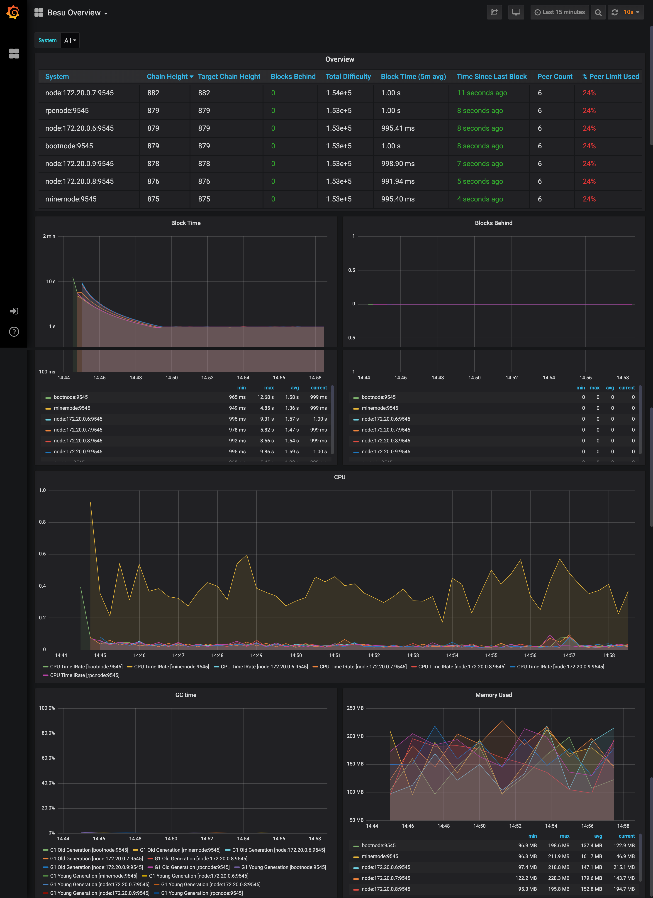
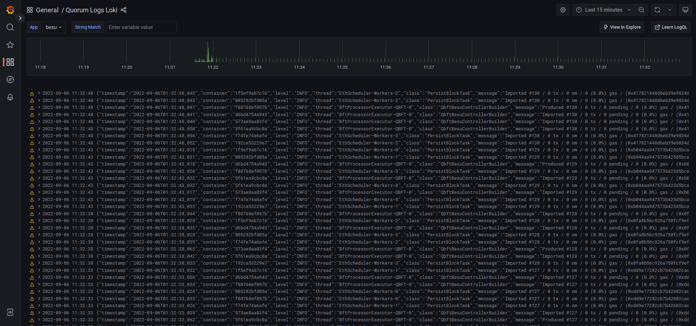

import TestAccounts from '../../global/test_accounts.md';

import Postman from '../../global/postman.md';

import Tabs from '@theme/Tabs';
import TabItem from '@theme/TabItem';

# Developer Quickstart

The Quorum Developer Quickstart uses the Hyperledger Besu Docker image to run a private [IBFT 2.0](../how-to/configure/consensus/ibft.md) network of Besu nodes managed by Docker Compose.

:::caution

This tutorial runs a private network suitable for education or demonstration purposes and is not intended for running production networks.

:::

## Prerequisites

- One of the following operating systems:
  - Linux on x86_64 architecture
  - macOS on an Intel processor (M1 processor not supported yet)
  - Windows 64-bit edition, with:
    - Windows Subsystem for Linux 2
    - Docker desktop configured to use the WSL2-based engine
- [Docker and Docker Compose](https://docs.docker.com/compose/install/)
- [Node.js](https://nodejs.org/en/download/) version 12 or higher
- [Hardhat](https://hardhat.org/hardhat-runner/docs/getting-started#overview)
- [cURL command line](https://curl.haxx.se/download.html)
- [MetaMask](https://metamask.io/)

:::info

Allow Docker up to 4G of memory or 6G if running the privacy examples. Refer to the **Resources** section in [Docker for Mac](https://docs.docker.com/docker-for-mac/) and [Docker Desktop](https://docs.docker.com/docker-for-windows/) for details.

:::

## Generate the tutorial blockchain configuration files

To create the tutorial `docker-compose` files and artifacts, run:

```bash
npx quorum-dev-quickstart
```

Follow the prompts displayed to run Hyperledger Besu and [logging with ELK](../how-to/monitor/elastic-stack.md). Enter `n` for Codefi Orchestrate and [private transactions](../concepts/privacy/index.md).

:::note

If you enter `y` for private transactions, you get three Besu nodes with corresponding Tessera nodes for privacy. You can follow the [privacy walk-through](privacy/index.md), which details how to send private transactions and interact with deployed private contracts.

:::

## Start the network

To start the network, go to the installation directory (`quorum-test-network` if you used the default value) and run:

```bash
./run.sh
```

The script builds the Docker images, and runs the Docker containers.

Four Besu IBFT 2.0 validator nodes and a non-validator node are created to simulate a base network.

When execution is successfully finished, the process lists the available services:

```log title="Services list"
*************************************
Quorum Dev Quickstart
*************************************
----------------------------------
List endpoints and services
----------------------------------
JSON-RPC HTTP service endpoint      : http://localhost:8545
JSON-RPC WebSocket service endpoint : ws://localhost:8546
Web block explorer address          : http://localhost:25000/
Prometheus address                  : http://localhost:9090/graph
Grafana address                     : http://localhost:3000/d/XE4V0WGZz/besu-overview?orgId=1&refresh=10s&from=now-30m&to=now&var-system=All
Kibana logs address                 : http://localhost:5601/app/kibana#/discover
Collated logs using Grafana Loki    : http://localhost:3000/d/Ak6eXLsPxFemKYKEXfcH/quorum-logs-loki?orgId=1&var-app=besu&var-search=

For more information on the endpoints and services, refer to README.md in the installation directory.
****************************************************************
```

- Use the **JSON-RPC HTTP service endpoint** to access the RPC node service from your dapp or from cryptocurrency wallets such as MetaMask.
- Use the **JSON-RPC WebSocket service endpoint** to access the Web socket node service from your dapp.
- Use the **Web block explorer address** to display the [block explorer Web application](http://localhost:25000).
- Use the **Prometheus address** to access the [Prometheus dashboard](http://localhost:9090/graph). [Read more about metrics](../../public-networks/how-to/monitor/metrics.md).
- Use the **Grafana address** to access the [Grafana dashboard](http://localhost:3000/d/XE4V0WGZz/besu-overview?orgId=1&refresh=10s&from=now-30m&to=now&var-system=All). [Read more about metrics](../../public-networks/how-to/monitor/metrics.md).
- Use the **Kibana logs address** to access the [logs in Kibana](http://localhost:5601/app/kibana#/discover). [Read more about log management](../how-to/monitor/elastic-stack.md).
- Use the **Grafana Loki logs address** to access the [logs in Grafana](http://localhost:3000/d/Ak6eXLsPxFemKYKEXfcH/quorum-logs-loki?orgId=1&var-app=besu&var-search=). [Read more about log management](../how-to/monitor/loki.md).

To display the list of endpoints again, run:

```bash
./list.sh
```

## Use a block explorer

You can [use Chainlens Blockchain Explorer](../how-to/monitor/chainlens.md) to analyze block
information, contract metadata, transaction searches, and more.
Chainlens has built-in support for privacy-enabled Besu networks.

:::note
You must connect to one of the privacy nodes (for example, `member1besu`), not the dedicated RPC,
to allow access for Besu [privacy API methods](../reference/api/index.md#priv-methods). 
In production networks, you must [secure access](../../public-networks/how-to/use-besu-api/authenticate.md)
to RPC nodes.
:::

Clone the [Chainlens GitHub repository](https://github.com/web3labs/chainlens-free):

```bash
git clone https://github.com/web3labs/chainlens-free
```

From the `docker-compose` directory, run the following command:

```bash
cd docker-compose
NODE_ENDPOINT=member1besu PORT=26000 docker-compose -f docker-compose.yml -f chainlens-extensions/docker-compose-quorum-dev-quickstart.yml up
```

Open `http://localhost/` on your browser.
You’ll see the new initialization page while it boots up.
This may take 5–10 minutes for the all services to start and the ingestion sync to complete.

To stop all the services from running, run the following command from the `docker-compose` directory:

```bash
docker-compose down -v
```

## Monitor nodes with Prometheus and Grafana

The sample network also includes Prometheus and Grafana monitoring tools to let you visualize node health and usage. You can directly access these tools from your browser at the addresses displayed in the endpoint list.

- [Prometheus dashboard](http://localhost:9090/graph)
- [Grafana dashboard](http://localhost:3000/d/XE4V0WGZz/besu-overview?orgId=1&refresh=10s&from=now-30m&to=now&var-system=All)
- [Grafana Loki logs dashboard](http://localhost:3000/d/Ak6eXLsPxFemKYKEXfcH/quorum-logs-loki?orgId=1&var-app=quorum&var-search=)

For more details on how to configure and use these tools for your own nodes, see the [performance monitoring documentation](../../public-networks/how-to/monitor/metrics.md), [Prometheus documentation](https://prometheus.io/docs/introduction/overview/) and [Grafana documentation](https://grafana.com/docs/).



and collated logs via Grafana Loki



## Run JSON-RPC requests

You can run JSON-RPC requests on:

- HTTP with `http://localhost:8545`.
- WebSockets with `ws://localhost:8546`.

### Run with `cURL`

This tutorial uses [cURL](https://curl.haxx.se/download.html) to send JSON-RPC requests over HTTP.

### Run with Postman

You can also run all the requests with the Besu Postman collection.

<Postman />

### Request the node version

Run the following command from the host shell:

```bash
curl -X POST --data '{"jsonrpc":"2.0","method":"web3_clientVersion","params":[],"id":1}' http://localhost:8545
```

The result displays the client version of the running node:

<Tabs>

<TabItem value="Result example" label="Result example" default>

```json
{
  "jsonrpc": "2.0",
  "id": 1,
  "result": "besu/v21.1.2/linux-x86_64/oracle_openjdk-java-11"
}
```

</TabItem>

<TabItem value="Result explanation" label="Result explanation">

- `"jsonrpc" : "2.0"` indicates that the JSON-RPC 2.0 spec format is used.
- `"id" : 1` is the request identifier used to match the request and the response. This tutorial always uses 1.
- `"result"` contains the running Besu information:
  - `v21.1.2` is the running Besu version number. This may be different when you run this tutorial.
  - `linux-x86_64` is the architecture used to build this version.
  - `oracle_openjdk-java-11` is the JVM type and version used to build this version. This may be different when you run this tutorial.

</TabItem>

</Tabs>

Successfully calling this method shows that you can connect to the nodes using JSON-RPC over HTTP.

From here, you can walk through more interesting requests demonstrated in the rest of this section, or skip ahead to [Create a transaction using MetaMask](#create-a-transaction-using-metamask).

### Count the peers

Peers are the other nodes connected to the node receiving the JSON-RPC request.

Poll the peer count using [`net_peerCount`](../../public-networks/reference/api/index.md#net_peercount):

```bash
curl -X POST --data '{"jsonrpc":"2.0","method":"net_peerCount","params":[],"id":1}' http://localhost:8545
```

The result indicates that there are four peers (the validators):

```json
{
  "jsonrpc": "2.0",
  "id": 1,
  "result": "0x4"
}
```

### Request the most recent block number

Call [`eth_blockNumber`](../../public-networks/reference/api/index.md#eth_blockNumber) to retrieve the number of the most recently synchronized block:

```bash
curl -X POST --data '{"jsonrpc":"2.0","method":"eth_blockNumber","params":[],"id":1}' http://localhost:8545
```

The result indicates the highest block number synchronized on this node.

```json
{
  "jsonrpc": "2.0",
  "id": 1,
  "result": "0x2a"
}
```

Here the hexadecimal value `0x2a` translates to decimal as `42`, the number of blocks received by the node so far, about two minutes after the new network started.

## Public transactions

This example uses the [web3.js](https://www.npmjs.com/package/web3) library to make the API calls, using the `rpcnode`
accessed on `http://localhost:8545`.

Navigate to the `smart_contracts` directory and deploy the public transaction:

```bash
cd smart_contracts
npm install
node scripts/public/hre_1559_public_tx.js
# or via ethers
node scripts/public/hre_public_tx.js
```

This deploys the contract and sends an arbitrary value (`47`) from `Member1` to `Member3`. The script then performs:

1. A read operation on the contract using the `get` function and the contract's ABI, at the specified address.
1. A write operation using the `set` function and the contract's ABI, at the address and sets the value to `123`.
1. A read operation on all events emitted.

The script output is as follows:

```bash
{
  address: '0x2b224e70f606267586616586850aC6f4Ae971eCb',
  privateKey: '0xb3f2ab4d7bb07a4168432fb572ceb57fd9b842ed8dc41256255db6ff95784000',
  signTransaction: [Function: signTransaction],
  sign: [Function: sign],
  encrypt: [Function: encrypt]
}
create and sign the txn
sending the txn
tx transactionHash: 0x423d56f958a316d2691e05e158c6a3f37004c27a1ec9697cf9fed2a5c2ae2c2b
tx contractAddress: 0xB9A44d3BeF64ABfA1485215736B61880eDe630D9
Contract deployed at address: 0xB9A44d3BeF64ABfA1485215736B61880eDe630D9
Use the smart contracts 'get' function to read the contract's constructor initialized value .. 
Obtained value at deployed contract is: 47
Use the smart contracts 'set' function to update that value to 123 .. 
sending the txn
tx transactionHash: 0xab460da2544687c5fae4089d01b14bbb9bea765449e1fd2c30b30e1761481344
tx contractAddress: null
Verify the updated value that was set .. 
Obtained value at deployed contract is: 123
Obtained all value events from deployed contract : [47,123]
```

We also have a second example that shows how to transfer ETH between accounts. Navigate to the `smart_contracts` directory
and deploy the `eth_tx` transaction:

```bash
cd smart_contracts
npm install
node scripts/public/hre_eth_tx.js
```

The output is as follows:

```bash
Account A has balance of: 90000
Account B has balance of: 0
create and sign the txn
sending the txn
tx transactionHash: 0x8b9d247900f2b50a8dded3c0d73ee29f04487a268714ec4ebddf268e73080f98
Account A has an updated balance of: 89999.999999999999999744
Account B has an updated balance of: 0.000000000000000256
```

## Create a transaction using MetaMask

You can use [MetaMask](https://metamask.io/) to send a transaction on your private network.

1. Open MetaMask and connect it to your private network RPC endpoint by selecting `Localhost 8545` in the network list.
1. Choose one of the following test accounts and [import it into MetaMask by copying the corresponding private key](https://metamask.zendesk.com/hc/en-us/articles/360015489331-How-to-import-an-Account).

<TestAccounts />

:::note

Besu doesn't incorporate [account management](../../public-networks/how-to/send-transactions.md). To create your own account, you have to use a third-party tool, such as MetaMask.

:::

1.  After importing an existing test account, [create another test account from scratch] to use as the recipient for a test Ether transaction.

1.  In MetaMask, select the new test account and [copy its address](https://metamask.zendesk.com/hc/en-us/articles/360015289512-How-to-copy-your-MetaMask-Account-Public-Address).

1.  In the [Block Explorer](http://localhost:25000), search for the new test account by selecting the :mag: and pasting the test account address into the search box.

    The new test account displays with a zero balance.

1.  [Send test Ether](https://metamask.zendesk.com/hc/en-us/articles/360015488931-How-to-send-ETH-and-ERC-20-tokens-from-your-MetaMask-Wallet) from the first test account (containing test Ether) to the new test account (which has a zero balance).

    :::tip

    You can use a zero gas price here as this private test network is a [free gas network](../how-to/configure/free-gas.md), but the maximum amount of gas that can be used (the gas limit) for a value transaction must be at least 21000.

    :::

1.  Refresh the Block Explorer page in your browser displaying the target test account.

    The updated balance reflects the transaction completed using MetaMask.

## Smart contract and dapp usage

You can use a demo dapp called QuorumToken which uses an ERC20 token that is deployed to the network.

We'll use [Hardhat](https://www.npmjs.com/package/hardhat), [Ethers](https://www.npmjs.com/package/ethers) and [MetaMask](https://metamask.io/) to interact with the network, which involves the following steps:

1. Deploy the contract and **save the contract's address**.
1. Start the dapp, and read and transact with the deployed token.

The `dapps/quorumToken` directory is this structured in this manner (only relevant paths shown):

```bash
quorumToken
├── hardhat.config.ts       // hardhat network config
├── contracts               // the QuorumToken.sol
├── scripts                 // handy scripts eg: to deploy to a chain
├── test                    // contract tests
└── frontend                // dapp done in next.js
  ├── public
  ├── src
  ├── styles
  ├── tsconfig.json
```

### Deploy the contract 

Once the network is up and running, enter the `quorumToken` directory and run the following:

```bash
# install dependencies
npm i
# compile the contract
npm run compile
npm run test
# deploy the contract to the quickstart network
npm run deploy-quorumtoken
```
The output is similar to the following:

```bash
# compile
> quorumToken@1.0.0 compile
> npx hardhat compile

Generating typings for: 5 artifacts in dir: typechain-types for target: ethers-v6
Successfully generated 24 typings!
Compiled 5 Solidity files successfully

# test
> quorumToken@1.0.0 test
> npx hardhat test

  QuorumToken
    Deployment
      ✔ Should have the correct initial supply (1075ms)
      ✔ Should token transfer with correct balance (78ms)


  2 passing (1s)

# deploy
Contract deploy at: 0x5FbDB2315678afecb367f032d93F642f64180aa3
```
This will deploy the contract to the network and return the address. **Please save this address for the next step**.

### Run the dapp

The dapp runs a local website using Next.js, and uses the contract in the previous step deployed on the network.

With the blockchain running, and MetaMask connected to `localhost` on port `8545`, import one of [our test accounts via private key](../reference/accounts-for-testing.md), and run the following command:

```bash
cd frontend
npm i
npm run dev
```
This starts the dapp, binding it to port `3001` on your machine.

```bash
> webapp@0.1.0 dev
> next dev -p 3001

- ready started server on [::]:3001, url: http://localhost:3001
- event compiled client and server successfully in 270 ms (18 modules)
- wait compiling...
- event compiled client and server successfully in 173 ms (18 modules)
```

In the browser where you have MetaMask enabled and one of the test accounts loaded, open a new tab and navigate to
[the QuorumToken dapp](http://localhost:3001).
Connect to MetaMask and input the address from the previous step. Fox example our contract above deployed to `0x5FbDB2315678afecb367f032d93F642f64180aa3`. 

The dapp will then read the balance of the account from MetaMask and get details of the contract. You can then send funds
to another address (any of the other test accounts) on the network, and MetaMask will sign and send the transaction.

You can also search for the transaction and view its details in the [Block Explorer](http://localhost:25000/).


The MetMask UI also keeps a record of the transaction.


### Deploy your own dapp

You can deploy your own dapp to the Quorum Developer Quickstart by configuring your dapp to point to the Quickstart network.

We recommend using [Hardhat](https://hardhat.org/hardhat-runner/docs/guides/project-setup), and you can use the sample
`hardhat.config.js` to configure the `networks` object in the [Hardhat configuration file](https://hardhat.org/hardhat-network/docs/reference#config)
to specify which networks to connect to for deployments and testing. The Quickstart's RPC service endpoint is `http://localhost:8545`.

For example, the following is the Hardhat configuration file for the QuorumToken dapp used in the Quickstart GoQuorum network:

```js
module.exports = {
  networks: {
    // in built test network to use when developing contracts
    hardhat: {
      chainId: 1337
    },
    quickstart: {
      url: "http://127.0.0.1:8545",
      chainId: 1337,
      // test accounts only, all good ;)
      accounts: [
        "0x8f2a55949038a9610f50fb23b5883af3b4ecb3c3bb792cbcefbd1542c692be63",
        "0xc87509a1c067bbde78beb793e6fa76530b6382a4c0241e5e4a9ec0a0f44dc0d3",
        "0xae6ae8e5ccbfb04590405997ee2d52d2b330726137b875053c36d94e974d162f"
      ]
    }
  },  
  defaultNetwork: "hardhat",
  ...
  ...
```

Deploy the contract using:

```bash
npx hardhat run ./scripts/deploy_quorumtoken.ts --network quickstart
```

## Stop and restart the private network without removing containers

To shut down the private network without deleting the containers:

```bash
./stop.sh
```

This command stops the containers related to the services specified in the `docker-compose.yml` file.

To restart the private network:

```bash
./resume.sh
```

## Stop the private network and remove containers

To shut down the private network and delete all containers and images created from running the sample network and the Pet Shop dapp:

```bash
./remove.sh
```

## Add a new node to the network

New nodes joining an existing network require the following:

- The same genesis file used by all other nodes on the running network.
- A list of nodes to connect to; this is done by specifying [bootnodes], or by providing a list of [static nodes].
- A node key pair and optionally an account. If the running network is using permissions, then you need to add the new node's enode details to the [permissions file] used by existing nodes, or update the onchain permissioning contract.

The following steps describe the process to add a new node to the Developer Quickstart.

### 1. Create the node key files

Create a node key pair and account for a new node by running the following script:

```bash
cd ./extra
npm install
node generate_node_keys.js --password "Password"
```

:::note

The `--password` parameter is optional.

:::

### 2. Create new node directory

Navigate to the directory where the configuration files for the network were created.

:::note

The directory was specified in an earlier step when running `npx quorum-dev-quickstart`. The default location is `./quorum-test-network`.

:::

In the `config/nodes` directory, create a subdirectory for the new node (for example, `newnode`), and move the `nodekey`, `nodekey.pub`, `address` and `accountkey` files from the previous step into this directory.

### 3. Update docker-compose

Add an entry for the new node into the docker-compose file:

```yaml
newnode:
  <<: *besu-def
  container_name: newnode
  volumes:
    - public-keys:/opt/besu/public-keys/
    - ./config/besu/:/config
    - ./config/nodes/newnode:/opt/besu/keys
    - ./logs/besu:/tmp/besu
  depends_on:
    - validator1
  networks:
    quorum-dev-quickstart:
      ipv4_address: 172.16.239.41
```

:::caution important
Select an IP address and port map not being used for the other containers.
Mount the newly created folder `./config/nodes/newnode` to the `/opt/besu/keys` directory of the new node, as seen
in this example.
:::

### 4. Update Prometheus configuration

Update `prometheus.yml` in the `./config/prometheus/` directory to configure metrics to display in Grafana.

Insert the following under `scrape_configs` section in the file. Change `job_name` and `targets` appropriately if you've updated them.

```yaml
- job_name: newnode
  scrape_interval: 15s
  scrape_timeout: 10s
  metrics_path: /metrics
  scheme: http
  static_configs:
    - targets: [newnode:9545]
```

### 5. Update files with the enode address

Add the new node's enode address to the [static nodes] file and [permissions file]. The enode uses the format `enode://pubkey@ip_address:30303`. If the `nodekey.pub` is `4540ea...9c1d78` and the IP address is `172.16.239.41`, then the enode address is `"enode://4540ea...9c1d78@172.16.239.41:30303"`, which must be added to both files.

Alternatively, call the [`perm_addNodesToAllowlist`](../../public-networks/reference/api/index.md#perm_addnodestoallowlist) API method on existing nodes to add the new node without restarting.

:::note

Calling the API method by itself only persists for as long as the nodes remain online and is lost on the next restart.

On a live network, the new node must be added to the [permissions file] so that subsequent restarts of the nodes are aware of the change.

:::

### 6. Start the network

Once complete, start the network up with `./run.sh`. When using the smart contract you can either make changes via a [dapp](https://github.com/ConsenSys/permissioning-smart-contracts) or via [RPC API calls](../../public-networks/reference/api/index.md#perm_addnodestoallowlist).

<!-- Links -->

[bootnodes]: ../how-to/configure/bootnodes.md
[permissions file]: ../how-to/use-permissioning/local.md
[static nodes]: ../../public-networks/how-to/connect/static-nodes.md
[allow list]: ../how-to/use-permissioning/local.md#node-allowlisting
[Import one of the existing accounts above into MetaMask]: https://metamask.zendesk.com/hc/en-us/articles/360015489331-Importing-an-Account-New-UI-
[create another test account from scratch]: https://metamask.zendesk.com/hc/en-us/articles/360015289452-Creating-Additional-MetaMask-Wallets-New-UI-
