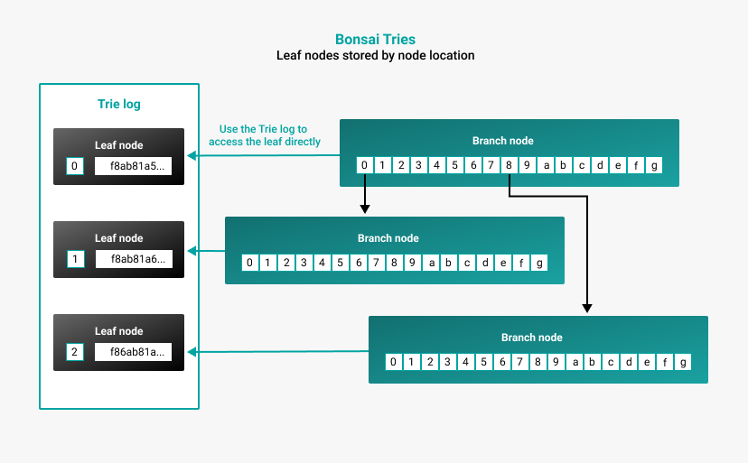
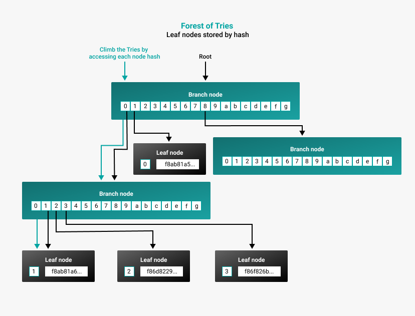

# Data storage formats

Besu offers two formats for storing the world state, [Bonsai Tries](#bonsai-tries) and [Forest of Tries](#forest-of-tries).

## Bonsai Tries

Bonsai Tries is a data storage layout policy designed to reduce storage requirements and increase read performance. This is the default for Besu.

Bonsai stores leaf values in a trie log, separate from the branches of the trie. Bonsai stores nodes by the location of the node instead of the hash of the node. Bonsai can access the leaf from the underlying storage directly using the account key. This greatly reduces the disk space needed for storage and allows for less resource-demanding and faster read performance. Bonsai inherently prunes orphaned nodes and old branches.

To run a node with Bonsai Tries data storage format, use the command line option [`--data-storage-format=BONSAI`](../reference/cli/options.md#data-storage-format).

:::caution important
Do not run an [archive node](../get-started/connect/sync-node.md#run-an-archive-node) with Bonsai Tries.
Bonsai is designed for retrieving recent data only.
:::

:::tip
You can read more about Bonsai in [Consensys' Guide to Bonsai Tries](https://consensys.io/blog/bonsai-tries-guide).
:::

## Forest of Tries

Forest of Tries, also called forest mode, is another method of representing the world state, and is more suitable for [archive nodes](../get-started/connect/sync-node.md#run-an-archive-node).

In forest mode, each node in the trie is saved in a key-value store by hash. For each block, the world state is updated with new nodes, leaf nodes, and a new state root. Old leaf nodes remain in the underlying data store. Data is accessed and stored by hash, which increases the size of the database and increases the resources and time needed to access account data.

:::warning
Forest pruning using the `--pruning-enabled` option is no longer supported.
We recommend using [Bonsai Tries](#bonsai-tries) to save disk space.
:::

## Forest of Tries vs. Bonsai Tries

### Storage requirements

Forest mode uses significantly more memory than Bonsai.
With a [full node](../get-started/connect/sync-node.md#run-a-full-node), forest mode uses an
estimated 750 GB of storage, while Bonsai uses an estimated 650 GB of storage.
[Archive nodes](../get-started/connect/sync-node.md#run-an-archive-node) must use forest mode, which
uses an estimated 12 TB of storage.

### Accessing data

Forest mode must go through all the branches by hash to read a leaf value. Bonsai can access the leaf from the underlying storage directly using the account key. Bonsai will generally read faster than forest mode, particularly if the blocks are more recent.

However, Bonsai becomes increasingly more resource-intensive the further in history you try to read data. To prevent this, you can limit how far Bonsai looks back while reconstructing data. The default limit Bonsai looks back is 512. To change the parameter, use the [`--bonsai-historical-block-limit`](../reference/cli/options.md#bonsai-historical-block-limit) option. This might directly impact [JSON-RPC API](../reference/api/index.md) queries.

:::note

Using `--bonsai-historical-block-limit` doesn't affect the size of the database being stored, only how far back to load. This means there is no "safe minimum" value to use with this option.

:::

### Syncing nodes

The following table shows the ways you can [sync a full node](../get-started/connect/sync-node.md#run-a-full-node) with the different data storage formats using [fast](../get-started/connect/sync-node.md#fast-synchronization) and [snap](../get-started/connect/sync-node.md#snap-synchronization) sync.

| Data storage format | Sync mode | Storage estimate | Can other nodes sync to your node? |
| --- | --- | --- | --- |
| Bonsai | Fast | 1140 GB | No |
| Bonsai | Snap | 1090 GB | Yes |
| Bonsai | Checkpoint | 840 GB | No |
| Forest | Fast | 1200 GB | Yes |

:::tip

We recommend using snap sync with Bonsai for the fastest sync and lowest storage requirements.

:::
