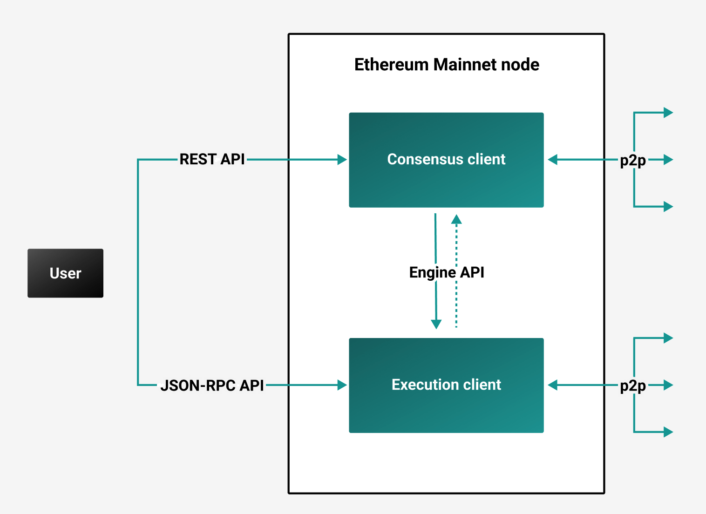

# Node clients

Ethereum's Proof of Stake (PoS) protocol leverages two separate P2P networks supporting 
separate clients. Execution clients gossip transactions over their network, enabling them to manage 
their local transaction pool. Consensus clients gossip blocks over their network, enabling consensus 
and chain growth. A validator node also runs the [validator client](#validator-clients).

:::info
As as result of [the 2022 Merge](https://ethereum.org/en/upgrades/merge/), Ethereum Mainnet 
transitioned from Proof of Work (PoW) to [PoS](proof-of-stake/index.md) consensus.
:::

## Execution and consensus clients

Under PoS, a full Ethereum Mainnet node is a combination of an execution client (previously called 
an [Eth1 client](https://blog.ethereum.org/2022/01/24/the-great-eth2-renaming/) client) and a 
consensus client (previously called an 
[Eth2 client](https://blog.ethereum.org/2022/01/24/the-great-eth2-renaming/)). The consensus client 
uses the [Engine API](../how-to/use-engine-api.md) to communicate with the execution client.

### Execution clients

Execution clients, such as Besu, manage the execution layer, including executing transactions and 
updating the world state. Execution clients serve [JSON-RPC API](../reference/engine-api/index.md) 
requests and communicate with each other P2P.

Besu is an execution client that you can run with:

- [Any consensus client on Mainnet](../get-started/connect/mainnet.md).
- [Any consensus client on a testnet](../get-started/connect/testnet.md).
- [Teku on Mainnet](../tutorials/besu-teku-mainnet.md).
- [Teku on a testnet](../tutorials/besu-teku-testnet.md).

### Consensus clients

The consensus client (also known as the beacon node, CL client or, formerly, the Eth2 client) 
implements the PoS consensus algorithm, which enables the network to achieve agreement based on 
validated data from the execution client. Consensus clients serve 
[REST API](https://docs.teku.consensys.net/reference/rest) requests and
communicate with each other P2P.

Consensus clients, such as [Teku](https://docs.teku.consensys.net/en/latest/) contain beacon node 
implementations. The beacon node is the primary link to the [Beacon Chain] (i.e. the consensus layer). 
A consensus client can run without the (bundled) validator to keep up with the head of the chain, 
allowing the node to stay synced.

#### Validator clients

To operate a validator node, node operators must also run a validator client and deposit the 
[required ETH](https://ethereum.org/en/developers/docs/consensus-mechanisms/pos/#validators) into the 
deposit contract. The validator client handles attestations and block proposal &mdash; i.e. performs 
[validator duties](proof-of-stake/index.md) on the consensus layer. 
The validator client may either be run 
[in the same process](https://docs.teku.consensys.net/get-started/start-teku#start-the-clients-in-a-single-process) 
as the beacon node or [separately](https://docs.teku.consensys.net/get-started/start-teku#run-the-clients-separately).

Validators earn [rewards](https://www.blocknative.com/ethereum-staking-calculator) for performing
 [validator duties](proof-of-stake/index.md), and 
 [fee recipients](https://docs.teku.consensys.net/reference/cli#validators-proposer-default-fee-recipient) 
 also earn rewards for the inclusion of execution layer transactions.

<!-- links -->

[Beacon Chain]: https://ethereum.org/en/upgrades/beacon-chain/
[Teku]: https://docs.teku.consensys.net/en/stable/
[Run a node]: https://ethereum.org/en/developers/docs/nodes-and-clients/run-a-node/
