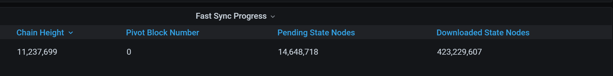

# Node synchronization

Besu supports two [node types](#node-types) and several [synchronization modes](#sync-modes) on
public networks.

## Node types

### Full nodes

A full node consists of an 
[execution and consensus client](node-clients.md#execution-and-consensus-clients), 
and stores a local copy of the blockchain.
With a full node, you can check current balances, sign and send transactions, and look at current
dapp data.

Full nodes can guarantee the latest state of the blockchain (and some older states). However, they 
can't serve the network with all data requests (for example, the balance of an account at an old 
block).

You can run a full node using [snap synchronization](#snap-synchronization),
[checkpoint synchronization](#checkpoint-synchronization), or
[fast synchronization](#fast-synchronization-deprecated).

### Archive nodes

An archive node is a node that also stores the intermediary state of every account and contract
for every block since the genesis block. 
Archive nodes can do everything full nodes do, and they can also access historical state data. 
This means that archive nodes require more disk space than full nodes.

You can only run an archive node using [full synchronization](#full-synchronization).

:::caution important
Do not run an archive node with the [Bonsai Tries](data-storage-formats.md#bonsai-tries)
data storage format.
Bonsai is designed for retrieving recent data only.
:::

## Sync modes

Besu supports several synchronization modes for different network types, node types, and use cases.
The following is an overview of the public network sync modes:

| Sync mode                                 | Description                                                                                                                       | Requirements                 | Limitations                                            |
|-------------------------------------------|-----------------------------------------------------------------------------------------------------------------------------------|------------------------------|--------------------------------------------------------|
| [Snap](#snap-synchronization)             | Efficient sync from genesis block, downloading as many trie leaves as possible and reconstructing the state locally. Faster than fast sync. | Besu version 22.4.0 or later | Cannot switch from fast sync to snap sync mid-process. |
| [Checkpoint](#checkpoint-synchronization) | Syncs from a specific checkpoint block configured in the genesis file. Fastest sync mode with lowest storage requirements.        | Besu version 22.4.3 or later |                                                        |
| [Fast](#fast-synchronization-deprecated)  | Downloads block headers and transaction receipts, verifies chain from genesis block.                                              | None                         | Deprecated in Besu version 24.12.0 and later.          |
| [Full](#full-synchronization)             | Downloads and verifies the entire blockchain and state from genesis block, building an archive node with full state history.      | None                         | Slowest sync mode, requires the most disk space.       |

:::info Private network syncing

Private networks can use the same sync methods as public networks, but might require different configurations.
See [Node synchronization for private networks](../../private-networks/concepts/node-sync-private.md) for more information.

:::

:::note Troubleshooting

Besu must connect with other peers to sync with the network.
If your node is having trouble peering, try [troubleshooting peering](../how-to/troubleshoot/peering.md).

:::

### Snap synchronization

:::tip

We recommend using snap sync over fast sync because snap sync can be faster than fast sync by
several days (for Mainnet).
Use snap sync with the [Bonsai](data-storage-formats.md#bonsai-tries)
data storage format for the fastest sync and lowest storage requirements.

:::

Snap sync is the default sync mode for all named [networks](../reference/cli/options.md#network)
except `dev`.
You can enable snap sync using [`--sync-mode=SNAP`](../reference/cli/options.md#sync-mode).
You need Besu version 22.4.0 or later to use snap sync.
By default, [Snap sync prunes historical block data](../how-to/pre-merge-history-expiry.md) for
[pre-merge](https://ethereum.org/en/roadmap/merge/) Proof of Work (PoW) blocks, retaining only the
headers and the genesis block.

:::note
To download the full PoW block history, set `--snapsync-synchronizer-pre-merge-headers-only-enabled` to `false`. However, this will increase the sync time and disk space usage.
:::

Instead of downloading the [state trie](data-storage-formats.md) node by node, snap
sync downloads as many leaves of the trie as possible, and reconstructs the trie locally.

You can't switch from fast sync to snap sync. If your node is blocked in the middle of a fast sync,
you can start over using snap sync instead by stopping the node, deleting the data directory, and
starting over using `--sync-mode=SNAP`.

You can restart Besu during a snap sync in case of hardware or software problems. The sync resumes
from the last valid world state and continues to download blocks starting from the last downloaded
block.

See [how to read the Besu metrics charts](../how-to/monitor/understand-metrics.md) when using
snap sync.

### Checkpoint synchronization

You can enable checkpoint sync using [`--sync-mode=CHECKPOINT`](../reference/cli/options.md#sync-mode).
You need Besu version 22.4.3 or later to use checkpoint sync.

Checkpoint sync behaves like [snap sync](#snap-synchronization), but instead of syncing from the
genesis block, it syncs from a specific checkpoint block configured in the [Besu genesis file](genesis-file.md).

Ethereum Mainnet, Holesky, and Ephemery testnet configurations already define default checkpoints, so you
don't have to add this yourself.

For other networks, you can configure a checkpoint in the genesis file by specifying the block hash,
number, and total difficulty as in the following example.

```json title="Checkpoint configuration example"
"checkpoint": {
  "hash": "0x844d581cb00058d19f0584fb582fa2de208876ee56bbae27446a679baf4633f4",
  "number": 14700000,
  "totalDifficulty": "0xA2539264C62BF98CFC6"
}
```

:::note

If using [Clique](../../private-networks/how-to/configure/consensus/clique.md) consensus, the
checkpoint must be the beginning of an epoch.

:::

If you enable checkpoint sync without a checkpoint configuration in the genesis file, Besu snap
syncs from the genesis block.

You can restart Besu during a checkpoint sync in case of hardware or software problems. The sync
resumes from the last valid world state and continues to download blocks starting from the last
downloaded block.

### Fast synchronization (Deprecated)

:::caution

Fast sync is deprecated in Besu version 24.12.0 and later. Please read this [blog post](https://www.lfdecentralizedtrust.org/blog/sunsetting-tessera-and-simplifying-hyperledger-besu) for more context on the rationale behind this decision as well as alternative options.

If you sync for the first time or need to re-sync, update Besu to a version that supports newer sync methods.

:::

You can enable fast sync using [`--sync-mode=FAST`](../reference/cli/options.md#sync-mode).

Fast sync downloads the block headers and transaction receipts, and verifies the chain of block
headers from the genesis block.

When starting fast sync, Besu first downloads the world state for a recent block verified by its
peers (referred to as a pivot block), and then begins fast sync from the genesis block.

Using fast sync with [private transactions](../../private-networks/concepts/privacy/index.md)
isn't supported.

You can observe the `besu_synchronizer_fast_sync_*` and `besu_synchronizer_world_state_*`
[metrics](../how-to/monitor/metrics.md#view-the-metrics-list) to monitor fast sync.

:::note

When fast syncing, block numbers increase until close to the head block, then the process pauses
while the world state download completes. This may take a significant amount of time depending on
world state size, during which the current head block doesn't increase. For example, Mainnet may
take several days or more to fast sync. Fast sync time may increase because Besu picks new pivot
blocks, or because peers prune the world state before it completes downloading.

:::

<details>
<summary>RocksDB error on AWS</summary>

When running Besu on some cloud providers, a known
[RocksDB](https://github.com/facebook/rocksdb/issues/6435) issue causes fast sync to fail occasionally.
The following error is displayed repeatedly:

```
EthScheduler-Services-1 (importBlock) | ERROR | PipelineChainDownloader | Chain download failed. 
Restarting after short delay.
java.util.concurrent.CompletionException: org.hyperledger.besu.plugin.services.exception.StorageException: org.rocksdb.RocksDBException: block checksum mismatch:
```

The failure has been seen on AWS and Digital Ocean. On AWS, A full restart of the VM is required to
restart the fast sync. Fast sync isn't
[currently supported on Digital Ocean](https://github.com/hyperledger/besu/blob/750580dcca349d22d024cc14a8171b2fa74b505a/CHANGELOG.md#143).

</details>

<details>
<summary>Pending state nodes stays constant</summary>

When fast syncing, the pending state nodes count is the number of nodes yet to be downloaded, and it
should change constantly. Pending state nodes trend to 0 during fast sync and then goes to 0.

If the number stays constant, this could mean your node isn't syncing against any peers.

In the following example, the pivot block is 0 and the pending state nodes value is constant. This
means the node isn't syncing against any peers. The fact that state nodes have been downloaded means
at some stage it was syncing.



The easiest solution in this scenario is to restart fast sync to obtain a new pivot block.

</details>

### Full synchronization

Full sync is the default sync mode for the [`dev` network](../reference/cli/options.md#network).
You can enable full sync using [`--sync-mode=FULL`](../reference/cli/options.md#sync-mode).
Use full sync to run an [archive node](#archive-nodes).
Full sync starts from the genesis block and reprocesses all transactions.

:::caution important
Do not run an archive node with the [Bonsai Tries](data-storage-formats.md#bonsai-tries)
data storage format.
Bonsai is designed for retrieving recent data only.
:::

## Sync times

To sync with a public network, Besu runs two processes in parallel: the world state sync and the
blockchain download.

While the world state syncs, Besu downloads and imports the blockchain in the background.
The blockchain download time depends on CPU, the network, Besu's peers, and disk speed.
The blockchain download generally takes longer than the world state sync. Besu must catch up to the 
current chain head and sync the world state to participate on Mainnet.

The following table shows the average world state sync time, and blockchain download time, for each 
sync mode on Mainnet.

All times are hardware dependent; this table is based on running AWS instances m6gd.2xlarge.
Each sync mode also has its own world state database size.

| Sync mode  | Time to sync world state | Time to download blockchain | Disk usage    |
|------------|--------------------------|-----------------------------|---------------|
| Snap       | ~6 hours                 | ~14 hours                   | Smallest disk |
| Checkpoint | ~5 hours                 | ~13 hours                   | Smallest disk |
| Fast       | ~1.5 days                | ~1.5 days                   | Average disk  |
| Full       | ~weeks                   | ~weeks                      | Largest disk  |

:::note Notes
- Snap and checkpoint syncs handle blockchain data similarly to fast sync, but differ in how they
  process world state data.
- By default, Snap sync prunes historical block data for pre-merge PoW blocks.
    Downloading full PoW blocks could double the download time and increases disk usage.
- As of mid 2025, an average Mainnet snap sync (with history pruning enabled) consumes
    around 785 GB using Bonsai Tries.
  Read more about [storage requirements](data-storage-formats.md#storage-requirements)
  across data storage formats and sync modes.
- Testnets take significantly less time and space to sync.
:::

## Storage

You can store the world state using [Forest of Tries](data-storage-formats.md#forest-of-tries)
or [Bonsai Tries](data-storage-formats.md#bonsai-tries).
Besu uses Bonsai by default.

If you're running a [full node](#full-nodes), we recommend using Bonsai for the lowest storage requirements.
