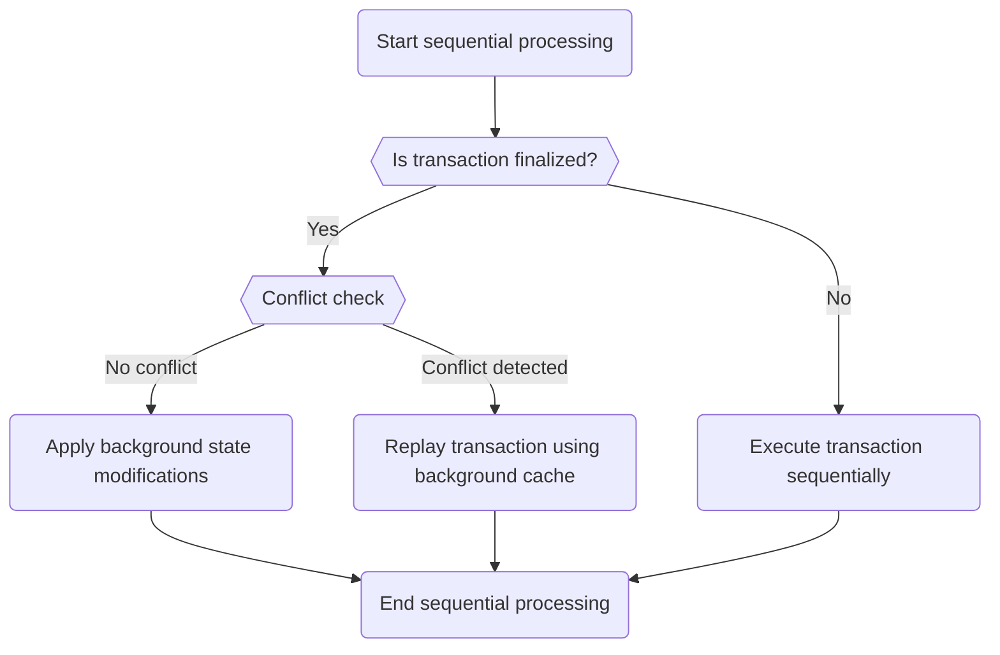
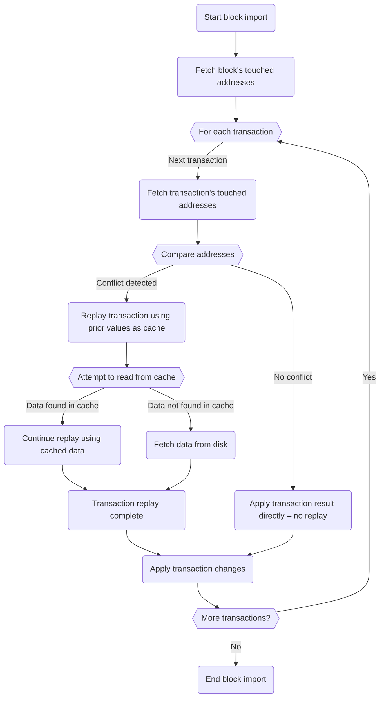
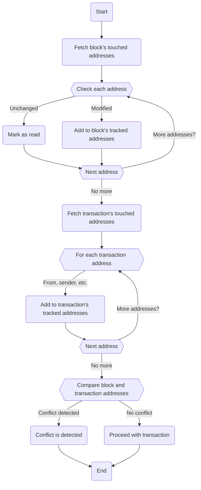

# Parallel transaction execution

Besu supports parallel transaction execution, using an optimistic approach to parallelize
transactions within a block when using the
[Bonsai Tries](data-storage-formats.md#bonsai-tries) data storage format.
This page provides an [overview of the mechanism](#parallelization-mechanism-overview) and some key
[metrics](#metrics).

:::warning Important
Parallel transaction execution is an early access feature.
You can enable it using the `--Xbonsai-parallel-tx-processing-enabled` option.
:::

## Parallelization mechanism overview

When parallel transaction execution is enabled, Besu initially executes all transactions within a
block in parallel, operating under the optimistic assumption that they can all be executed
concurrently without conflict.
This parallel execution runs in the background, and Besu proceeds to sequentially process the
transactions without waiting for the parallel execution to complete.

The following flowchart outlines the sequential processing flow:

Besu first determines if a transaction has been "finalized," or completed by the background parallel
execution:

- **Finalized:** If the transaction is finalized, Besu examines whether there are any conflicts with
  previously executed transactions.
  - **No conflict:** If no conflict is detected, Besu directly applies the state modifications
    generated in the background to the block, avoiding re-execution.
  - **Conflict detected:** If a conflict is detected, Besu replays the transaction, using a cache of
    background reads to improve efficiency.
- **Not finalized:** If the transaction is not finalized, Besu executes it sequentially within the
  block to ensure its completion, independent of the background execution.

### Conflict detection strategy

Besu's conflict detection strategy uses a Bonsai feature, the *accumulator*, that tracks addresses
and slots touched or modified during a block's or transaction's execution.

:::tip
You can read more about Bonsai in [Consensys' Guide to Bonsai Tries](https://consensys.io/blog/bonsai-tries-guide).
:::

If a slot, code, or anything else related to an account is modified, the Bonsai accumulator keeps
track of this information.
This strategy leverages Bonsai's storage benefits, only keeping track of state diffs block-to-block
in Besu storage.

The following flowchart outlines how Besu detects conflicts and imports transactions into the block:

Besu takes what the accumulator tracks at the block and transaction level, compares the
transaction's list of touched addresses to the block's list, and checks for conflicts.

Besu identifies conflicts by checking whether a transaction has interacted with accounts modified by
the block (that is, modified by previous transactions).
If a conflict is detected, Besu replays the transaction using cached data or data fetched from disk.
Each time a transaction is added to the block, Besu incorporates the transaction's tracked list into
the block's list.

:::info Note
The following are excluded from the conflict check:

- Unchanged accounts read by the block.

- Rewards given to the validator coinbase address at the end of each transaction.
  If these were considered, every transaction would conflict with the coinbase address.
  Besu identifies this address as a conflict only if it is accessed for reasons other than receiving
  rewards at the transaction's conclusion.
:::

The following flowchart further outlines how Besu maintains the lists of tracked addresses:

Besu's conflict detection strategy is intentionally basic, to simplify debugging and edge cases.
With this approach, close to 40% of transactions do not require replay.
In the future, enhancements may be implemented to refine the detection strategy and reduce false positives.

You can enable this early access feature using the `--Xbonsai-parallel-tx-processing-enabled` option.

## Metrics