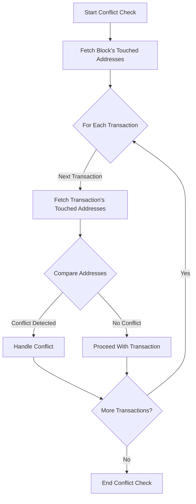

# Parallel transaction execution

Besu supports parallel transaction execution, using an optimistic approach to
parallelize transactions within a block.
This page provides an [overview of the mechanism](#parallelization-mechanism-overview)
and some key [metrics](#metrics).

:::warning Important
Parallel transaction execution is an early access feature.
You can enable it using the `--Xbonsai-parallel-tx-processing-enabled` option.
:::

## Parallelization mechanism overview

Simple flowchart test:

Mechanism overview flowchart test:

## Metrics