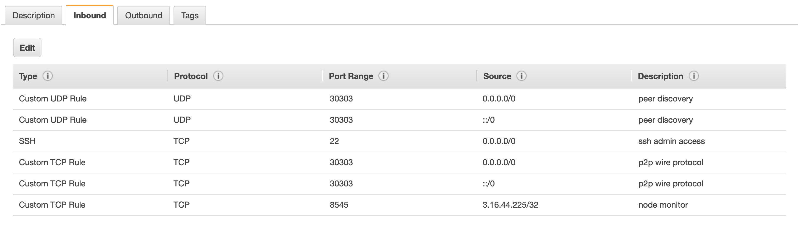

# Configure ports

To enable communication you must expose Hyperledger Besu ports appropriately. The following shows an example port configuration for a Besu node on AWS. 

When running Besu from the [Docker image](../../get-started/install/run-docker-image.md), [expose ports](../../get-started/install/run-docker-image.md#exposing-ports).

:::info

If your nodes are running in AWS, ensure you have appropriate `SecurityGroups` to allow access to the required ports.

:::

:::tip

Besu supports [UPnP](specify-nat.md) for home or small office environments where a wireless router or modem provides NAT isolation.

:::

## P2P networking

To enable peer discovery, the P2P UDP port must be open for inbound connections. Specify the P2P port using the [`--p2p-port`](../../reference/cli/options.md#p2p-port) option. The default is `30303`.

We also recommend opening the P2P TCP port for inbound connections. This is not strictly required because Besu attempts to open outbound TCP connections. But if no nodes on the network are accepting inbound TCP connections, nodes cannot communicate.

Combine the P2P port with the values for the [`--p2p-host`](../../reference/cli/options.md#p2p-host) and [`--p2p-interface`](../../reference/cli/options.md#p2p-interface) options when specifying the [P2P host](../../reference/cli/options.md#p2p-host) and [P2P network interface](../../reference/cli/options.md#p2p-interface).

:::info

By default, peer discovery listens on `0.0.0.0:30303` (all interfaces). If the device Besu is running on must bind to a specific network interface, specify the interface using the [`--p2p-interface`](../../reference/cli/options.md#p2p-interface) option.

:::

## JSON-RPC API

To enable access to the [JSON-RPC API](../use-besu-api/json-rpc.md), open the HTTP JSON-RPC and WebSockets JSON-RPC ports to the intended users of the JSON-RPC API on TCP.

Specify the HTTP and WebSockets JSON-RPC ports using the [`--rpc-http-port`](../../reference/cli/options.md#rpc-http-port) and [`--rpc-ws-port`](../../reference/cli/options.md#rpc-ws-port) options. The defaults are `8545` and `8546`.

## Metrics

To enable [Prometheus to access Besu](../monitor/metrics.md), open the metrics port or metrics push port to Prometheus or the Prometheus push gateway on TCP.

Specify the ports for Prometheus and Prometheus push gateway using the [`--metrics-port`](../../reference/cli/options.md#metrics-port) and [`--metrics-push-port`](../../reference/cli/options.md#metrics-push-port) options. The defaults are `9545` and `9001`.
