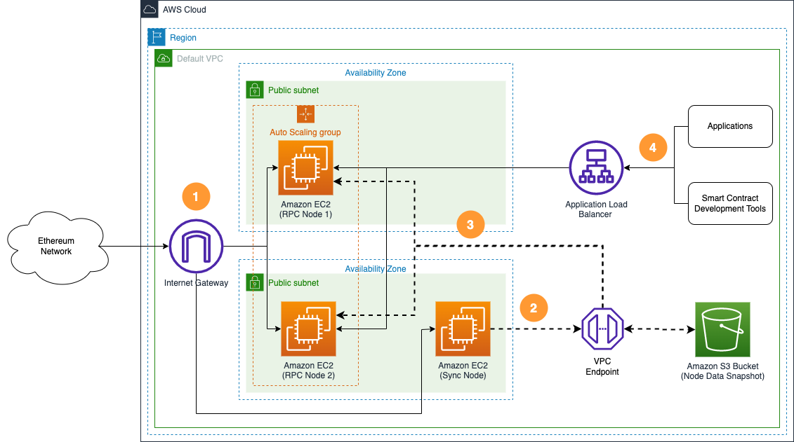
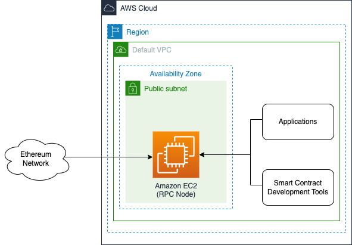

import Tabs from '@theme/Tabs';
import TabItem from '@theme/TabItem';

# Deploy AWS Node Runners

[AWS Blockchain Node Runners](https://aws-samples.github.io/aws-blockchain-node-runners/docs/intro)
is an open-source initiative aimed at simplifying the deployment of self-managed blockchain nodes
on AWS using vetted deployment blueprints and infrastructure configurations. 
AWS Node Runners solves common challenges in architecting and deploying blockchain nodes on AWS,
helping users identify optimal configurations for specific protocol clients.

This page walks you through the AWS Node Runners [architecture](#architecture), and how to
[deploy Besu and Teku on AWS](#deploy-aws-node-runners).

## Architecture

AWS Blockchain Node Runners supports several Ethereum client combinations and offers two
configuration options: a single node setup for development environments, and a highly available
multi-node setup for production environments.
The following diagrams illustrate the high level architecture of these setups.

### Single RPC node setup

<br/>
<p align="center">



</p>
<br/>

This single node setup is for small-scale development environments.
It deploys a single EC2 instance with both consensus and execution clients.
The RPC port is exposed only to internal IP range of the VPC, while P2P ports allow external access to keep the clients synced.

### Highly available setup

<br/>
<p align="center">



</p>
<br/>

In this highly available, multiple node setup:

1. The sync node synchronizes data continuously with the Ethereum network.
1. The sync node copies node state data to an Amazon S3 bucket.
1. New RPC nodes copy state data from the Amazon S3 bucket to accelerate their initial sync.
1. The Application Load Balancer routes application and smart contract development tool requests to available RPC nodes.

### Architecture checklist

The following is a checklist for an implementation of the AWS Blockchain Node Runners. 
This checklist takes into account questions from the [AWS Well-Architected framework](https://aws.amazon.com/architecture/well-architected/)
that are relevant to this workload. 
You can add more checks from the framework if required for your workload.

<table>
  <thead>
    <tr>
      <th>Pillar</th>
      <th>Control</th>
      <th>Question/Check</th>
      <th>Notes</th>
    </tr>
  </thead>
  <tbody>
    <tr>
      <td rowspan="10" align="center"><b>Security</b></td>
      <td rowspan="2" align="center">Network protection</td>
      <td>Are there unnecessary open ports in security groups?</td>
      <td>The Erigon snap sync port (`42069`) remains open for non-Erigon clients.</td>
    </tr>
    <tr>
      <td>Traffic inspection</td>
      <td>AWS WAF can be implemented for traffic inspection. Additional charges will apply.</td>
    </tr>
    <tr>
      <td rowspan="2" align="center">Compute protection</td>
      <td>Reduce attack surface</td>
      <td>This solution uses Amazon Linux 2 AMI. You can run hardening scripts on it.</td>
    </tr>
    <tr>
      <td>Enable users to perform actions at a distance</td>
      <td>This solution uses AWS Systems Manager for terminal sessions, not SSH ports.</td>
    </tr>
    <tr>
      <td rowspan="2" align="center">Data protection at rest</td>
      <td>Use encrypted Amazon Elastic Block Store (Amazon EBS) volumes</td>
      <td>This solution uses encrypted Amazon EBS volumes.</td>
    </tr>
    <tr>
      <td>Use encrypted Amazon Simple Storage Service (Amazon S3) buckets</td>
      <td>This solution uses Amazon S3 managed keys (SSE-S3) encryption.</td>
    </tr>
    <tr>
      <td align="center">Data protection in transit</td>
      <td>Use TLS</td>
      <td>The AWS Application Load Balancer currently uses an HTTP listener. To use TLS, create an HTTPS listener with a self-signed certificate.</td>
    </tr>
    <tr>
      <td rowspan="2" align="center">Authorization and access control</td>
      <td>Use instance profile with Amazon Elastic Compute Cloud (Amazon EC2) instances</td>
      <td>This solution uses AWS Identity and Access Management (AWS IAM) role instead of IAM user.</td>
    </tr>
    <tr>
      <td>Follow the principle of least privilege access</td>
      <td>In the sync node, the root user is not used (it uses the special user `ethereum` instead).</td>
    </tr>
    <tr>
      <td align="center">Application security</td>
      <td>Security-focused development practices</td>
      <td>cdk-nag is used with appropriate suppressions.</td>
    </tr>
    <tr>
      <td rowspan="2" align="center"><b>Cost optimization</b></td>
      <td colspan="2" align="center">Use cost-effective resources</td>
      <td>AWS Graviton-based Amazon EC2 instances are used, which are cost-effective compared to Intel/AMD instances.</td>
    </tr>
    <tr>
      <td colspan="2" align="center">Estimate costs</td>
      <td>One sync node with m7g.2xlarge for geth-Lighthouse configuration (2048 GB SSD) will cost around $430 per month in the US East region. Additional charges apply if you deploy RPC nodes with a load balancer.</td>
    </tr>
    <tr>
      <td rowspan="3" align="center"><b>Reliability</b></td>
      <td colspan="2" align="center">Withstand component failures</td>
      <td>This solution uses AWS Application Load Balancer with RPC nodes for high availability. If the sync node fails, Amazon S3 backup can be used to reinstate the nodes.</td>
    </tr>
    <tr>
      <td colspan="2" align="center">How is data backed up?</td>
      <td>Data is backed up to Amazon S3 using the <a href="https://github.com/peak/s5cmd">s5cmd</a> tool.</td>
    </tr>
    <tr>
      <td colspan="2" align="center">How are workload resources monitored?</td>
      <td>Resources are monitored using Amazon CloudWatch dashboards. Amazon CloudWatch custom metrics are pushed via CloudWatch Agent.</td>
    </tr>
    <tr>
      <td rowspan="3" align="center"><b>Performance efficiency</b></td>
      <td colspan="2" align="center">How is the compute solution selected?</td>
      <td>The solution is selected based on best price-performance, that is, AWS Graviton-based Amazon EC2 instances.</td>
    </tr>
    <tr>
      <td colspan="2" align="center">How is the storage solution selected?</td>
      <td>The solution is selected based on best price-performance, that is, gp3 Amazon EBS volumes with optimal IOPS and throughput.</td>
    </tr>
    <tr>
      <td colspan="2" align="center">How is the architecture selected?</td>
      <td>The s5cmd tool is used for Amazon S3 uploads/downloads because it gives better price-performance compared to Amazon EBS snapshots.</td>
    </tr>
    <tr>
      <td align="center"><b>Operational excellence</b></td>
      <td colspan="2" align="center">How is health of the workload determined?</td>
      <td>Workload health is determined via AWS Application Load Balancer Target Group Health Checks, on port `8545`.</td>
    </tr>
    <tr>
      <td align="center"><b>Sustainability</b></td>
      <td colspan="2" align="center">Select the most efficient hardware for your workload</td>
      <td>This solution uses AWS Graviton-based Amazon EC2 instances, which offer the best performance per watt of energy use in Amazon EC2.</td>
    </tr>
  </tbody>
</table>

## Deploy Besu and Teku on AWS

:::note
In this guide, you'll set all major configuration through environment variables, but you can also
modify parameters in the `config/config.ts` file.
:::

### 1. Configure the AWS CloudShell

#### 1.1. Log into AWS

Log in to your [AWS account](https://aws.amazon.com/) with permissions to create and modify
resources in IAM, EC2, EBS, VPC, S3, KMS, and Secrets Manager. 
From the AWS Management Console, open the [AWS CloudShell](https://docs.aws.amazon.com/cloudshell/latest/userguide/welcome.html),
a web-based shell environment.
For more information, see [this demo](https://youtu.be/fz4rbjRaiQM) on
[CloudShell with VPC environment](https://docs.aws.amazon.com/cloudshell/latest/userguide/creating-vpc-environment.html),
which you'll use to test APIs from an internal IP address space.

#### 1.2. Install dependencies

To deploy and test blueprints in the CloudShell, clone the following repository and install dependencies: 

```bash
git clone https://github.com/aws-samples/aws-blockchain-node-runners.git
cd aws-blockchain-node-runners
npm install
```

### 2. Prepare to deploy nodes

In the root directory of your project:

1. If you have deleted or don't have the default VPC, create a default VPC:

    ```bash
    aws ec2 create-default-vpc
    ```
  
    :::note
    You might see the following error if the default VPC already exists: 
    
    ```bash
    An error occurred (DefaultVpcAlreadyExists) when calling the CreateDefaultVpc operation: A Default VPC already exists for this account in this region.
    ``` 
   
    This means that he default VPC must have at least two public subnets in different Availability
    Zones, and public subnet must set `Auto-assign public IPv4 address` to `YES`.
    :::

1. Configure your Node Runners Ethereum blueprint deployment.
   To specify the Ethereum client combination you want to deploy, create your own copy of the `.env`
   file and edit it using your preferred text editor.
   The following example uses a sample configuration from the repository for a Besu and Teku node deployment:

    ```bash
    # Make sure you are in aws-blockchain-node-runners/lib/ethereum
    cd lib/ethereum
    pwd
    cp ./sample-configs/.env-besu-teku .env
    nano .env
    ```
  
    :::note
    You can find more examples for other Ethereum client combinations in the `sample-configs` directory.
    :::

1. Deploy common components, such as IAM role and Amazon S3 bucket to store data snapshots:

    ```bash
    pwd
    # Make sure you are in aws-blockchain-node-runners/lib/ethereum
    npx cdk deploy eth-common
    ```

### 3. Deploy  nodes

#### 3.1. (Option 1) Single RPC node

In a single RPC node setup:

1. Deploy the node:

    ```bash
    pwd
    # Make sure you are in aws-blockchain-node-runners/lib/ethereum
    npx cdk deploy eth-single-node --json --outputs-file single-node-deploy.json
    ```

    :::note
    The default VPC must have at least two public subnets in different Availability Zones, and the
    public subnets must set `Auto-assign public IPv4 address` to `YES`.
    :::

1. After starting the node, wait for the initial synchronization process to finish.
   It can take from half a day to approximately 6-10 days, depending on the client combination and
   the network state.
   You can use Amazon CloudWatch to track the progress, which publishes metrics every five minutes.
   Watch `sync distance` for the consensus client, and `blocks behind` for the execution client.
   When the node is fully synced, those two metrics should be `0`.
   To see them:

   - Navigate to [CloudWatch service](https://console.aws.amazon.com/cloudwatch/) (make sure you are
     in the region you have specified for `AWS_REGION`).
   - Open `Dashboards` and select `eth-sync-node-<your-eth-client-combination>` from the list of dashboards.

1. Once the initial synchronization is done, you can access the RPC API of that node from within the
   same VPC.
   The RPC port is not exposed to the Internet.
   Turn the following query against the private IP of the single RPC node you deployed:

    ```bash
    INSTANCE_ID=$(cat single-node-deploy.json | jq -r '..|.node-instance-id? | select(. != null)')
    NODE_INTERNAL_IP=$(aws ec2 describe-instances --instance-ids $INSTANCE_ID --query 'Reservations[*].Instances[*].PrivateIpAddress' --output text)
    echo "NODE_INTERNAL_IP=$NODE_INTERNAL_IP"
    ```

    Copy the output from the last `echo` command with `NODE_INTERNAL_IP=<internal_IP>` and open
    [CloudShell tab with VPC environment](https://docs.aws.amazon.com/cloudshell/latest/userguide/creating-vpc-environment.html)
    to access the internal IP address space.
    Paste `NODE_INTERNAL_IP=<internal_IP>` into the new CloudShell tab.
    Then, query the API:
    
    ``` bash
    # IMPORTANT: Run from CloudShell VPC environment tab
    # This queries the token balance of a Beacon deposit contract: https://etherscan.io/address/0x00000000219ab540356cbb839cbe05303d7705fa
    curl http://$NODE_INTERNAL_IP:8545 -X POST -H "Content-Type: application/json" \
    --data '{"method":"eth_getBalance","params":["0x00000000219ab540356cBB839Cbe05303d7705Fa", "latest"],"id":1,"jsonrpc":"2.0"}'
    ```

    The result should look like the following (the actual balance might change):
    
    ```javascript
    {"jsonrpc":"2.0","id":1,"result":"0xe791d050f91d9949d344d"}
    ```

#### 3.2. (Option 2) Highly available RPC nodes

In a highly available multi-node setup:

1. Deploy the sync node:

    ```bash
    pwd
    # Make sure you are in aws-blockchain-node-runners/lib/ethereum
    npx cdk deploy eth-sync-node --json --outputs-file sync-node-deploy.json
    ```
   
    :::note
    The default VPC must have at least two public subnets in different Availability Zones, and the
    public subnets must set `Auto-assign public IPv4 address` to `YES`.
    :::

1. After starting the node, wait for the initial synchronization process to finish.
   It can take from half a day to approximately 6-10 days, depending on the client combination and
   the network state.
   You can use Amazon CloudWatch to track the progress, which publishes metrics every five minutes.
   Watch `sync distance` for the consensus client, and `blocks behind` for the execution client.
   When the node is fully synced, those two metrics should be `0`.
   To see them:

    - Navigate to [CloudWatch service](https://console.aws.amazon.com/cloudwatch/) (make sure you are
    in the region you have specified for `AWS_REGION`).
    - Open `Dashboards` and select `eth-sync-node-<your-eth-client-combination>` from the list of dashboards.

    Once the synchronization process is over, the script automatically stops both clients and copies
    all the contents of the `/data` directory to your snapshot S3 bucket.
    That can take from 30 minutes to approximately 2 hours.
    During the process, you will see lower CPU and RAM usage, but high data disc throughput and
    outbound network traffic.
    The script automatically starts the clients after the process is done.
    
    :::note
    The snapshot backup process automatically runs every day at midnight of the time zone were the
    sync node runs.
    To change the schedule, modify `crontab` of the root user on the node's EC2 instance.
    :::

1. Configure and deploy two RPC nodes:

    ```bash
    pwd
    # Make sure you are in aws-blockchain-node-runners/lib/ethereum
    npx cdk deploy eth-rpc-nodes --json --outputs-file rpc-node-deploy.json
    ```

1. Give the new RPC nodes approximately 30 minutes to initialize, then run the following query
   against the load balancer behind the RPC node created:

    ```bash
    export ETH_RPC_ABL_URL=$(cat rpc-node-deploy.json | jq -r '..|.alburl? | select(. != null)')
    echo ETH_RPC_ABL_URL=$ETH_RPC_ABL_URL
    ```
    
    ```bash
    # IMPORTANT: Run from CloudShell VPC environment tab
    # We query token balance of Beacon deposit contract: https://etherscan.io/address/0x00000000219ab540356cbb839cbe05303d7705fa
    curl http://$ETH_RPC_ABL_URL:8545 -X POST -H "Content-Type: application/json" \
     --data '{"method":"eth_getBalance","params":["0x00000000219ab540356cBB839Cbe05303d7705Fa", "latest"],"id":1,"jsonrpc":"2.0"}'
    ```
    
    The result should look like the following (the actual balance might change):
    
    ```javascript
    {"jsonrpc":"2.0","id":1,"result":"0xe791d050f91d9949d344d"}
    ```

    If the nodes are still starting and catching up with the chain, you will see the following response:

    ```HTML
    <html>
    <head><title>503 Service Temporarily Unavailable</title></head>
    <body>
    <center><h1>503 Service Temporarily Unavailable</h1></center>
    </body>
    ```

    :::note
    By default and for security reasons, the load balancer is available only from within the default
    VPC in the region where it is deployed.
    It is not available from the Internet and is not open for external connections.
    Before opening it up, protect your RPC APIs.
    :::

### 4. Clear and undeploy nodes

To clear and undeploy the RPC nodes, sync nodes, and common components, use the following commands:

```bash
# Set the AWS account ID and region in case the local .env file is lost.
export AWS_ACCOUNT_ID=<your_target_AWS_account_id>
export AWS_REGION=<your_target_AWS_region>

pwd
# Make sure you are in aws-blockchain-node-runners/lib/ethereum.

# Destroy the single RPC node.
cdk destroy eth-single-node

# Destroy multiple RPC nodes.
cdk destroy eth-rpc-nodes

# Destroy the sync node.
cdk destroy eth-sync-node

# You need to manually delete an s3 bucket with a name similar to 'eth-snapshots-$accountid-eth-nodes-common'
# on the console:
#  1. Empty the bucket
#  2. Delete the bucket
#  3. Execute and delete all common components like IAM role and Security Group
cdk destroy eth-common
```
