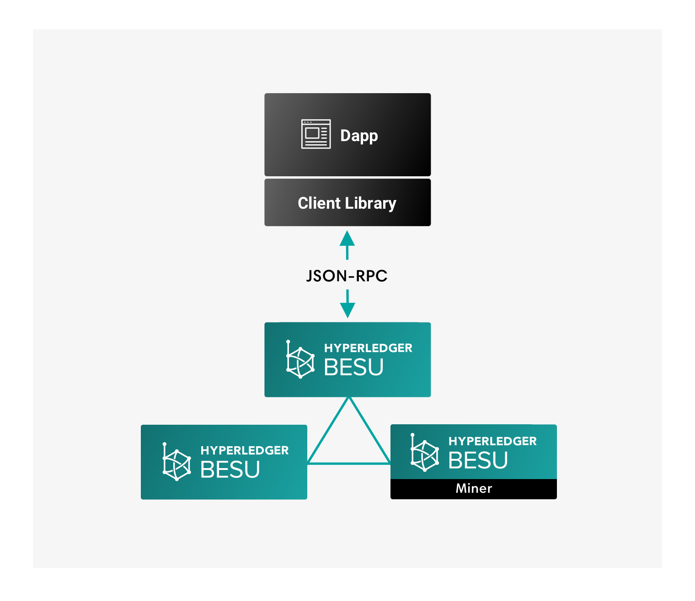

# Use client libraries

Dapps use client libraries, such as [web3.js](https://github.com/ethereum/web3.js/), [web3j](https://github.com/web3j/web3j), or [ethereumj](https://github.com/ethereum/ethereumj), to forward JSON-RPC requests to Besu. Any client library implementing core Ethereum RPC methods works with Besu.

Use client libraries to create signed transactions.

:::note

[Besu does not support key management inside the client](../send-transactions.md#use-wallets-for-key-management).

:::
