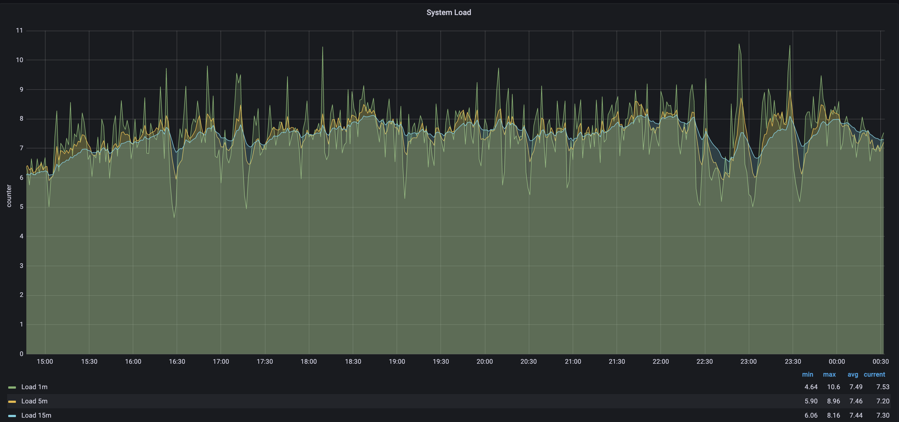

If you've run Besu on mainnet several times with `X_SNAP` option enabled,
you may have noticed graphical patterns that stand out in different metrics charts.

These patterns are related to the Besu sync process.

Read this page to better understand and know how to interpret these graphical patterns.

## CPU Utilization

The following screenshot from [monitoring Besu with Prometheus and Grafana] shows patterns related to CPU utilization.

The CPU pattern is a "staircase" pattern, where each step represents one of the Besu running stages.

### 1 -- Blocks import and world state download

Step 1 highlights blocks import and world state download, two tasks that are executed in parallel in Besu.
Besu manages these two tasks with two different pipelines.

This step is CPU-bound[^1].
The two pipelines stages run on multiple threads.

As displayed on the following screenshot -- for a VM with 8 CPU -- the CPU load average is about 7.5
and sometimes exceeds 10 (a 100% load for the 8 CPUs is 8).
It means that there's more work to be done than what the CPUs can handle.

### 2 -- World state healing

The healing, step 2, starts just after the world state download in step 1 is over.
The peak in system CPU is related to the high rate of IO (input and output) required during this step.
IO utilization is around 61% during healing when it's only 39% during the remaining sync.

### 3 -- Blocks import

After step 1 and 2 where world state is downloaded and healed, block import continues.

The visible drop in CPU shows that Besu finished the world state nodes download.

Block import step is long as Besu can't parallelize block import,
it has to validate each parent block before importing a child.

!!!note
    The Besu team is discussing other algorithm and implementations to make this block import faster.
    Stay tuned!

### 4 -- Blocks full import

In step 4, all the transactions of each block are executed by Besu.
This is where Besu updates the world state after the healing step.

The quantity of imported blocks in this step depends on the speed of the sync.
This number indicates the cumulated blocks quantity behind head since the last healing step.

This step consumes less CPU than the previous steps because the sequential part
-- executing transactions on the EVM -- must be single-threaded,
reducing the concurrent work at the CPU level.

### 5 -- Blocks production and propagation

Once Besu is completely synced, it propagates blocks and executes the transactions inside each block.
Block production and propagation step shows an important reduction in CPU consumption.
This reduction is due to the idle time while waiting for the new block and because executing
transactions on the EVM is sequential.

## Block time

The following screenshot shows patterns related to block times as available in the [Besu Grafana full dashboard](https://grafana.com/grafana/dashboards/16455-besu-full/).

The block times screenshot also shows a "staircase" pattern.

Block time metric measures the duration for getting new blocks in Besu.

Block time is closely related to the steps described in the previous [CPU utilization](#cpu-utilization).

### 1 -- Block import time

Block import time, as visible in step 1, is the duration for importing a block.

Import includes:

- the data retrieval over the network
- the headers, body and, receipt validation
- persisting the block in the database.

Duration for a block import is between a few milliseconds and up to tens of milliseconds.

### 2 -- Block full import time

The next step is the block full import time graph shows the duration for importing the block
(duration of the first stage) and for the execution of all the transactions in this block.

Besu spends between 1 and 2 seconds per block for this step, depending on the number and complexity
of the transactions.

### 3 -- Block network time

The last step shows block network time that includes the propagating of the block over the network and
the execution of all its transactions.

It usually takes between 13 and 16 seconds.

[monitoring Besu with Prometheus and Grafana]: ../../../private-networks/tutorials/quickstart.md#monitor-nodes-with-prometheus-and-grafana

[^1]: A CPU-bound task means that only the CPU speed drives the time required to execute the task.
Find more about [CPU-bounding on Wikipedia](https://en.wikipedia.org/wiki/CPU-bound).
