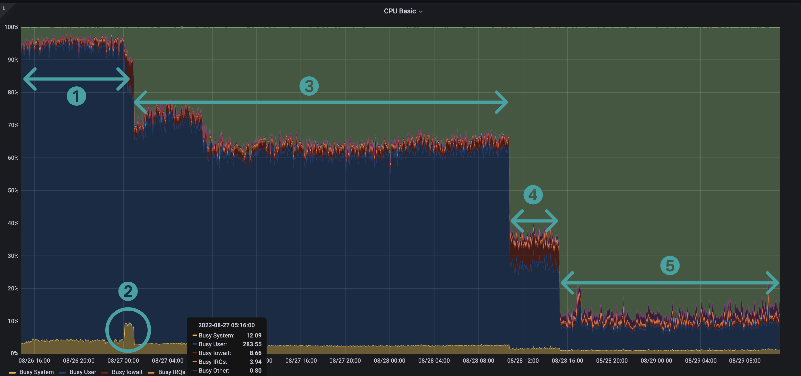

If you've run Besu on mainnet several times with X_SNAP enabled, you may have noticed patterns that stand out in different metrics. These patterns are related to how Besu works during the sync period.

# CPU Utilization

The first pattern is related to CPU utilization. We have here a staircase pattern, where each step represents one of the following stages (in chronological order)

- **Blocks import and world state download** : These two tasks are executed in parallel in Besu. Besu manages these two tasks with two different pipelines.
- **The world state heal step** : The heal step starts just after world state download is finished. The peak in System CPU is related to the high rate of IO done during this step, IO utilisation was around 61% during this period against 39% during the whole sync period.
- **Blocks import** : When the world state download and its heal are finished, blocks import continue its execution as it takes longer time. The drop in CPU utilization is related to the fact that Besu has less work to do as there are no more world state nodes to download. The other reason is that we can not parallelize blocks import, as we need to validate each parent before its child, although we're discussing other algorithm implementations to make this faster.
- **Blocks Full import** : In this step, all the transactions of each block are executed, this is basically done to update the world state from the last heal step. The number of blocks imported in this step depends on the speed of the sync, that is the number of cumulated blocks behind head from the last heal step. This step consumes less CPU because the sequential part (executing transactions on the EVM) must be single-threaded, thus the amount of concurrent work done at the CPU level reduces.
- **Blocks production/propagation** : After Besu is completely synced, it participates in propagating blocks by executing the transactions inside each block. In this step, we can notice a big decrease in CPU consumption because of the idle time waiting for the new block, and also the fact that executing transactions on the EVM is completely sequential.

# Block time
(the metric defined in [this dashboard](https://grafana.com/grafana/dashboards/16455-besu-full/))

Block time graph is also a staircase pattern, because this metric measures the time it takes to get new blocks in Besu, and this is closely related to the steps we discussed above. We can then see three stages :

- **Block import time** : It is the time it takes to import a block, i.e get the data over the network, validate the headers, the body, the receipts and persist the block in the database. This is basically done during the third fist steps above.This time is between a few milliseconds and a few tens of milliseconds.
- **Block full import time** : This is the time it takes to import the block (time of the first stage) and execute all the block's transactions. Currently, this time in Besu is between 1 and 2 seconds.
- **Block network time** : This is the time it takes to get the new block to propagate over the network and execute all its transactions. This time is between 13 and 16 seconds in general.

