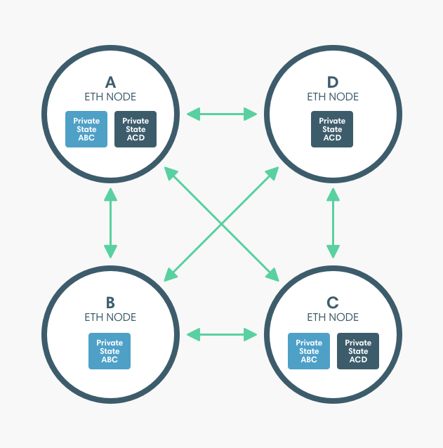

# Privacy groups

A privacy group is a group of nodes identified by a unique privacy group ID by Tessera. Tessera stores each private transaction with the privacy group ID.

The Besu nodes maintain the public world state for the blockchain and a private state for each privacy group. The private states contain data that is not shared in the globally replicated world state.

:::caution

The privacy group implementations described below are offchain privacy groups and cannot have their group membership updated.

[Flexible privacy groups are an early access feature](flexible-privacy.md).

:::

## Privacy types

Besu implements two types of privacy:

- Enterprise Ethereum Alliance (EEA) privacy, where private transactions include `privateFor` as the recipient.
- Besu-extended privacy, where private transactions include `privacyGroupId` as the recipient.

Both privacy types create privacy groups and store private transactions with their privacy group in Tessera.

:::note

For clarity, the Tessera nodes are not shown in the previous diagram. To send private transactions, each Besu node must have an associated Tessera node.

:::

### Access between states

A contract in a privacy group:

- Can read or write to a contract in the same privacy group.
- Can read from the public state including public contracts.
- Cannot access contracts from a different privacy group.

A public contract cannot access a private contract.

### Enterprise Ethereum Alliance privacy

In the privacy implementation complying with the [EEA Client Specification](https://entethalliance.org/technical-documents/) the group of nodes specified by `privateFrom` and `privateFor` form a privacy group with a unique privacy group ID provided by Tessera.

The previous diagram illustrates two privacy groups enabling:

- A, B, and C to send transactions that are private from D.
- A, C, and D to send transactions that are private from B.

Using EEA-compliant privacy, to send private transactions between A, B, and C, A initializes a contract in a private transaction with B and C specified as the `privateFor` and A specified as the `privateFrom`. Initializing the contract creates a privacy group consisting of A, B, and C. For the ABC private state to remain consistent, A, B, and C must be included on transactions (as either `privateFrom` or `privateFor`) even if they are between only two of the three parties.

To send private transactions between A, C, and D, C initializes a different contract in a private transaction with A and D specified as the `privateFor` and C specified as the `privateFrom`. Initializing the contract creates a privacy group consisting of A, C, and D. For the ACD private state to remain consistent, A, C, and D must be included on transactions (as either `privateFrom` or `privateFor`) even if they are between only two of the three parties.

### Besu-extended privacy

The Besu-extended privacy implementation creates a privacy group using [`priv_createPrivacyGroup`](../../../public-networks/reference/api/index.md#priv_createprivacygroup) with private transactions sent to the privacy group ID.

Using the same privacy groups as in the previous example.

Using Besu-extended privacy, to send private transactions between A, B, and C, A creates a privacy group consisting of A, B, and C. The privacy group ID is specified when sending private transactions and A, B, and C are recipients of all private transactions sent to the privacy group.

To send private transactions between A, C, and D, A creates a privacy group consisting of A, C, and D. The privacy group ID of this group is specified when sending private transactions with A, C, and D as recipients.

## Multi-tenancy

When using [multi-tenancy](multi-tenancy.md) with privacy groups, each user provides a JSON Web Token (JWT) which allows Besu to check that the user has access to functionality and data associated with a privacy group.
