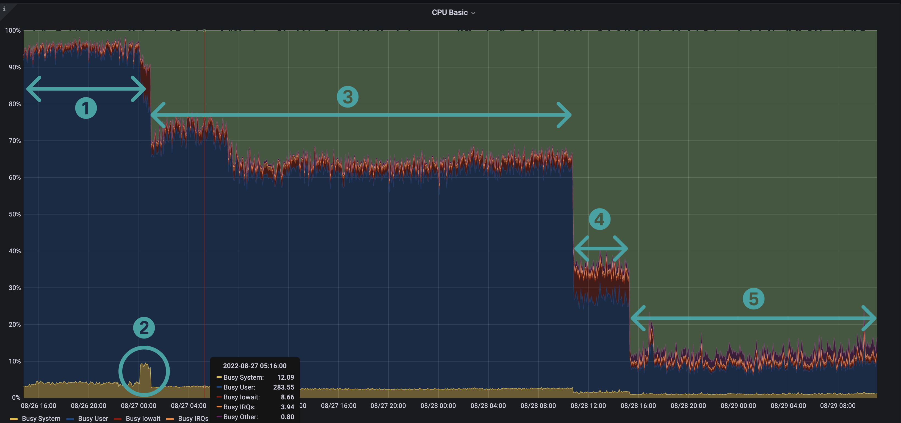
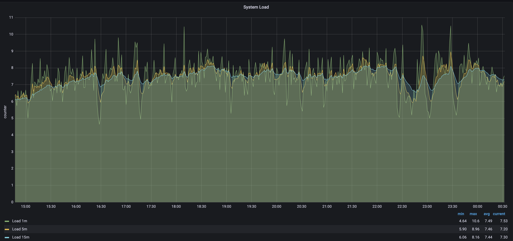
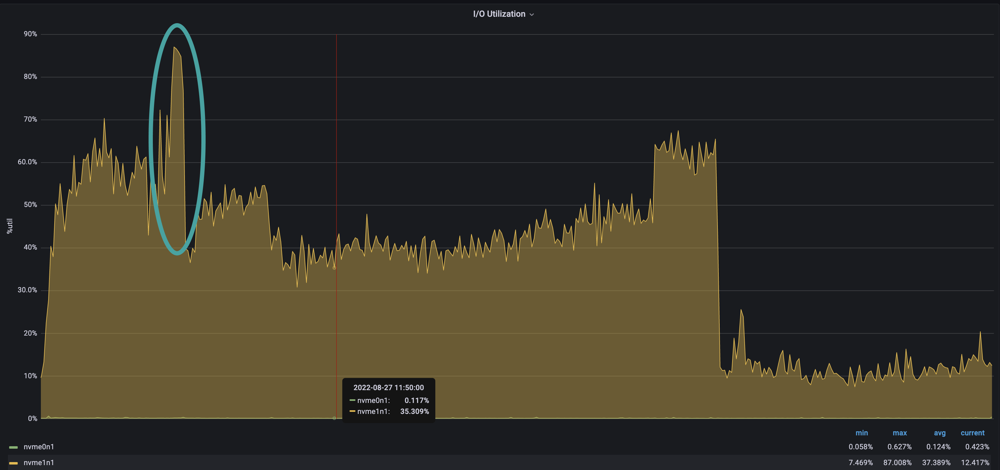

# Understand metrics

When running Besu on Ethereum Mainnet using [snap sync](../../get-started/connect/sync-node.md#snap-synchronization), you might notice graphical patterns that stand out in different metrics charts. These patterns are related to the [CPU usage](#cpu-usage) and [block time](#block-time) of the Besu sync process.

## CPU usage

The following screenshot from [monitoring Besu with Prometheus and Grafana] shows patterns related to CPU usage.

The CPU pattern is a "staircase" pattern, where each step represents one of the Besu running stages.

### 1. Blocks import and world state download

Step 1 highlights blocks import and world state download, two tasks executed in parallel in Besu. Besu manages these two tasks with two different pipelines.

This step is CPU-bound.[^1] The two pipeline stages run on multiple threads.

As displayed in the following screenshot (for a VM with 8 CPUs) the CPU load average is about 7.5 and sometimes exceeds 10 (a 100% load for the 8 CPUs is 8). This means there's more work to be done than what the CPUs can handle.

### 2. World state healing

Step 2, world state healing, starts just after the world state download in step 1 is complete. The peak in system CPU is related to the high rate of input and output (IO) required during this step. IO usage is around 61% during healing, and it's only 39% during the remaining sync.

### 3. Blocks import

After steps 1 and 2, world state is downloaded and healed, and block import continues.

The visible drop in CPU shows that Besu finished the world state nodes download.

The block import step is long because Besu can't parallelize block import -- it must validate each parent block before importing a child.

:::note

The Besu team is currently working on other algorithm and implementations to make this block import faster.

:::

### 4. Blocks full import

In step 4, Besu executes all transactions of each block. This is when Besu updates the world state after the healing step.

The quantity of imported blocks in this step depends on the speed of the sync. This number indicates the cumulated blocks quantity behind head since the last healing step.

This step consumes less CPU than the previous steps because the sequential part -- executing transactions on the EVM -- must be single-threaded, reducing the concurrent work at the CPU level.

### 5. Blocks production and propagation

Once Besu is completely synced, it propagates blocks and executes the transactions inside each block. Step 5, block production and propagation, shows a reduction in CPU consumption due to the idle time while waiting for the new block and the sequential nature of executing transactions on the EVM.

## Block time

Block time measures the duration of getting new blocks in Besu. Block time is closely related to [CPU usage](#cpu-usage).

The following screenshot shows patterns related to block time as available in the [Besu Grafana full dashboard](https://grafana.com/grafana/dashboards/16455-besu-full/).

The block time pattern is also a "staircase" pattern.

### 1. Block import time

Step 1, block import time, is the duration of importing a block.

Import includes:

- Data retrieval over the network.
- Headers, body, and receipt validation.
- Persisting the block in the database.

Block import takes between a few and tens of milliseconds.

### 2. Block full import time

Step 2, block full import time, is the duration of importing a block (step 1) and executing all its transactions.

Block full import takes between 1 and 2 seconds per block, depending on the number and complexity of the transactions.

### 3. Block network time

Step 3, block network time, is the duration of propagating a block over the network and executing all its transactions.

Block network takes between 13 and 16 seconds.

<!--links-->

[monitoring Besu with Prometheus and Grafana]: ../../../private-networks/tutorials/quickstart.md#monitor-nodes-with-prometheus-and-grafana

[^1]: A CPU-bound task means that the time required to execute the task is determined only by the CPU speed.
