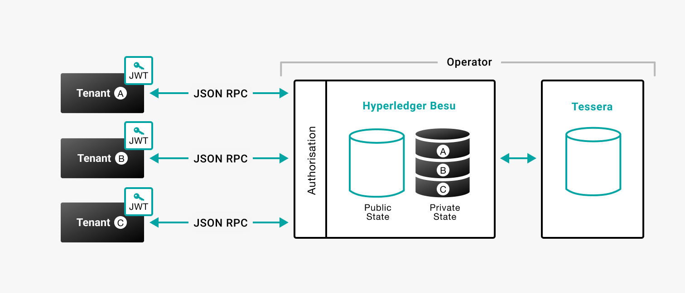

# Multi-tenancy

By default, each participant in a privacy network uses its own Besu and Tessera node.

Multi-tenancy allows multiple participants to use the same Besu and Tessera node. Each participant is a _tenant_, and the operator is the _owner_ of the Besu and Tessera node.

:::info

The operator is responsible for [configuring multi-tenancy](../../tutorials/privacy/multi-tenancy.md), and has access to all tenant data.

:::

:::tip

Ensure the multi-tenant Tessera node client API is configured to allow access only by the multi-tenant Besu node. Access to your data is secured through Besu using multi-tenancy mode.

If not configured to allow access only by the multi-tenant Besu node, other Tessera clients, including other Besu nodes, might be able to access tenant data.

To secure access, you can [configure TLS between Besu and Tessera](../../how-to/configure/tls/client-and-server.md) with the [`WHITELIST`](https://docs.tessera.consensys.net/en/stable/HowTo/Configure/TLS/#whitelist) trust mode.

:::

Multi-tenancy validates that tenants have permission to use the specified HTTP or WebSocket JSON-RPC requests, and the tenant has access to the requested privacy data. Private data is isolated and each tenant uses a JSON Web Token (JWT) for authentication.

You can [create the JWT either externally or internally](../../../public-networks/how-to/use-besu-api/authenticate.md).
