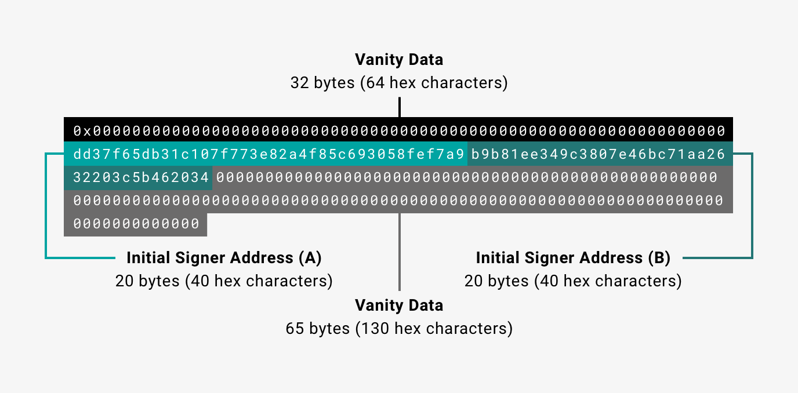

# Configure Clique consensus

Besu implements the [Clique](https://eips.ethereum.org/EIPS/eip-225) proof of authority (PoA) [consensus protocol](index.md). Private networks can use Clique.

:::danger

Clique is not suitable for production environments. Use only in development environments.

:::

In Clique networks, approved accounts, known as signers, validate transactions and blocks. Signers take turns to create the next block. Existing signers propose and vote to [add or remove signers](#add-and-remove-signers).

You can [create a private network using Clique](../../../tutorials/clique.md).

## Genesis file

To use Clique in a private network, Besu requires a Clique [genesis file](../../../../public-networks/concepts/genesis-file.md).

A Clique genesis file defines properties specific to Clique.

```json title="Example Clique genesis file"
{
  "config": {
    "chainId": 1981,
    "berlinBlock": 0,
    "clique": {
      "blockperiodseconds": 15,
      "epochlength": 30000
    }
  },
  "coinbase": "0x0000000000000000000000000000000000000000",
  "difficulty": "0x1",
  "extraData": "0x000000000000000000000000000000000000000000000000000000000000000001a54556254bfa3db2daa7673435ec63649925c50000000000000000000000000000000000000000000000000000000000000000000000000000000000000000000000000000000000000000000000000000000000",
  "gasLimit": "0x1fffffffffffff",
  "mixHash": "0x0000000000000000000000000000000000000000000000000000000000000000",
  "nonce": "0x0",
  "timestamp": "0x5c51a607",
  "alloc": {},
  "number": "0x0",
  "gasUsed": "0x0",
  "parentHash": "0x0000000000000000000000000000000000000000000000000000000000000000"
}
```

The properties specific to Clique are:

- `blockperiodseconds` - The block time, in seconds.
- `epochlength` - The number of blocks after which to reset all votes.
- `extraData` - [Extra data](#extra-data) including the initial signers.

### Extra data

The `extraData` property consists of:

- 0x prefix.
- 32 bytes of vanity data.
- A list of initial signer addresses (at least one initial signer is required). 20 bytes for each signer.
- 65 bytes for the proposer signature. In the genesis block there is no initial proposer, so the proposer signature is all zeros.

### One initial signer


### Two initial signers



### Post-Merge configuration

After [The Merge](../../../../public-networks/concepts/the-merge.md), the following block fields are modified or deprecated. Their fields **must** contain only the constant values from the following chart.

| Field | Constant value | Comment |
| --- | --- | --- |
| **`ommersHash`** | `0x1dcc4de8dec75d7aab85b567b6ccd41ad312451b948a7413f0a142fd40d49347` | `= Keccak256(RLP([]))` |
| **`difficulty`** | `0` | Replaced with `prevrandao` |
| **`mixHash`** | `0x0000000000000000000000000000000000000000000000000000000000000000` | Replaced with `prevrandao` |
| **`nonce`** | `0x0000000000000000` |  |
| **`ommers`** | `[]` | `RLP([]) = 0xc0` |

Additionally, [`extraData`](#extra-data) is limited to 32 bytes of vanity data after The Merge.

## Connect to a Clique network

To start a node on a Clique private network, use the [`--genesis-file`](../../../../public-networks/reference/cli/options.md#genesis-file) option to specify the custom genesis file.

## Add and remove signers

Existing signers propose and vote to add or remove validators using the Clique JSON-RPC API methods. Enable the HTTP interface with [`--rpc-http-enabled`](../../../../public-networks/reference/cli/options.md#rpc-http-enabled) or the WebSocket interface with [`--rpc-ws-enabled`](../../../../public-networks/reference/cli/options.md#rpc-ws-enabled).

The Clique API methods are disabled by default. To enable them, specify the [`--rpc-http-api`](../../../../public-networks/reference/cli/options.md#rpc-http-api) or [`--rpc-ws-api`](../../../../public-networks/reference/cli/options.md#rpc-ws-api) option and include `CLIQUE`.

The methods to add or remove signers are:

- [`clique_propose`](../../../reference/api/index.md#clique_propose).
- [`clique_getSigners`](../../../reference/api/index.md#clique_getsigners).
- [`clique_discard`](../../../reference/api/index.md#clique_discard).

To view signer metrics for a specified block range, call [`clique_getSignerMetrics`](../../../reference/api/index.md#clique_getsignermetrics).

### Add a signer

To propose adding a signer to a Clique network, call [`clique_propose`](../../../reference/api/index.md#clique_propose), specifying the address of the proposed signer and `true`. A majority of signers must execute the call.

```bash title="JSON-RPC clique_propose request example"
curl -X POST --data '{"jsonrpc":"2.0","method":"clique_propose","params":["0xFE3B557E8Fb62b89F4916B721be55cEb828dBd73", true], "id":1}' <JSON-RPC-endpoint:port>
```

When the signer creates the next block, the signer adds a vote to the block for the proposed signer.

When more than 50% of the existing signers propose adding the signer, with their votes distributed in blocks, the signer can begin signing blocks.

To return a list of signers and confirm the addition of a proposed signer, call [`clique_getSigners`](../../../reference/api/index.md#clique_getsigners).

```bash title="JSON-RPC clique_getSigners request example"
curl -X POST --data '{"jsonrpc":"2.0","method":"clique_getSigners","params":["latest"], "id":1}' <JSON-RPC-endpoint:port>
```

To discard your proposal after confirming the addition of a signer, call [`clique_discard`](../../../reference/api/index.md#clique_discard) specifying the address of the proposed signer.

```bash title="JSON-RPC clique_discard request example"
curl -X POST --data '{"jsonrpc":"2.0","method":"clique_discard","params":["0xFE3B557E8Fb62b89F4916B721be55cEb828dBd73"], "id":1}' <JSON-RPC-endpoint:port>
```

### Remove a signer

The process for removing a signer from a Clique network is the same as [adding a signer](#add-a-signer), except you specify `false` as the second parameter of [`clique_propose`](../../../reference/api/index.md#clique_propose).

### Epoch transition

At each epoch transition, Clique discards all pending votes collected from received blocks. Existing proposals remain in effect and signers re-add their vote the next time they create a block.

Define the number of blocks between epoch transitions in the [Clique genesis file](#genesis-file).

## Limitations

In Clique, blocks created by in-turn validators are published immediately. Out-of-turn validators create blocks that are published after a short delay. In-turn blocks have a higher difficulty than out-of-turn blocks, which allows small forks to resolve to the chain with more in-turn blocks.

However, when the out-of-turn delay is shorter than the block propagation delay, out-of-turn blocks may be published before in-turn blocks. This may cause large, irresolvable forks in a network.

:::tip

We recommend using a more updated consensus protocol such as [IBFT 2.0](ibft.md) or [QBFT](qbft.md).

:::

<!-- Acronyms and Definitions -->

\*[vanity data]: Signers can include anything they like as vanity data.
