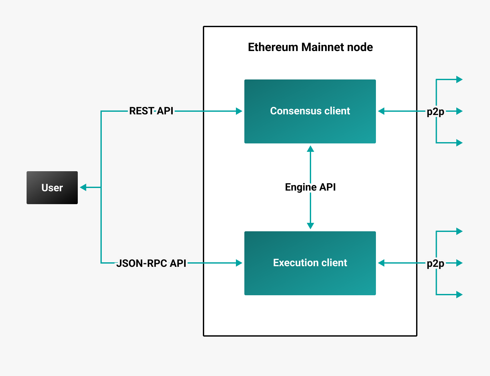

# The Merge

:::info

The Merge was executed on **September 15, 2022**.

:::

[The Merge](https://ethereum.org/en/upgrades/merge/) was an Ethereum upgrade that merged the [Beacon Chain] into Ethereum Mainnet, turning Mainnet into a combination of an [execution layer and consensus layer](#execution-and-consensus-clients). The Merge transitioned Mainnet from proof of work to [proof of stake consensus](proof-of-stake/index.md).

You can run Besu as an execution client with:

- [Any consensus client on Mainnet](../get-started/connect/mainnet.md).
- [Any consensus client on a testnet](../get-started/connect/testnet.md).
- [Teku on Mainnet](../tutorials/besu-teku-mainnet.md).
- [Teku on a testnet](../tutorials/besu-teku-testnet.md).

## Execution and consensus clients

After The Merge, a full Ethereum Mainnet node is a combination of an execution client (previously called an [Ethereum 1.0](https://blog.ethereum.org/2022/01/24/the-great-eth2-renaming/) client) and a consensus client (previously called an [Ethereum 2.0](https://blog.ethereum.org/2022/01/24/the-great-eth2-renaming/) client).

Execution and consensus clients communicate with each other using the [Engine API](../how-to/use-engine-api.md).

### Execution clients

Execution clients, such as Besu, manage the execution layer, including executing transactions and updating the world state. Execution clients serve [JSON-RPC API](../reference/engine-api/index.md) requests and communicate with each other in a peer-to-peer network.

### Consensus clients

Consensus clients, such as [Teku], contain beacon node and validator client implementations. The beacon node is the primary link to the [Beacon Chain] (consensus layer). The validator client performs [validator duties](proof-of-stake/index.md) on the consensus layer. Consensus clients serve [REST API](https://docs.teku.consensys.net/en/stable/Reference/Rest_API/Rest/) requests and communicate with each other in a peer-to-peer network.

## What happened during The Merge

Before The Merge, the execution and consensus clients' configurations were updated to listen for a certain total terminal difficulty (TTD) to be reached.

:::info

The TTD is a specific value for the total difficulty, which is the sum of the proof-of-work mining difficulty for all blocks up to some point in the blockchain.

:::

The consensus layer enabled the Merge configuration (Bellatrix) before reaching the TTD. Once the execution layer blocks reached the TTD, the Beacon Chain merged into Ethereum Mainnet, and Ethereum transitioned to a proof of stake network.

:::tip

After The Merge, a Mainnet node operator must run both an execution client and a beacon node at the same time. To become a validator, you must also run a validator client (either [in the same process as the beacon node](https://docs.teku.consensys.net/en/stable/HowTo/Get-Started/Run-Teku/#start-the-clients-in-a-single-process) or [separately](https://docs.teku.consensys.net/en/stable/HowTo/Get-Started/Run-Teku/#run-the-clients-separately).

:::

After The Merge, validators earn rewards for performing [validator duties](proof-of-stake/index.md), and [fee recipients](https://docs.teku.consensys.net/Reference/CLI/CLI-Syntax#validators-proposer-default-fee-recipient) also earn rewards for the inclusion of execution layer transactions.

<!-- links -->

[Beacon Chain]: https://ethereum.org/en/upgrades/beacon-chain/
[Teku]: https://docs.teku.consensys.net/en/stable/
