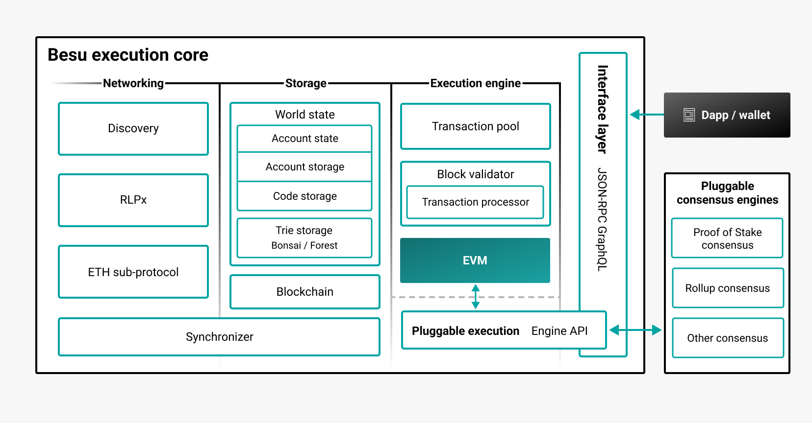

---
# page icon, insider only, see https://squidfunk.github.io/mkdocs-material/reference/#setting-the-page-icon
title: Public networks
sidebar_position: 1
description: Public networks overview
---

# Hyperledger Besu for public networks

Besu serves as an [execution client](concepts/the-merge.md#execution-clients) on public proof-of-stake Ethereum networks such as Ethereum Mainnet, Goerli, and Sepolia.

You can also run Besu using proof of work on [Ethereum Classic (ETC)](how-to/use-pow/mining.md).

Get started by [installing Besu](get-started/install/index.md).

## Architecture

The following diagram outlines the high-level architecture of Besu for public networks.

If you have any questions about Besu for public networks, contact us on the [Besu channel on Hyperledger Discord](https://discord.gg/hyperledger).
