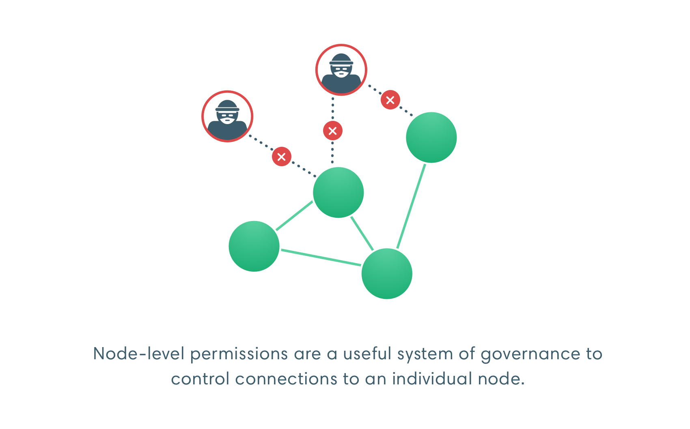
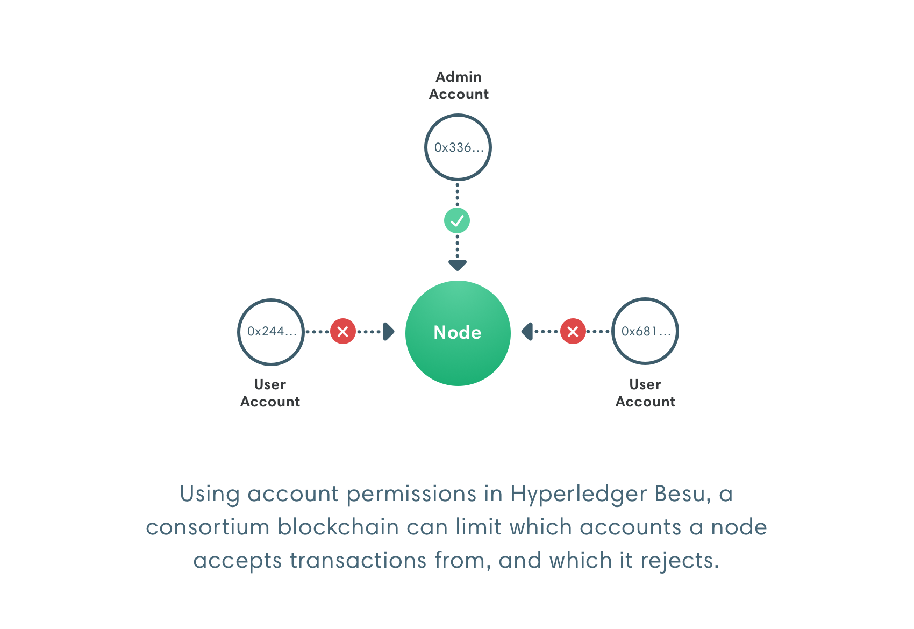
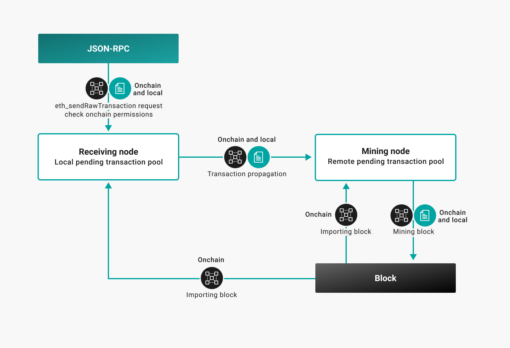

# Permissioning

A permissioned network enables node permissioning and account permissioning, allowing only specified nodes and accounts to access the network.

:::caution Permissioning is not privacy

In peer-to-peer networks, node permissioning enforces rules on nodes you control.

Permissioning requires a distributed network of trust across the network where participants agree to follow the rules. One bad actor can decide not to follow the rules. Nodes can take action to prevent the bad actor adding to the chain but they cannot prevent the bad actor from allowing access to the chain.

Besu also implements [privacy](../privacy/index.md).

:::

## Node permissioning

Use node permissioning to restrict access to known participants only.

## Account permissioning

Use account permissioning to:

- Enforce onboarding or identity requirements.
- Suspend accounts.
- Restrict the actions an account can perform.

## Specify permissioning

You can specify permissioning [locally](#local) or [onchain](#onchain).

### Local

[Local permissioning](../../how-to/use-permissioning/local.md) works at the node level. Each node in the network has a [permissions configuration file].

Local permissioning affects your node but not the rest of the network. Use local permissioning to restrict use of your node (that is, the resources under your control). For example, customers able to access your node.

Local permissioning does not require coordination with the rest of the network and you can act immediately to protect your node. Your rules are not enforced in blocks produced by other nodes.

### Onchain

[Onchain permissioning](onchain.md) works through a smart contract on the network. Specifying permissioning onchain enables all nodes to read and update permissioning configuration from one location.

Onchain permissioning requires coordination to update the rules. The network might not be able to act immediately (for example, the smart contract might enforce a minimum of number of votes before changing permissioning rules).

When you update onchain permissioning, the update applies across the network and new blocks abide by the updated rules. For example, blocked accounts can no longer add transactions to the chain.

The following diagram illustrates applying local and onchain permissioning rules.

<!-- Links -->

[permissions configuration file]: ../../how-to/use-permissioning/local.md#permissions-configuration-file
