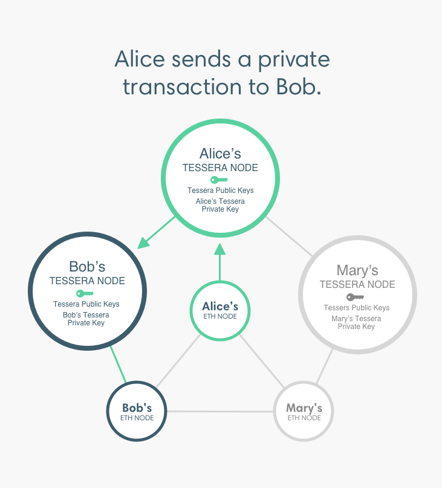

# Privacy

In Besu, privacy refers to the ability to keep transactions private between the involved participants. Other participants cannot access the transaction content or list of participants.

:::danger

For production environments requiring private transactions:

- We recommend using a network with a consensus mechanism supporting transaction finality. For example, [IBFT 2.0](../../how-to/configure/consensus/ibft.md).
- Tessera must be [highly available and run in a separate instance to Besu].

Using private transactions with [pruning] or [fast sync](../../../public-networks/reference/cli/options.md#sync-mode) isn't supported.

:::

## Private transaction manager

Besu uses a private transaction manager, [Tessera](https://docs.tessera.consensys.net/), to implement privacy. Each Besu node that sends or receives [private transactions](private-transactions/index.md) requires an associated Tessera node.

Private transactions pass from the Besu node to the associated Tessera node. The Tessera node encrypts and directly distributes (that is, point-to-point) the private transaction to the Tessera nodes participating in the transaction.

By default, each participant in a privacy-enabled network uses its own Besu and Tessera node. [Multi-tenancy](multi-tenancy.md) allows more than one participant to use the same Besu and Tessera node.

:::tip

Private Transaction Managers are also known as Enclaves.

:::

## Privacy-enabled networks

When enabling privacy in a [private network](../../get-started/system-requirements.md), there's an assumed level of trust among the node operators, since all are members of the private network.

:::caution

Inefficient contracts deployed accidentally or deliberately can cause performance issues in privacy-enabled networks because gas isn't required in private transactions.

:::

In contrast, gas is required in Ethereum Mainnet and public testnets because they are trustless environments.

Privacy-enabled networks should have a mechanism to establish trust offchain. Node operators should be informed on:

- Guidelines for use, responsibilities, and good behavior.
- Smart contract security, so contracts deployed on the network use resources efficiently.
- Consequences for malicious activity.

Privacy-enabled networks should run development and test environments that closely resemble production, so contracts can be tested, and potential issues can be found before they're deployed in production.

## Reorg-compatible privacy

In v1.4, using private transactions in a network using a consensus mechanism where forks occur (that is, PoW algorithms or Clique) is an early access feature.

Do not use private transactions in production environments using consensus mechanisms where forks occur.

<!-- Links -->

[highly available and run in a separate instance to Besu]: ../../how-to/use-privacy/tessera.md
[pruning]: ../../../public-networks/concepts/data-storage-formats.md#pruning
