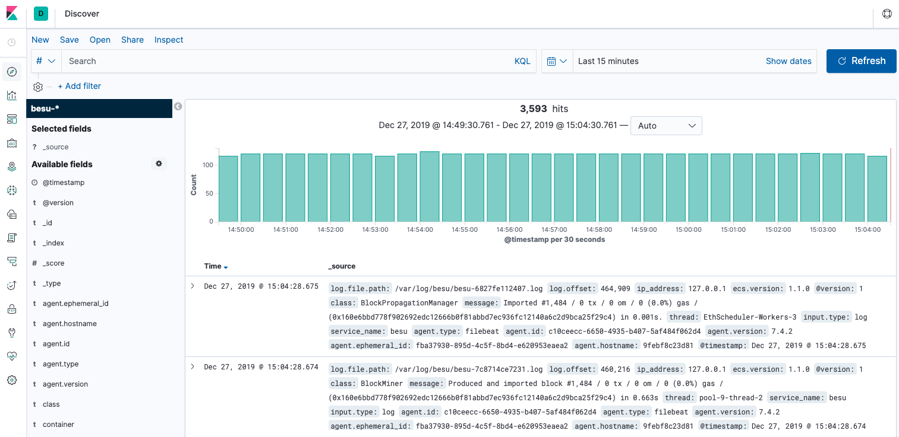

# Use Elastic Stack

[Elastic Stack] (ELK) is an open-source log management platform that is available when using the [Developer Quickstart](../../tutorials/quickstart.md).

The [Filebeat] configuration ingests logs and the [Metricbeat] configuration collects metrics from the nodes at regular defined intervals and outputs them to Redis for storage. Redis provides a highly available mechanism enabling storage by any of the Elastic Beats and pulled by Logstash as required.

The [pipeline configuration] defines the JSON format used for Besu logs and automatically picks up any new log fields.

:::note

The pipeline configuration must match the your log format. If using the default log format, you can use the [grok plugin](https://www.elastic.co/guide/en/logstash/current/plugins-filters-grok.html) to extract the log fields.

:::

To see the Besu Quickstart network logs in Kibana:

1. [Start the Developer Quickstart with Besu](../../tutorials/quickstart.md), selecting ELK monitoring.
1. Open the [`Kibana logs address`](http://localhost:5601/app/kibana#/discover) listed by the sample networks `list.sh` script. The logs display in Kibana.

   

<!-- Links -->

[Filebeat]: https://github.com/ConsenSys/quorum-dev-quickstart/blob/b72a0f64d685c851bf8be399a8e33bbdf0e09982/files/common/filebeat/filebeat.yml
[Metricbeat]: https://github.com/ConsenSys/quorum-dev-quickstart/blob/b72a0f64d685c851bf8be399a8e33bbdf0e09982/files/common/metricbeat/metricbeat.yml
[pipeline configuration]: https://github.com/ConsenSys/quorum-dev-quickstart/blob/b72a0f64d685c851bf8be399a8e33bbdf0e09982/files/common/logstash/pipeline/20_besu.conf
[Elastic Stack]: https://www.elastic.co/what-is/elk-stack
